# Landing — Páginas Públicas

> [!info] Extensión Frontend
> Módulo frontend independiente (`apps/front/modules/landing/`) para páginas públicas de marketing. 15 componentes autocontenidos orquestados en `pages/index.vue`. Usa el layout `public` (navbar + footer). Es hermano de `base/`, no un submódulo.

## Diagrama de Componentes

```mermaid
graph TB
    subgraph Page["pages/index.vue — Layout public"]
        Nav["LandingNavbar<br/>Sticky + drawer mobile"]
        Hero["LandingHero<br/>Logo + título gradiente + CTAs"]
        Benefits["LandingBenefits<br/>6 beneficios grid 3-col"]
        Features["LandingFeatures<br/>6 features i18n"]
        Services["LandingServices<br/>6 pilares zigzag"]
        Steps["LandingHowItWorks<br/>3 pasos visuales"]
        Pricing["LandingPricing<br/>3 planes + enterprise"]
        Testimonials["LandingTestimonials<br/>Carrusel 6 testimonios"]
        Team["LandingTeam<br/>8 miembros + redes"]
        Sponsors["LandingSponsors<br/>7 sponsors platino"]
        FAQ["LandingFAQ<br/>Acordeón 5 preguntas"]
        Community["LandingCommunity<br/>CTA Discord"]
        Contact["LandingContact<br/>Formulario mailto:"]
        Footer["LandingFooter<br/>Links + copyright"]
    end

    Nav --> Hero
    Hero --> Benefits
    Benefits --> Features
    Features --> Services
    Services --> Steps
    Steps --> Pricing
    Pricing --> Testimonials
    Testimonials --> Team
    Team --> Sponsors
    Sponsors --> FAQ
    FAQ --> Community
    Community --> Contact
    Contact --> Footer
```



## Estructura

```
modules/landing/
├── nuxt.config.ts                    # Componentes ./components/landing sin prefix
├── pages/
│   └── index.vue                     # Orquesta todos los Landing* components
└── components/landing/
    ├── LandingHero.vue               # Hero con logo, título gradiente, CTAs, dashboard animado
    ├── LandingNavbar.vue             # Sticky responsive + drawer mobile + LangButton + theme toggle
    ├── LandingBenefits.vue           # 6 beneficios con iconos lucide + AOS
    ├── LandingFeatures.vue           # 6 features con textos $t()
    ├── LandingServices.vue           # 6 pilares zigzag con badge PRO
    ├── LandingHowItWorks.vue         # 3 pasos: Clonar → Configurar → Desplegar
    ├── LandingTestimonials.vue       # Carrusel scroll snap: avatar + estrellas + texto
    ├── LandingTeam.vue               # 8 miembros: foto + nombre color + social links
    ├── LandingPricing.vue            # 3 planes (Free/€49.99/€199) + enterprise
    ├── LandingContact.vue            # Formulario: nombre, email, asunto, mensaje → mailto:
    ├── LandingFAQ.vue                # Acordeón DaisyUI 5 preguntas
    ├── LandingFooter.vue             # Logo + columnas links + copyright
    ├── LandingCommunity.vue          # CTA Discord con MessagesSquare
    ├── LandingSponsors.vue           # 7 sponsors platino con iconos lucide
    └── LandingToggleTheme.vue        # Botón light/dark con useColorMode()
```

## Componentes Clave

### LandingHero
- Logo + título con gradiente
- Descripción + 2 CTAs (Login / Cómo funciona)
- Imagen dashboard con animación de sombra
- Textos con `$t()` para i18n

### LandingNavbar
- **Desktop**: logo, 5 links de sección, LangButton, Login, theme toggle
- **Mobile**: overlay + drawer con los mismos links
- State: `isOpen` ref

### LandingPricing
- 3 planes: Developer (Free), Startup (€49.99, badge POPULAR), Enterprise (€199)
- Sección extra enterprise con features adicionales
- Referencia `StripeService` (datos actualmente estáticos)

### LandingContact
- Campos: nombre, apellidos, email, asunto (select), mensaje
- Validación de obligatorios
- Submit: `mailto:` codificado con datos del form
- Errores con alerta DaisyUI

## Relaciones

- [[Foundation/Extensiones/index|Extensiones]] — Índice de extensiones
- [[Foundation/Extensiones/Stripe - Integracion de Pagos|Stripe]] — LandingPricing referencia StripeService
- [[Foundation/Modulos/Translations - Internacionalizacion|Translations]] — Textos i18n via `$t()`
