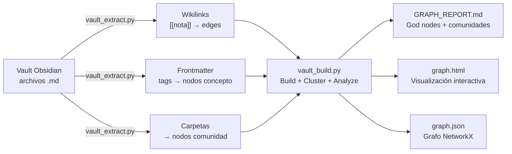
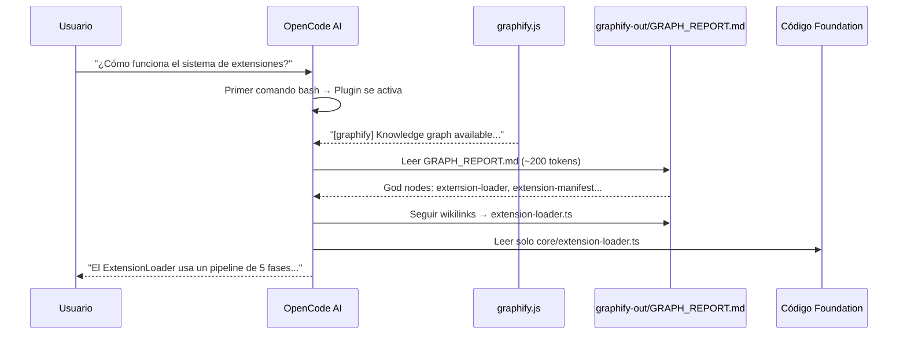

# Graphify — Knowledge Graph y OpenCode

> [!info] Graphify + OpenCode
> **Graphify** genera un knowledge graph a partir del código y documentación. **OpenCode** lo consulta como primer paso para entender la arquitectura sin leer cada archivo. El plugin `graphify.js` automatiza el recordatorio. Reducción de tokens: ~95%.

## Estado Actual

| Métrica | Valor |
|---------|-------|
| Archivos indexados | 98 |
| Palabras | ~100,871 |
| Nodos | 128 |
| Edges | 355 |
| Comunidades | 12 |
| Extracción | 100% EXTRACTED (wikilinks + frontmatter) |
| Costo tokens | 0 (sin LLM) |

## Cómo Funciona



### Extracción

`vault_extract.py` procesa cada archivo .md:

1. **Frontmatter** → `title` como label, `tags` como nodos `#tag`, `date` como timestamp
2. **Wikilinks** (`[[nota]]`) → edges `EXTRACTED` con `confidence_score: 1.0`
3. **Carpeta padre** → nodo comunidad (ej: `folder_Conceptos`)
4. **Code files** → AST extraction via graphify (classes, functions, imports)

### Build + Cluster

`vault_build.py`:
1. Construye el grafo NetworkX desde los edges extraídos
2. Clustering de Louvain → detecta comunidades
3. Calcula god nodes (degree centrality)
4. Encuentra conexiones sorprendentes (cross-comunidad)
5. Genera GRAPH_REPORT.md + graph.html + graph.json

## God Nodes Actuales

| # | Nodo | Edges | Comunidad |
|---|------|-------|-----------|
| 1 | `index` | 74 | Meta / Diagnóstico |
| 2 | `Conceptos` | 26 | Conceptos |
| 3 | `Índice Documentos Marca` | 21 | Meta |
| 4 | `Concepto Central - De aislado a conectado` | 15 | Conceptos |
| 5 | `Atenfy` | 14 | Proyectos |
| 6 | `Foundation` | 14 | Proyectos |
| 7 | `Naming - SOM OS` | 14 | Naming |
| 8 | `Propuesta de Valor` | 13 | Estrategia |
| 9 | `Plan de Empresa` | 12 | Estrategia |
| 10 | `CanvasAPI` | 11 | Proyectos |

## Comunidades Detectadas

| Comunidad | Cohesión | Notas |
|-----------|----------|-------|
| `00 - Meta / 01 - Diagnóstico` | 0.11 | Índices y documentos de diagnóstico |
| `Conceptos` | 0.41 | Notas atómicas de marca (ADN, arquetipo, insight) |
| `06 - Proyectos` | 0.63 | Proyectos del ecosistema |
| `Modulos` | 0.22 | Documentación de módulos de Foundation |
| `Extensiones` | 0.48 | Extensiones de Foundation |
| `Foundation` | 0.60 | Documentos raíz de Foundation |
| `07 - Informacion Publica` | 0.93 | Perfiles públicos y presencia digital |

## Cómo Usarlo

### En OpenCode (automático)

El Knowledge Manager lee `graphify-out/GRAPH_REPORT.md` como primer paso:

```
Paso 1: GRAPH_REPORT.md → god nodes
Paso 2: Navegar via wikilinks
Paso 3: Solo ahora leer archivos individuales
```

### Visualización

Abrí `graphify-out/graph.html` en cualquier browser. Sin servidor necesario.

### Regenerar

```bash
pip install graphifyy
python graphify-out/vault_extract.py
python graphify-out/vault_build.py
```

---

## Integración con OpenCode

### Plugin graphify.js

Foundation tiene el plugin `.agents/plugins/graphify.js` que se ejecuta **antes de cada comando bash**:

```javascript
// graphify OpenCode plugin
// Injects a knowledge graph reminder before bash tool calls when the graph exists.
export const GraphifyPlugin = async ({ directory }) => {
  let reminded = false;
  return {
    "tool.execute.before": async (input, output) => {
      if (reminded) return;
      if (!existsSync(join(directory, "graphify-out", "graph.json"))) return;
      if (input.tool === "bash") {
        output.args.command =
          'echo "[graphify] Knowledge graph available. Read graphify-out/GRAPH_REPORT.md for god nodes and architecture context before searching files." && ' +
          output.args.command;
        reminded = true;
      }
    },
  };
};
```

Esto significa que **la primera vez que OpenCode ejecuta un comando bash en Foundation**, recibe el recordatorio de consultar el grafo. Solo se activa si `graphify-out/graph.json` existe.

### Cómo OpenCode consulta el grafo



### Estrategia de lectura

El Knowledge Manager sigue este orden:

```
Paso 1: GRAPH_REPORT.md → god nodes (10 conceptos más conectados)
Paso 2: Seguir wikilinks desde god nodes hacia notas relacionadas
Paso 3: SOLO AHORA leer archivos individuales si es necesario
```

Esto es **80-95% más eficiente** que leer archivos uno por uno.

### Estados del grafo

| Proyecto | Archivos | Nodos | Edges | Comunidades | Extracción |
|----------|----------|-------|-------|-------------|------------|
| **Foundation** | 565 | 1,640 | 1,913 | 184 | 70% AST + 30% INFERRED |
| **Vault SOM-OS.dev** | 98 | 128 | 355 | 12 | 100% wikilinks (sin LLM) |

### Sin graphify-out (primer uso)

Si `graphify-out/` no existe o está vacío:
- El plugin `graphify.js` no se activa (verifica `existsSync`)
- OpenCode usa índices (`Vault-Index.md` + `index.md`) como fallback
- No hay penalización — simplemente no hay grafo disponible

### Regeneración

El grafo **no se regenera automáticamente** en commits. Se regenera manualmente cuando cambia significativamente la estructura:

```bash
# En Foundation — re-build desde el grafo existente (sin re-extraer)
python graphify-out/rebuild.py

# Para regenerar desde cero (requiere subagentes LLM, ~26 agentes)
/graphify C:\proyectos\foundation
```

> [!tip] Foundation ya tiene su grafo ejecutado
> El pipeline se ejecutó sobre los 565 archivos de Foundation (`.ts`, `.vue`, `.md`). El resultado: 1640 nodos, 1913 edges, 184 comunidades. El grafo **conecta backend y frontend** por dominio funcional — por ejemplo, `TranslationsController` (NestJS) y `InteractiveTranslationEditor.vue` (Vue) aparecen en la misma comunidad porque comparten la API `/translations`.

---

## Historial

### Qdrant (removido)

El vault usaba `tools/qdrant-sync.mjs` + Docker Qdrant para búsqueda semántica con embeddings. Fue reemplazado por Graphify porque:
- Qdrant requería Docker corriendo 24/7
- El sync no se ejecutaba automáticamente en commits
- Graphify aprovecha la estructura existente (wikilinks, frontmatter) sin necesidad de embeddings
- Cero dependencias externas, cero tokens de LLM

### Foundation MCP Engine (removido)

Foundation tuvo un `mcp-engine/` con Qdrant + OpenRouter. Fue removido del repositorio.

## Relaciones

- [[Foundation/index|Foundation]] — Índice general
- [[Foundation/Modulos/index|Módulos]] — Documentación de módulos
- [[00 - Meta/index|Meta]] — AGENTS.md configura el uso de Graphify
