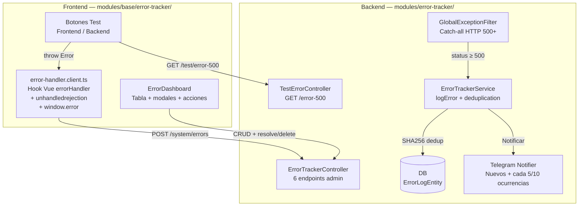
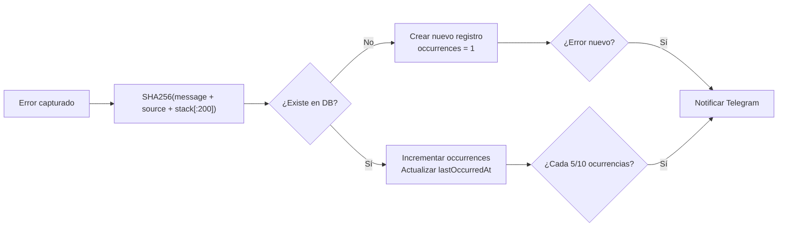
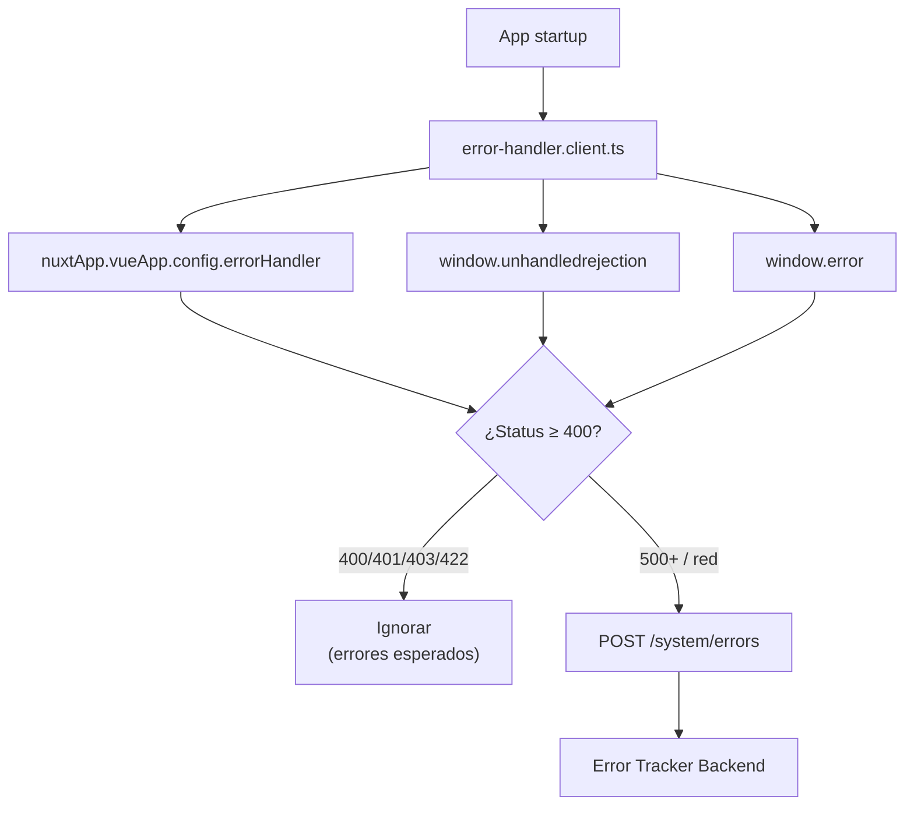

# Error Tracker — Monitoreo de Errores

> [!info] Resumen Full-Stack
> Sistema de tracking de errores con **backend** (`apps/back/src/modules/error-tracker/`) y **frontend** (`apps/front/modules/base/error-tracker/`). Backend: deduplicación SHA256, GlobalExceptionFilter, notificaciones Telegram. Frontend: dashboard con tabla de errores, plugin global de captura, test de errores.

## Diagrama de Arquitectura



## Backend — `apps/back/src/modules/error-tracker/`

### Estructura

```
error-tracker/
├── error-tracker.module.ts       # TypeOrmModule.forFeature([ErrorLogEntity])
├── error-tracker.controller.ts   # 6 endpoints (admin)
├── error-tracker.service.ts      # logError, deduplication, CRUD
├── test-error.controller.ts      # GET /error-500
├── dto/                          # create-error.dto, update-error.dto
├── entities/
│   └── error-log.entity.ts       # Tabla `error_logs`
└── filters/
    └── global-exception.filter.ts # Catch-all 500+
```

### Endpoints

| Método | Ruta | Auth | Descripción |
|--------|------|------|-------------|
| `POST` | `/system/errors` | Public | Reportar error (usado por frontend) |
| `GET` | `/system/errors` | JWT + admin | Listar todos (paginado) |
| `DELETE` | `/system/errors/resolved` | JWT + admin | Limpiar resueltos |
| `DELETE` | `/system/errors` | JWT + admin | Limpiar TODOS |
| `PATCH` | `/system/errors/:id/resolve` | JWT + admin | Marcar como resuelto |
| `DELETE` | `/system/errors/:id` | JWT + admin | Borrar uno |
| `GET` | `/system/test/error-500` | Public | Generar error 500 de prueba |

### Entidad — ErrorLogEntity

| Campo | Tipo | Descripción |
|-------|------|-------------|
| `id` | UUID (PK) | Identificador único |
| `hash` | string (unique) | SHA256(message + source + stack[:200]) |
| `message` | string | Mensaje de error |
| `source` | string? | Origen ("GlobalExceptionFilter", "VueErrorHandler") |
| `stack` | text? | Stack trace completo |
| `metadata` | jsonb? | Request URL, method, user agent |
| `occurrences` | int | Contador (incrementa en duplicados) |
| `resolved` | boolean | Marcado como resuelto |
| `resolvedAt` | timestamp | Cuándo se resolvió |
| `firstOccurredAt` | timestamp | Primera ocurrencia |
| `lastOccurredAt` | timestamp | Última ocurrencia |

### Sistema de Deduplicación



### GlobalExceptionFilter

```typescript
@Catch()
export class GlobalExceptionFilter implements ExceptionFilter {
  catch(exception: unknown, host: ArgumentsHost) {
    // Si status >= 500 → trackear automáticamente
    // Formatear respuesta JSON estándar
    // Notificar Telegram si es error nuevo
  }
}
```

### Process Listeners

```typescript
process.on('unhandledRejection', (reason) => { /* trackear */ });
process.on('uncaughtException', (error) => { /* trackear */ });
```

---

## Frontend — `apps/front/modules/base/error-tracker/`

### Estructura

```
modules/base/error-tracker/
├── nuxt.config.ts                    # Componentes con prefix ErrorTracker
├── components/
│   └── ErrorDashboard.vue           # Tabla + modales + acciones
├── composables/
│   └── useErrors.ts                  # API: fetch, report, clear, resolve
├── plugins/
│   ├── error-handler.client.ts       # Captura global Vue + JS
│   └── nav.ts                        # Menú "System" (admin-only)
└── pages/admin/
    └── errors.vue                    # Página de monitoreo
```

### Componente — ErrorDashboard

- **Tabla**: source, message, occurrences (badge), status, actions
- **Acciones por error**: Resolve, Delete, View Details (modal con stack trace + metadata JSON)
- **Acciones globales**: Test Frontend Error, Test Backend Error, Clear Resolved, Clear All

### Plugin — `error-handler.client.ts`



**Filtrado inteligente**: NO reporta errores HTTP 400, 401, 403, 422 (errores esperados de validación/auth). Solo reporta 500+ y errores de red.

### Composable — `useErrors`

```typescript
useErrors() → {
  fetchErrors(filters?), reportError(data), clearErrors(),
  deleteError(id), resolveError(id), clearResolvedErrors(),
  testBackendError(),
}
```

## Dependencias

- `TypeOrmModule` — ErrorLogEntity
- `ConfigModule` — Telegram config (opcional)

## Relaciones

- [[Foundation/Modulos/index|Módulos]] — Índice de módulos
- [[Foundation/Infraestructura - Base de Datos y Utilidades|Infraestructura]] — GlobalExceptionFilter en main.ts
- [[Foundation/Modulos/UI App - Toolkit de Componentes|UI App]] — DataTable usado en dashboard
