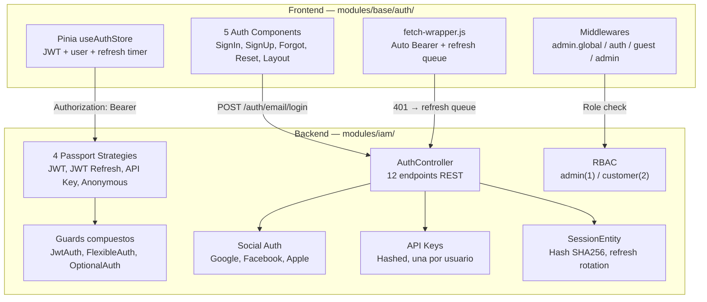
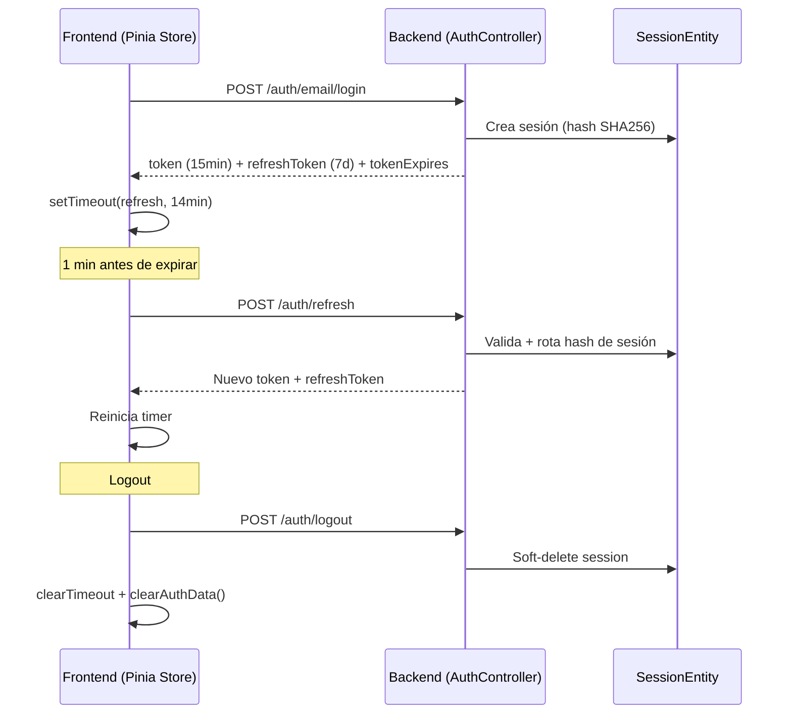
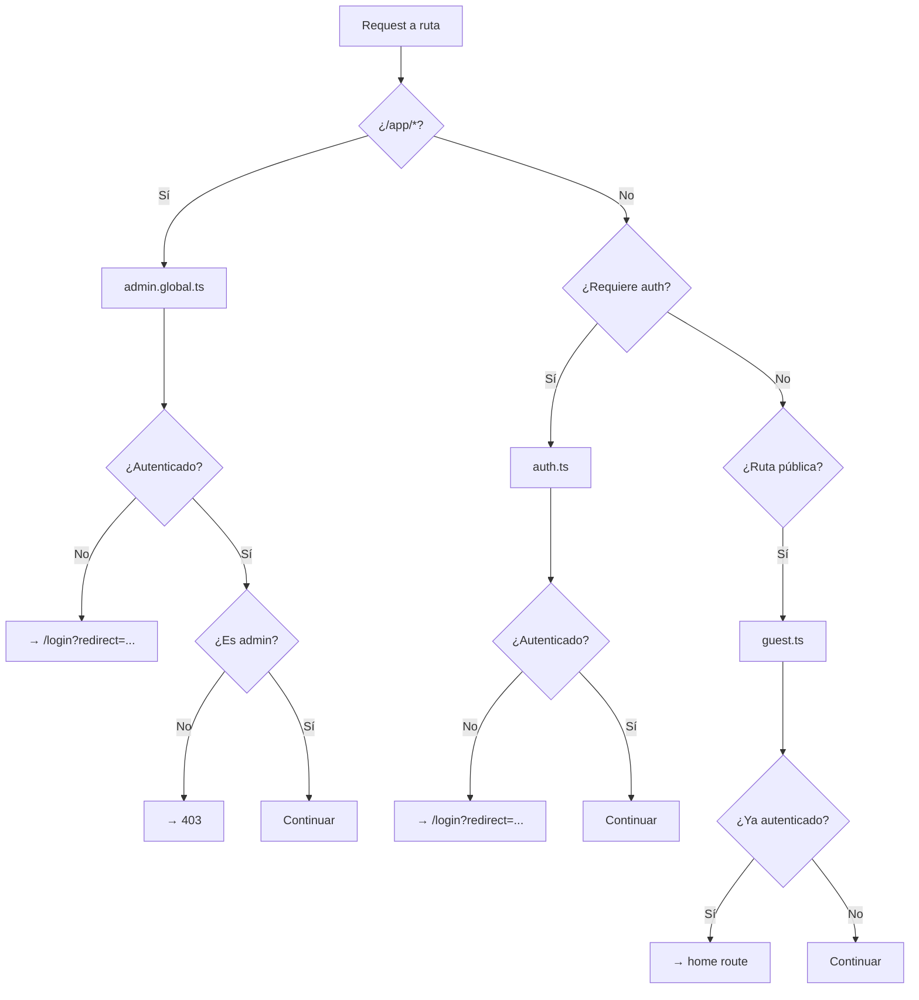

# IAM — Identity & Access Management

> [!info] Resumen Full-Stack
> Módulo que abarca **backend** (`apps/back/src/modules/iam/`) y **frontend** (`apps/front/modules/base/auth/`). Backend: 4 estrategias Passport, 4 proveedores de login, RBAC. Frontend: Pinia store, 5 componentes de formularios, 4 middlewares, JWT auto-refresh.

## Diagrama de Arquitectura



## Backend — `apps/back/src/modules/iam/`

### Estructura

```
iam/
├── iam.module.ts              # Root: agrega auth, social, session, api-keys
├── auth/                      # Auth core
│   ├── auth.module.ts         # JWT + Passport + Mail + Session
│   ├── auth.controller.ts     # 12 endpoints REST
│   ├── auth.service.ts        # Login, register, refresh, reset, social
│   ├── decorators/            # @JwtAuth, @FlexibleAuth, @AdminAuth...
│   ├── dto/                   # 8 DTOs
│   ├── guards/                # JwtAuthGuard, FlexibleAuthGuard, etc.
│   └── strategies/            # JWT, JWT Refresh, API Key, Anonymous
├── auth-google/               # Google OAuth2
├── auth-facebook/             # Facebook Graph API
├── auth-apple/                # Sign in with Apple
├── api-keys/                  # API Key generation (hashed), revocación
├── session/                   # SessionEntity (hash SHA256) + Repository
└── roles/                     # RBAC: RolesGuard, @Roles decorator
```

### Endpoints — AuthController (`/auth`)

| Método | Ruta | Auth | Descripción |
|--------|------|------|-------------|
| `POST` | `/email/login` | Public | Login → JWT + refresh token + sesión |
| `POST` | `/email/register` | Public | Registro → inactivo → email confirmación |
| `POST` | `/email/confirm` | Public | Confirmar email (hash JWT) |
| `POST` | `/email/confirm/new` | Public | Confirmar nuevo email |
| `POST` | `/forgot/password` | Public | Solicitar reset → email |
| `POST` | `/reset/password` | Public | Ejecutar reset con hash |
| `GET` | `/me` | JWT | Perfil del usuario |
| `POST` | `/refresh` | JWT Refresh | Rotar refresh → nuevo par JWT |
| `POST` | `/logout` | JWT | Soft-delete session |
| `PATCH` | `/me` | JWT | Actualizar perfil |
| `PATCH` | `/me/language` | JWT | Cambiar idioma |
| `DELETE` | `/me` | JWT | Soft-delete usuario |

### Endpoints — Social Auth

| Método | Ruta | Proveedor |
|--------|------|-----------|
| `POST` | `/auth/google/login` | Google OAuth2 |
| `POST` | `/auth/facebook/login` | Facebook Graph API |
| `POST` | `/auth/apple/login` | Sign in with Apple |

### Endpoints — API Keys (`/api-keys`)

| Método | Ruta | Auth | Descripción |
|--------|------|------|-------------|
| `GET` | `/` | JWT | Obtener/regenerar API key |
| `POST` | `/regenerate` | JWT | Regenerar (revoca anterior) |
| `DELETE` | `/` | JWT | Revocar API key |

### Estrategias Passport

| Estrategia | Header | Propósito |
|------------|--------|-----------|
| `JwtStrategy` | `Authorization: Bearer` | Valida JWT, busca usuario en DB |
| `JwtRefreshStrategy` | `Authorization: Bearer` | Valida refresh token contra sesión |
| `ApiKeyStrategy` | `X-API-Key` | Valida key hasheada contra DB |
| `AnonymousStrategy` | (ninguno) | Permite acceso anónimo |

### Guards Compuestos

| Guard | Comportamiento |
|-------|---------------|
| `JwtAuthGuard` | Solo JWT — lanza 401 |
| `ApiKeyAuthGuard` | Solo API Key — lanza 401 |
| `FlexibleAuthGuard` | JWT **o** API Key — lanza 401 si ninguno |
| `OptionalAuthGuard` | JWT, API Key, **o anónimo** — nunca lanza error |

### Decoradores de Auth

```typescript
@JwtAuth()          // = @UseGuards(JwtAuthGuard) + @ApiBearerAuth()
@ApiKeyAuth()       // = @UseGuards(ApiKeyAuthGuard) + @ApiSecurity('ApiKey')
@FlexibleAuth()     // = @UseGuards(FlexibleAuthGuard) + ambos swagger
@OptionalAuth()     // = @UseGuards(OptionalAuthGuard) + opcional swagger
@AdminAuth()        // = @JwtAuth() + @Roles(admin) + RolesGuard
@CustomerAuth()     // = @JwtAuth() + @Roles(customer) + RolesGuard
@CurrentUser()      // Extrae req.user (nullable)
@RequiredUser()     // Extrae req.user (lanza si null)
@UserId()           // Extrae solo req.user.id
```

### RBAC — Roles

| Rol | ID | Acceso |
|-----|----|--------|
| `admin` | 1 | Total. Ve todos los recursos |
| `customer` | 2 | Solo sus recursos (ownership pattern) |

### Flujo de Refresh Token



### Entidades Backend

| Entidad | Tabla | Campos clave |
|---------|-------|-------------|
| `UserEntity` | `user` | id, email, password, provider, socialId, role, status |
| `RoleEntity` | `role` | id (1=admin, 2=customer), name |
| `SessionEntity` | `session` | id, user (FK), hash (SHA256), deletedAt |
| `ApiKeyEntity` | `api_key` | id, user (FK), key (hashed) |

---

## Frontend — `apps/front/modules/base/auth/`

### Estructura

```
modules/base/auth/
├── nuxt.config.ts               # Auto-imports components, stores, composables
├── components/auth/
│   ├── AuthLayout.vue           # Layout pantalla dividida (imagen + slot)
│   ├── AuthSignIn.vue           # Login email/password
│   ├── AuthSignUp.vue           # Registro nombre/email/password
│   ├── AuthForgotPassword.vue   # Recuperar contraseña
│   └── AuthResetPassword.vue    # Resetear con hash de URL
├── composables/
│   └── useHomeRoute.ts          # Ruta home según rol
├── stores/
│   └── auth.store.ts            # Pinia: JWT, user, refresh, login/logout
├── middleware/
│   ├── admin.global.ts          # Global: protege /app/* → admin only
│   ├── auth.ts                  # Nombrado: requiere autenticación
│   ├── guest.ts                 # Nombrado: redirige auth users
│   └── admin.ts                 # Nombrado: solo admin
├── plugins/
│   └── auth.client.ts           # Init al arrancar (refresh + fetch user)
├── pages/(auth)/
│   ├── login.vue
│   ├── register.vue
│   ├── forgot-password.vue
│   └── password-change.vue
└── utils/
    └── redirect.ts              # Sanitización de redirect URLs
```

### Componentes

| Componente | Props | Descripción |
|------------|-------|-------------|
| `AuthLayout` | `reverse?: boolean` | Layout dividido: imagen izq, contenido der |
| `AuthSignIn` | — | Email + password + loading + errores específicos |
| `AuthSignUp` | — | Nombre + email + password + confirmación |
| `AuthForgotPassword` | — | Email → estados: form/loading/éxito |
| `AuthResetPassword` | — | Lee hash+expires de URL, valida expiración |

### Pinia Store — `useAuthStore`

```typescript
// State
{
  token: string | null,           // JWT access token
  refreshToken: string | null,    // JWT refresh token
  tokenExpires: number | null,    // Timestamp expiración
  user: User | null,              // Datos del usuario
  refreshTokenTimeout: any,       // ID del setTimeout
}

// Getters
isAuthenticated, isTokenExpired, isAdmin, isCustomer, fullName

// Actions clave
login(email, password) → POST /auth/email/login → guarda JWT + inicia timer
refreshAccessToken()    → POST /auth/refresh → nuevo JWT + reinicia timer
logout()                → POST /auth/logout → limpia state + timer
startRefreshTokenTimer() → setTimeout 1 min antes de expirar
```

**Persistencia**: `pinia-plugin-persistedstate` — sobrevive refrescos.

### Middlewares



### Fetch Wrapper

`helpers/fetch-wrapper.js`:
- Auto-attach: `Authorization: Bearer <token>`
- En 401: intenta `refreshAccessToken()` → cola de requests → retry
- Si refresh falla → redirect a login

### Utilidades — `redirect.ts`

```typescript
sanitizeRedirect(redirect: string): string | null
// Valida: string, empieza con /, no es // (previene open redirect)
```

## Dependencias

- `UsersModule` — buscar/crear usuarios
- `SessionModule` — sesiones con hash SHA256
- `MailModule` — emails de activación, reset
- `JwtModule` — generación de tokens
- `ApiKeysModule` — validación de API keys

## Relaciones

- [[Foundation/Modulos/index|Módulos]] — Índice de módulos
- [[Foundation/Modulos/Users - Gestión de Usuarios|Users]] — Gestión de usuarios
- [[Foundation/Modulos/Communications - Comunicaciones y Email|Communications]] — Emails de auth
- [[Foundation/Modulos/UI App - Toolkit de Componentes|UI App]] — FormInput, PasswordInput usados en forms
