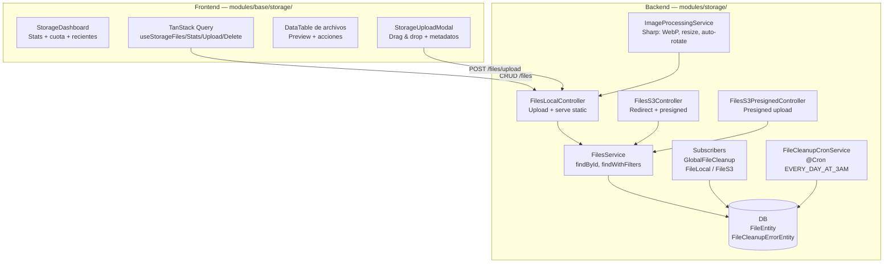
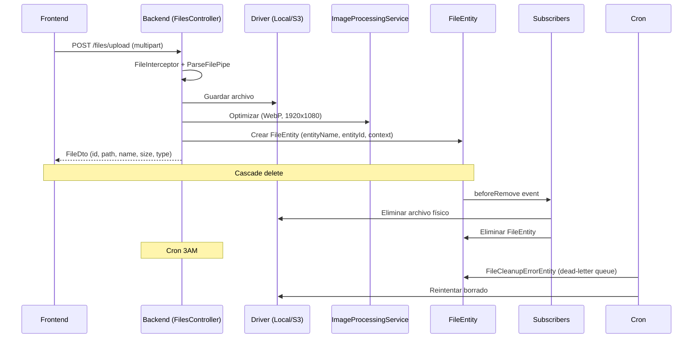
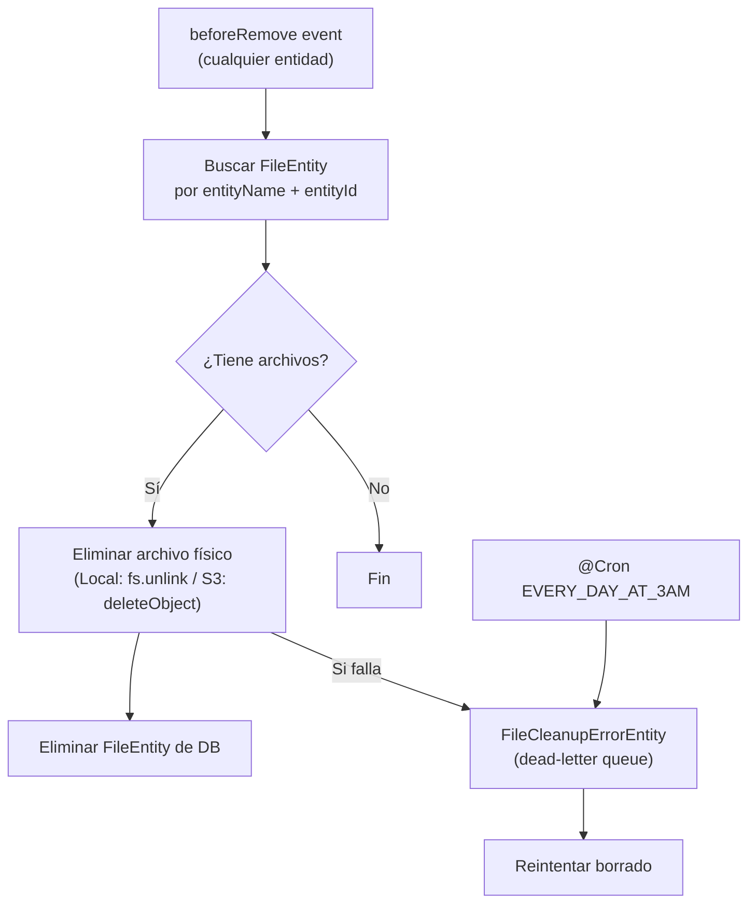

# Storage — Sistema de Archivos

> [!info] Resumen Full-Stack
> Sistema de archivos polimórfico. **Backend** (`apps/back/src/modules/storage/`): 3 drivers, procesamiento de imágenes (Sharp), cascade delete, cron de limpieza. **Frontend** (`apps/front/modules/base/storage/`): dashboard de stats, upload drag & drop, DataTable con preview, TanStack Query para cacheo.

## Diagrama de Arquitectura



## Flujo de Upload



## Backend — `apps/back/src/modules/storage/`

### Drivers

| Driver | Controller | Comportamiento |
|--------|------------|----------------|
| **Local** | `FilesLocalController` | Archivos en `./files/public|private`. Serve static |
| **S3** | `FilesS3Controller` | AWS S3 SDK. Redirect a S3 URL |
| **S3 Presigned** | `FilesS3PresignedController` | Backend genera presigned URL → frontend sube directo |

Selección via `file.driver` en `file.config.ts`.

### Endpoints — FilesLocalController (`/files`, v1)

| Método | Ruta | Auth | Descripción |
|--------|------|------|-------------|
| `GET` | `/` | JWT | Listar con filtros (entityName, entityId, isPublic, type) |
| `POST` | `/upload` | JWT | Upload con FileInterceptor |
| `PUT` | `/:id` | JWT | Reemplazar archivo |
| `PATCH` | `/:id` | JWT | Actualizar metadata (nombre/visibilidad) |
| `DELETE` | `/:id` | JWT | Borrar |
| `POST` | `/optimize` | JWT | Optimizar sin guardar (devuelve WebP) |
| `GET` | `/stats` | JWT | Estadísticas de almacenamiento |
| `GET` | `/public/*` | Public | Servir archivos públicos |
| `GET` | `/private/*` | JWT | Servir archivos privados |

### Entidades

| Entidad | Tabla | Campos |
|---------|-------|--------|
| `FileEntity` | `file` | id (UUID), path, name, isPublic, entityName, entityId, context, userId, type (MIME), size |
| `FileCleanupErrorEntity` | `file_cleanup_errors` | id, fileUri, driver, attempts, errorMessage |

### Sistema Polimórfico

```typescript
// Cualquier entidad puede tener archivos
POST /files/upload
{ file, entityName: "user", entityId: "123", context: "profile", isPublic: true }

GET /files?entityName=user&entityId=123&context=profile
```

### Cascade Delete



> [!warning] Usar `.remove()` de TypeORM. `.delete()` o QueryBuilder **bypassean** los subscribers.

### Procesamiento de Imágenes (Sharp)

- **WebP** (quality configurable)
- **Max 1920x1080** (mantiene aspect ratio)
- **Auto-rotate** según EXIF

---

## Frontend — `apps/front/modules/base/storage/`

### Estructura

```
modules/base/storage/
├── components/
│   ├── StorageDashboard.vue     # Cards stats + cuota + recientes
│   ├── StorageUploadModal.vue   # Drag & drop + metadatos colapsables
│   ├── FilePreview.vue          # Thumbnail imagen o FileTypeIcon
│   └── FileTypeIcon.vue         # Icono según MIME type
├── composables/                  # TanStack Query hooks
│   ├── useStorageFiles.ts       # Query: listar archivos
│   ├── useStorageStats.ts       # Query: estadísticas
│   ├── useFileUpload.ts         # Mutation: upload
│   ├── useFileDelete.ts         # Mutation: delete
│   └── useFileUpdate.ts         # Mutation: update metadata
├── types/index.ts               # FileType, FileStats, FileUploadMeta
└── pages/app/storage/
    └── index.vue                # Dashboard + DataTable + UploadModal
```

### Componentes

| Componente | Props | Descripción |
|------------|-------|-------------|
| `StorageDashboard` | `stats?, loading?, quota?` | Cards: total, espacio, imágenes, docs. Barra progreso cuota. Precio estimado B2 |
| `StorageUploadModal` | `open: boolean` | Drag & drop zone, lista archivos con FilePreview, metadatos colapsables (entityName, entityId, context, isPublic). Emite `upload({files, meta?})` |
| `FilePreview` | `file: FileType, size?` | Imagen → thumbnail, otros → FileTypeIcon. Tamaños sm/md/lg |
| `FileTypeIcon` | `mimeType, size?` | image→Image, pdf→FileText, video→Video, audio→Music, default→File |

### TanStack Query — Auto-cacheo

| Composable | Query Key | Tipo |
|------------|-----------|------|
| `useStorageFiles(filters?)` | `['storage', 'files', filters]` | Query |
| `useStorageStats()` | `['storage', 'stats']` | Query |
| `useFileUpload()` | Invalida files + stats | Mutation |
| `useFileDelete()` | Invalida files + stats | Mutation |
| `useFileUpdate()` | Invalida files + stats | Mutation |

Al subir/borrar/actualizar → queries de lista y stats se refrescan automáticamente.

### Tipos

```typescript
interface FileType {
  id, path, name, isPublic, entityName?, entityId?,
  context?, userId?, type: string, size: number, createdAt
}
interface FileStats { totalFiles, totalSize, byType[], recentFiles[] }
interface FileUploadMeta { entityName?, entityId?, context?, isPublic? }
```

## Dependencias

- `ConfigModule` — `file.config.ts`
- `TypeOrmModule` — FileEntity + FileCleanupErrorEntity
- `ScheduleModule` — Cron limpieza
- `MulterModule` — Uploads locales
- `Sharp` — Procesamiento de imágenes
- `TanStack Query` (frontend) — Cacheo y mutaciones

## Relaciones

- [[Foundation/Modulos/index|Módulos]] — Índice de módulos
- [[Foundation/Modulos/Users - Gestión de Usuarios|Users]] — Fotos de perfil polimórficas
- [[Foundation/Infraestructura - Base de Datos y Utilidades|Infraestructura]] — Config de archivos
- [[Foundation/Modulos/UI App - Toolkit de Componentes|UI App]] — DataTable, FormSwitch, TableActionMenu
