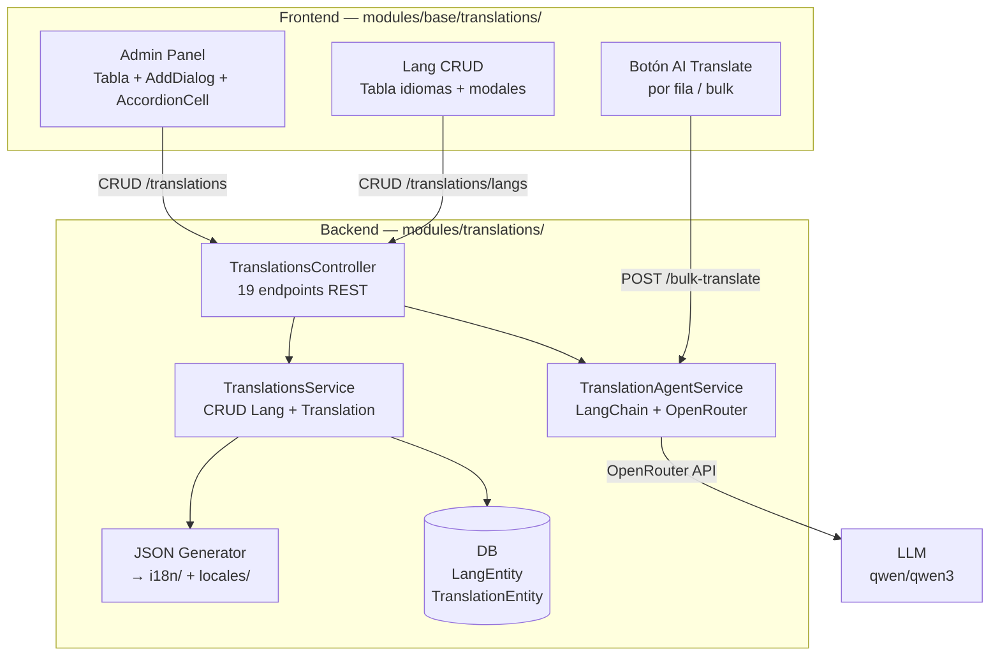
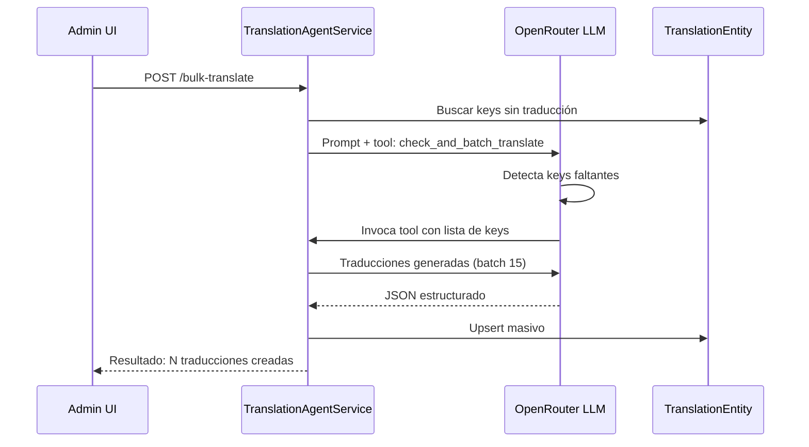

# Translations — Internacionalización

> [!info] Resumen Full-Stack
> Sistema i18n completo. **Backend** (`apps/back/src/modules/translations/`): traducciones en DB, generación JSON, traducción IA via OpenRouter + LangChain tools. **Frontend** (`apps/front/modules/base/translations/`): tabla de traducciones con edición multi-idioma, auto-traducción IA, panel admin de idiomas.

## Diagrama de Arquitectura



## Backend — `apps/back/src/modules/translations/`

### Estructura

```
translations/
├── translations.module.ts        # TypeORM + ConfigModule
├── translations.controller.ts    # 19 endpoints
├── translations.service.ts       # CRUD Lang + Translation, generación JSON
├── translation-agent.service.ts  # IA: OpenRouter + LangChain tools
├── dto/                          # create/update Lang y Translation, batch
├── infrastructure/
│   ├── entities/
│   │   ├── lang.entity.ts        # Tabla `lang`: code, name, flagCode, isActive
│   │   └── translation.entity.ts # Tabla `translation`: app, section, key, content, lang
│   └── seeds/translation-seed.service.ts
└── cli/                          # add-translation.ts, sync-translations.ts
```

### Entidades

| Entidad | Tabla | Campos |
|---------|-------|--------|
| `LangEntity` | `lang` | id, code (unique), name, flagCode, isActive |
| `TranslationEntity` | `translation` | id, app (front/back), section, key, content, lang (FK), entityName?, entityId?, category |

### Endpoints

#### Gestión de Idiomas

| Método | Ruta | Auth | Descripción |
|--------|------|------|-------------|
| `POST` | `/langs` | admin | Crear idioma |
| `GET` | `/langs` | Public | Listar idiomas |
| `PATCH` | `/langs/:id` | admin | Actualizar idioma |
| `DELETE` | `/langs/:id` | admin | Eliminar idioma |

#### Gestión de Traducciones

| Método | Ruta | Auth | Descripción |
|--------|------|------|-------------|
| `POST` | `/` | admin | Crear traducción |
| `POST` | `/dynamic/batch` | admin | Upsert masivo (max 50) |
| `GET` | `/` | Public | Listar (paginado, agrupado por app+section+key) |
| `PATCH` | `/:id` | admin | Actualizar traducción |
| `DELETE` | `/:id` | admin | Eliminar traducción |

#### Generación

| Método | Ruta | Auth | Descripción |
|--------|------|------|-------------|
| `POST` | `/generate` | admin | Generar JSON en `i18n/` y `locales/` |
| `POST` | `/sync` | admin | Alias de generate |

#### IA

| Método | Ruta | Auth | Descripción |
|--------|------|------|-------------|
| `POST` | `/translate-row` | admin | Traducir una combinación específica |
| `POST` | `/bulk-translate` | admin | Traducir TODAS las keys faltantes (batch 15) |
| `POST` | `/translate-entity` | admin | Traducir campo CMS |

#### Búsqueda

| Método | Ruta | Auth | Descripción |
|--------|------|------|-------------|
| `GET` | `/exact` | Public | Por app+section+key exactos |
| `GET` | `/exact-by-path` | Public | Por dotPath ("front.landing.hero.title") |
| `GET` | `/dynamic/:lang/:entityName/:entityId` | Public | Traducciones dinámicas por entidad |

### TranslationAgentService — IA



**Modelo**: `openrouter/free` via `ChatOpenAI` (configurable).  
**Tool Pattern**: El LLM usa una tool `check_and_batch_translate` que orquesta batch translation en un solo LLM call con JSON structured output.

### Generación de JSON

`POST /translations/generate`:
1. Lee todas las traducciones de DB
2. Agrupa por `app` y `section.key`
3. Soporta subcarpetas: `section:key` con `:` → `section/key.json`
4. Genera: `apps/back/src/i18n/<lang>/...` y `apps/front/locales/<lang>.json`

---

## Frontend — `apps/front/modules/base/translations/`

### Estructura

```
modules/base/translations/
├── nuxt.config.ts                    # Componentes con prefix Translations
├── components/
│   ├── AddTranslationDialog.vue      # Modal crear traducción
│   └── TranslationAccordionCell.vue  # Celda expandible multi-idioma
├── composables/
│   └── useTranslations.ts            # API: CRUD + generate + AI
├── plugins/
│   └── nav.ts                        # Menú "Translations" (admin-only)
└── pages/admin/translations/
    ├── index.vue                     # Tabla con DataTable + acciones
    └── langs/index.vue               # CRUD de idiomas
```

### Componentes

| Componente | Descripción |
|------------|-------------|
| `AddTranslationDialog` | Modal: section, key, lang (FormSelect), content (textarea). Emite `created` |
| `TranslationAccordionCell` | Celda expandible: colapsado = preview 1er idioma, expandido = textarea por idioma con persist on-blur + botón AI translate |

### Composable — `useTranslations`

```typescript
useTranslations() → {
  // Idiomas
  getLangs(), createLang(data), updateLang(id, data), deleteLang(id),
  // Traducciones
  getTranslations(filters), getExactTranslation(app, section, key),
  getExactTranslationByDotPath(path), createTranslation(data),
  updateTranslation(id, data), deleteTranslation(id),
  // Generación y AI
  generateJson(), bulkTranslate(), syncTranslations(),
}
```

### Páginas

| Ruta | Descripción |
|------|-------------|
| `admin/translations/` | Tabs Front/Back, DataTable con AccordionCell. Botones: Add, Auto-translate, Generate JSON, Sync |
| `admin/translations/langs/` | CRUD de idiomas con FormInput + FormSwitch |

## Dependencias

- `TypeOrmModule` — LangEntity + TranslationEntity
- `ConfigModule` — OpenRouter API key
- `@langchain/core` — LangChain tools y agents
- `ChatOpenAI` — Cliente OpenAI-compatible via OpenRouter

## Relaciones

- [[Foundation/Modulos/index|Módulos]] — Índice de módulos
- [[Foundation/Extensiones/CMS - Content Management System|CMS]] — Traducciones dinámicas de contenido
- [[Foundation/Modulos/UI App - Toolkit de Componentes|UI App]] — DataTable, FormInput, FormSwitch
