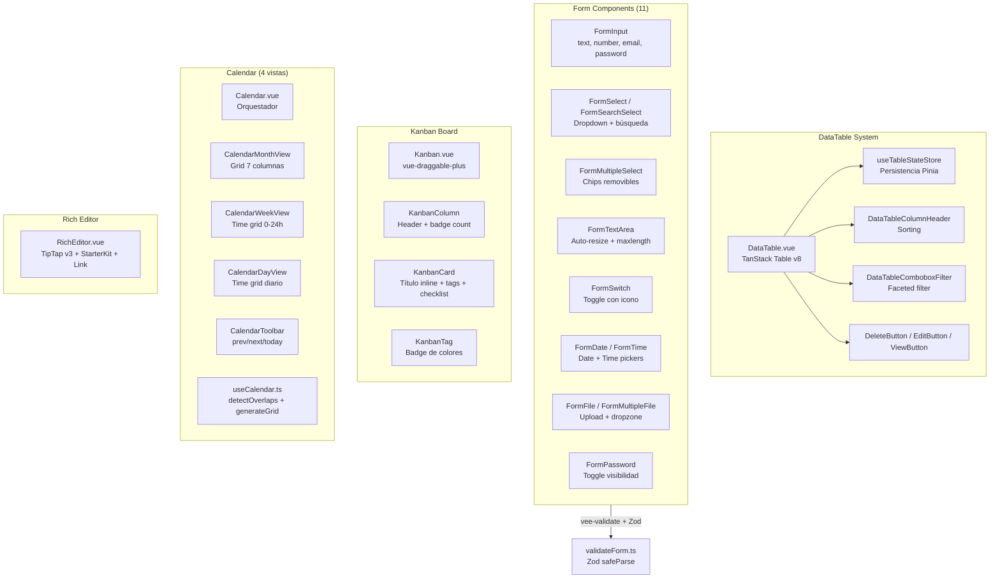

# UI App — Toolkit de Componentes

> [!info] Resumen
> Módulo **solo frontend** — no tiene contraparte backend. Es el toolkit visual de Foundation: DataTable avanzado, 11 componentes de formulario con validación Zod, Kanban board completo, Calendario con 4 vistas, y RichEditor WYSIWYG. Ubicado en `apps/front/modules/base/ui-app/`.

## Diagrama de Componentes



---

## DataTable

`DataTable.vue` — Componente genérico `<TData, TValue>` con **TanStack Table v8**.

### Props

| Prop | Tipo | Descripción |
|------|------|-------------|
| `columns` | `MyColumnDef[]` | Definición de columnas |
| `data` | `TData[]` | Datos modo client-side |
| `endpoint` | `string` | URL modo server-side (fetch automático) |
| `tableName` | `string` | Nombre para persistir estado en Pinia |
| `refreshKey` | `number` | Key para forzar refresh externo |
| `manual` | `boolean` | Paginación/sorting/filtros manejados por el padre |
| `total` | `number` | Total de registros en modo manual |

### Features

- **Sorting**: multi-columna, click en cabeceras
- **Filtering**: text, number, date, select, boolean, combobox (faceted)
- **Pagination**: server-side y client-side
- **Column visibility**: toggle on/off
- **Búsqueda global**: filtro de texto
- **Estado persistente**: `useTableStateStore` (Pinia, persistido por `tableName`)
- **Modo server-side**: `endpoint` prop → `useFetch` con query params automáticos

### Emits
- `edit(data)`, `properties(data)`, `row-click(rowOriginal)`

### Componentes auxiliares

| Componente | Descripción |
|------------|-------------|
| `DataTableColumnHeader` | Cabecera clickeable con ArrowUpDown |
| `DataTableComboboxFilter` | Dropdown con búsqueda, faceted filter |
| `SortableHeader` | Cabecera sortable simplificada |
| `DeleteButton` | Botón rojo Trash2, tooltip "Eliminar" |
| `EditButton` | Botón info Edit, tooltip "Editar" |
| `ViewButton` | Botón outline Eye, tooltip "Ver". Prop: `label` |

---

## Form Components — 11 Componentes

Basados en **vee-validate** + **Zod**. Registrados sin prefix (`<FormInput>`, `<FormSelect>`).

| Componente | Tipo | Props destacadas |
|------------|------|-----------------|
| `FormInput` | text, number, email, password | label, placeholder, required, disabled, error, description, icon slots |
| `FormSelect` | Select con búsqueda | label, options, showCreateButton, onCreateClick |
| `FormSearchSelect` | Select con búsqueda integrada | Similar a FormSelect |
| `FormMultipleSelect` | Multi-select + chips | label, options, modelValue (array) |
| `FormTextArea` | Textarea | rows, maxlength (counter), autoResize, resize |
| `FormSwitch` | Toggle switch | variant (icon/DaisyUI), showIcon |
| `FormDate` | Date picker nativo | label, placeholder, disabled |
| `FormTime` | Time picker nativo | label, placeholder, showIcon |
| `FormFile` | Input file simple | label, accept |
| `FormMultipleFile` | Dropzone drag & drop | label, accept, lista archivos con delete |
| `FormPassword` | Password + toggle visibilidad | label, Eye/EyeOff |

### Helpers

| Archivo | Propósito |
|---------|-----------|
| `validateForm.ts` | Zod `safeParse` + errores por path |
| `checkFileType.ts` | Verifica extensión contra lista permitida |

---

## Kanban Board

Sistema Kanban con **drag & drop** (vue-draggable-plus).

| Componente | Descripción |
|------------|-------------|
| `Kanban` | Tablero principal. Agrupa por estado. Slots: `empty-state`, `column-header`, `card-actions` |
| `KanbanColumn` | Columna con header + contador + cards + botón crear |
| `KanbanCard` | Tarjeta: título editable inline, tags, checklist expandible, prioridad, avatar, due date |
| `KanbanTag` | Badge de tag con color configurable |
| `UserAvatar` | Avatar imagen/iniciales + tooltip (nombre·email·rol) |

### Tipos

```typescript
interface KanbanTask {
  id, title, description, stateId, tags: KanbanTag[],
  assignee: KanbanAssignee, checklist: KanbanChecklistItem[],
  relatedTasks: KanbanTaskLink[], priority, dueDate, order, metadata, comments
}
```

---

## Calendar — 4 Vistas

| Componente | Props clave |
|------------|-------------|
| `Calendar` | `events`, `view`, `initialDate`, `loading`, `snapMinutes` |
| `CalendarToolbar` | `currentDate`, `view`, `title` |
| `CalendarMonthView` | Grid 7 cols, máx 3 eventos/celda, "+N más" |
| `CalendarWeekView` | Time grid 0-24h, all-day events, overlap detection |
| `CalendarDayView` | Time grid diario, all-day events, overlaps |
| `CalendarEvent` | Chip draggable con ghost visual teleported |

### Composable — `useCalendar.ts`
`generateMonthGrid`, `generateWeekGrid`, `getEventsForDay`, `detectOverlaps` (algoritmo de columnas), `calculateEventStyle`.

---

## RichEditor

`RichEditor.vue` — **TipTap v3** + StarterKit + Link.
- Toolbar: Bold, Italic, H1, H2, lists, blockquote, code block, link, undo/redo
- v-model emite HTML

---

## Páginas Demo

Disponibles solo en desarrollo (`/app/components/*`):

| Ruta | Demo |
|------|------|
| `data-table-demo` | DataTable |
| `form-components-demo` | Todos los Form* |
| `form-custom-demo` | Formularios custom |
| `kanban-demo` | Kanban board |
| `calendar-demo` | Calendar 4 vistas |
| `rich-editor-demo` | TipTap editor |

## Relaciones

- [[Foundation/Modulos/index|Módulos]] — Índice de módulos
- [[Foundation/Modulos/IAM - Identity y Access Management|IAM]] — FormInput, PasswordInput usados en auth forms
- [[Foundation/Modulos/Translations - Internacionalizacion|Translations]] — DataTable, FormInput, FormSwitch
- [[Foundation/Modulos/Error Tracker - Monitoreo de Errores|Error Tracker]] — DataTable en dashboard
- [[Foundation/Modulos/Storage - Sistema de Archivos|Storage]] — DataTable, FormSwitch, TableActionMenu
