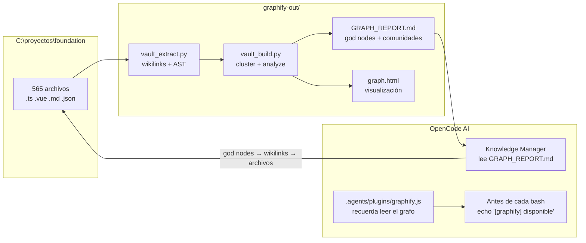

# Foundation — Documentación Técnica

> [!info] Propósito
> Esta carpeta contiene la documentación técnica detallada de **Foundation**, la plantilla modular SaaS sobre la que se construyen los proyectos del ecosistema SOM-OS. Cada módulo, extensión y subsistema está documentado con su propósito, endpoints, entidades, arquitectura y dependencias.

## Estructura de Documentación

| Carpeta | Contenido |
|---------|-----------|
| [[Foundation/Modulos/index|Modulos/]] | Módulos full-stack y solo backend: IAM, Users, Storage, Communications, Error Tracker, Translations, Billing, UI App |
| [[Foundation/Extensiones/index|Extensiones/]] | Sistema de extensiones + CMS + Stripe + Landing |
| [[Foundation/Core - Sistema de Núcleo|Core]] | Extension Loader, Conflict Detector, Dependency Resolver, Foundation Module |
| [[Foundation/Infraestructura - Base de Datos y Utilidades|Infraestructura]] | TypeORM Config, Mailer, Utils, Seeds, Migraciones |
| [[Foundation/Graphify - Knowledge Graph y OpenCode|Graphify + OpenCode]] | Cómo Graphify analiza Foundation y OpenCode lo consulta |

## Graphify + OpenCode

Foundation usa **Graphify** como knowledge graph. El pipeline es:



### Cómo funciona

1. **Graphify analiza Foundation** — extrae wikilinks, AST de código (clases, imports), y frontmatter. Genera un grafo con 1640 nodos, 1913 edges y 184 comunidades.

2. **El plugin `graphify.js`** — antes de cada comando bash en Foundation, OpenCode recibe un recordatorio: `"[graphify] Knowledge graph available. Read graphify-out/GRAPH_REPORT.md for god nodes and architecture context."`

3. **OpenCode consulta el grafo** — en lugar de leer 565 archivos (~212K palabras), lee `GRAPH_REPORT.md` para encontrar los god nodes (conceptos más conectados) y desde ahí navega por el código vía wikilinks e imports. Reducción de tokens: ~95%.

### Estado actual

| Proyecto | Archivos | Nodos | Edges | Comunidades |
|----------|----------|-------|-------|-------------|
| **Foundation** | 565 | 1,640 | 1,913 | 184 |
| **Vault SOM-OS.dev** | 98 | 128 | 355 | 12 |

### Regenerar

```bash
# En Foundation
pip install graphifyy
python graphify-out/vault_extract.py
python graphify-out/vault_build.py

# O via OpenCode skill
/graphify C:\proyectos\foundation
```

## Stack Tecnológico

| Capa | Tecnologías |
|------|-------------|
| **Monorepo** | Turborepo + pnpm |
| **Backend** | NestJS 11 + TypeORM + PostgreSQL + Redis + BullMQ + Passport JWT |
| **Frontend** | Nuxt 4 + Vue 3 + Tailwind CSS + DaisyUI + Pinia + TanStack Table |
| **Extensiones** | Sistema auto-descubrible con manifiestos, detección de conflictos, resolución de dependencias |
| **Infra** | Docker Compose (PostgreSQL, Redis, Mailpit) + Stripe + AWS S3 |
| **Email** | Nodemailer + BullMQ + Maizzle (Tailwind) |

## Arquitectura General

```
apps/
├── back/                      # NestJS 11 Backend
│   └── src/
│       ├── modules/           # Módulos de negocio (core features)
│       ├── extensions/        # Extensiones drop-in (auto-discovered)
│       ├── core/              # Sistema de núcleo (loader, conflict detector, etc.)
│       ├── infrastructure/    # DB, mailer, utils
│       └── config/            # Config factories
└── front/                     # Nuxt 4 Frontend
    └── modules/
        ├── landing/           # Páginas públicas (15 componentes)
        ├── base/
        │   ├── auth/          # Autenticación + RBAC
        │   ├── ui-app/        # Componentes UI (DataTable, Form, Kanban, Calendar)
        │   ├── translations/  # UI de gestión de i18n
        │   ├── error-tracker/ # Dashboard de errores
        │   └── storage/       # UI de gestión de archivos
```

## Relaciones

- [[Foundation]] — Visión general del proyecto (resumen ejecutivo)
- [[Atenfy]] — Construido sobre Foundation
- [[SOM Tap - Tarjeta de Visita Digital Inteligente|SOM Tap]] — Construido sobre Foundation
- [[CommitWear]] — Podría usar Foundation como base
- [[CanvasAPI]] — Podría usar Foundation como base
