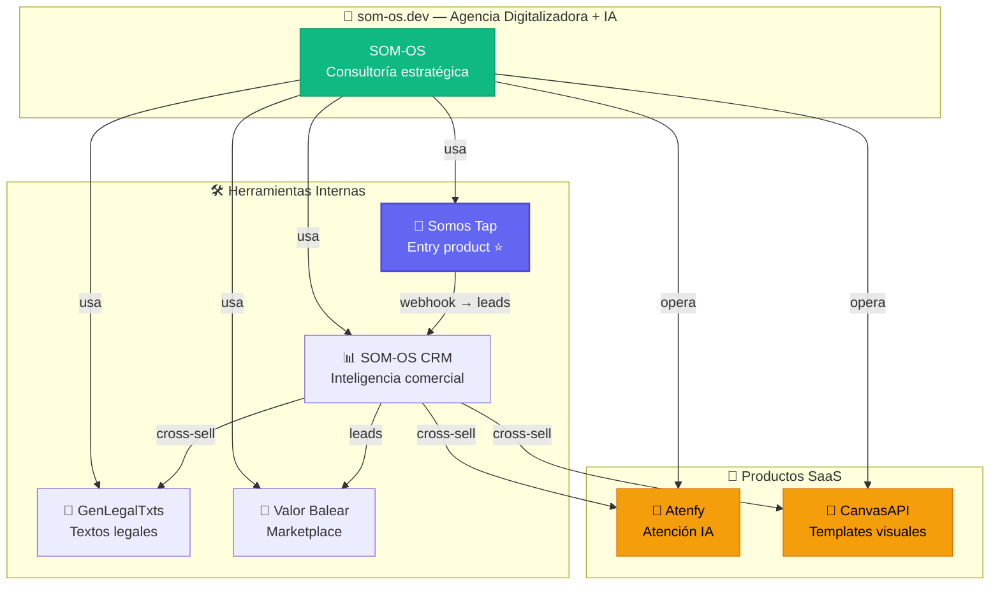
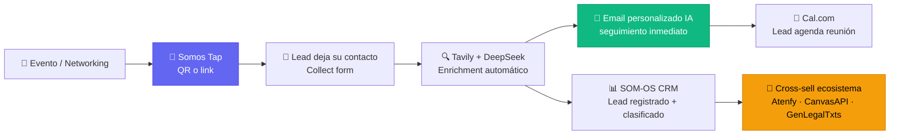
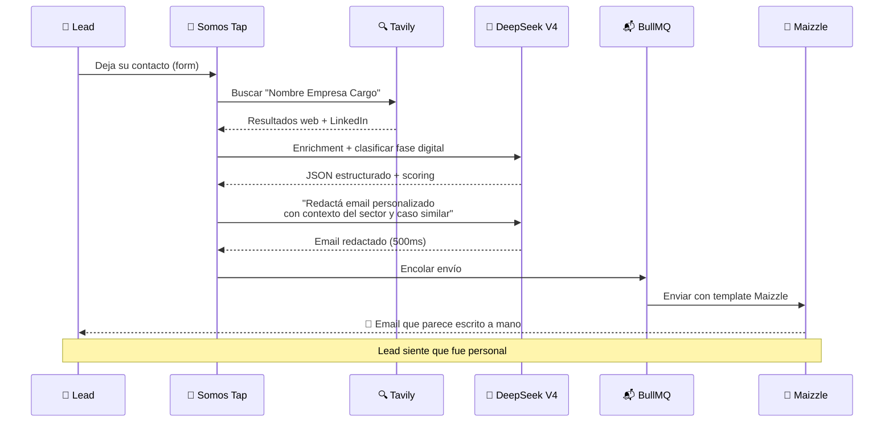
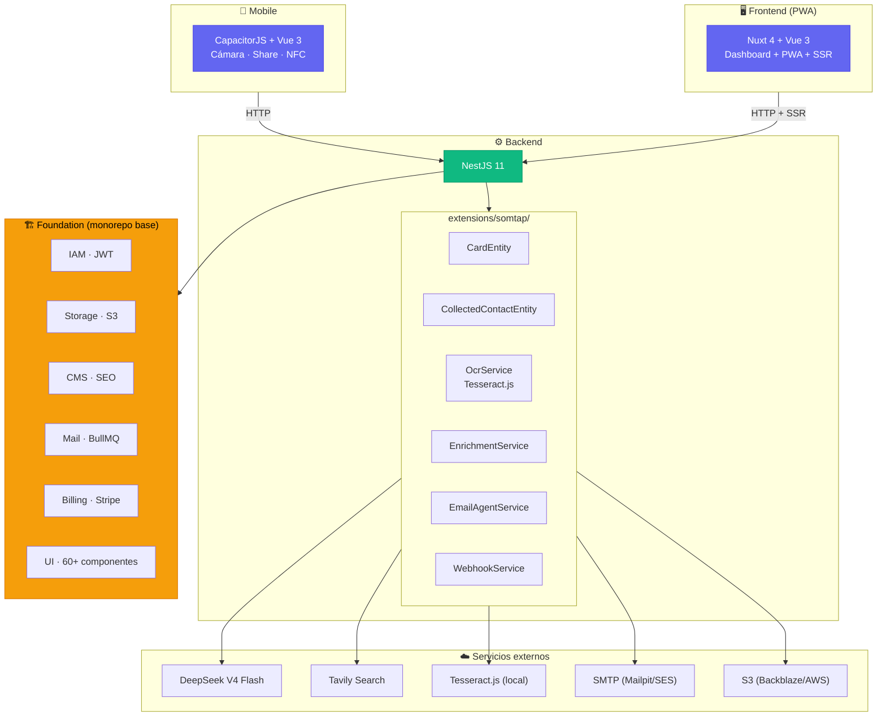
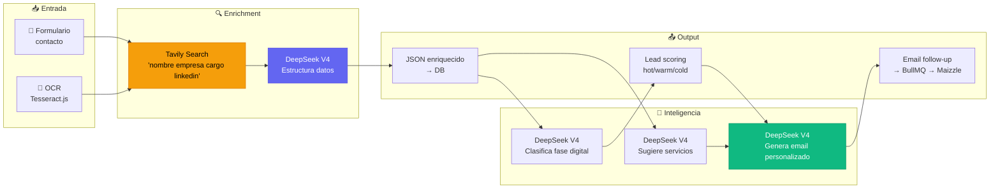
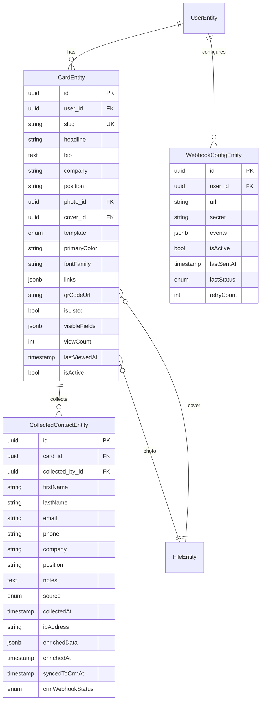
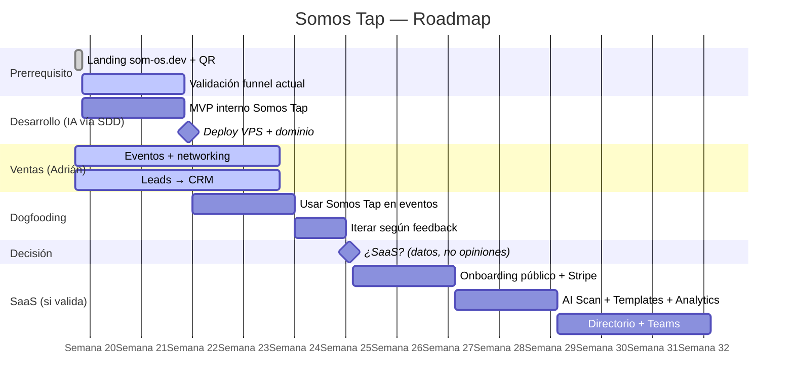

---
title: "Somos Tap - Tarjeta de Visita Digital Inteligente"
date: 2026-05-21
tags:
  - proyecto
  - prd
  - saas
  - mobile
  - networking
  - ia
  - foundation
  - nestjs
  - nuxt
  - capacitorjs
  - crm
  - webhooks
  - SOM-OS.dev
  - ecosistema
  - tesseract
  - deepseek
  - tavily
category: proyecto
status: diseño
description: "PRD completo de Somos Tap: tarjeta de visita digital con IA. Dominio somtap.app. Construido sobre Foundation (NestJS + Nuxt + CapacitorJS). OCR gratuito con Tesseract.js, IA con DeepSeek V4 Flash (~$0.001/lead). Webhooks nativos a cualquier CRM. Directorio global como add-on de pago (GDPR-compliant)."
---

# Somos Tap — Tarjeta de Visita Digital Inteligente

> [!info] Elevator Pitch
> Somos Tap es una **tarjeta de visita digital con IA** que reemplaza las tarjetas de papel. Compartí tu contacto al instante con un tap, recolectá leads automáticamente, y enriquecelos con IA — todo desde un dashboard central. Para profesionales y equipos que hacen networking y no quieren perder oportunidades. Simple, rápido de lanzar, **costes operativos casi cero**, y se integra con cualquier CRM vía webhooks. **Somos red. Somos Tap.**

> [!tip] Tagline
> **Somos Tap. Somos red.** — Un tap y estás conectado.

---

## 1. Análisis del producto de referencia (azzapp.com)

### 1.1 Qué es azzapp

azzapp.com es una plataforma de **digital business card** lanzada en 2026. Posicionada como "#1 Digital Business Card with AI". Disponible en iOS y Android, con dashboard web. Es el competidor directo a batir.

### 1.2 Features principales de azzapp

| Feature | Descripción |
|---------|-------------|
| **Share** | Compartir contacto instantáneamente vía QR, link, NFC |
| **Dynamic Design** | Diseño de tarjeta que refleja estilo personal y actividad profesional |
| **AI Scan** | Escanea tarjetas físicas, badges, firmas de email → contactos digitales |
| **Collect** | Recolecta contactos organizados por fecha/ubicación |
| **AI Enrichment** | Enriquece contactos con datos de IA (empresa, cargo, LinkedIn) |
| **Email Signature** | Firma de email dinámica. Un click → guardar contacto |
| **Teams** | Dashboard centralizado. Contactos se quedan aunque empleados se vayan |
| **Apps nativas** | iOS y Android |

### 1.3 Pricing de azzapp (modelo freemium)

- **Free**: crear tarjeta, compartir, recolectar contactos básico
- **Pro** (~$5-10/mes): AI enrichment, dynamic design avanzado, analytics
- **Teams** (~$15-30/seat/mes): dashboard centralizado, admin, contactos compartidos, CRM export

### 1.4 Competidores en el mercado

| Competidor | Diferenciador |
|------------|---------------|
| **azzapp** | IA-powered, diseño dinámico, apps iOS/Android |
| **HiHello** | Enfoque enterprise, QR + NFC físico |
| **Blinq** | Australia, pop-up digital card en lock screen |
| **Popl** | NFC tags + digital cards, muy B2C eventos |
| **Linlet** | Simple, QR-only, minimalista |
| **Wave** | NFC + app, enfoque networking eventos |

### 1.5 Debilidades de azzapp = oportunidades para Somos Tap

| Debilidad de azzapp | Cómo Somos Tap lo resuelve |
|---------------------|--------------------------|
| **Sin CRM nativo** — Solo export CSV. Sin pipeline. | **Webhooks nativos** → cualquier CRM. Integración directa con [[SOM-OS CRM - Motor de Inteligencia Comercial\|SOM-OS CRM]]. |
| **Sin webhooks** — No se integra automáticamente. | **Webhooks estándar** con HMAC. POST automático al recolectar contacto. |
| **IA superficial** — Enrichment básico, sin clasificación. | **DeepSeek V4 Flash** → clasifica fase digital, sugiere servicios, scoring. |
| **Sin directorio** — Sin red profesional, sin descubrimiento. | **Directorio global (add-on pago)** — encontrá profesionales por sector/ciudad. |
| **Costes de IA altos** — APIs propietarias. | **Tesseract.js (OCR gratis) + DeepSeek V4 Flash (~$0.001/lead)**. |
| **Seguimiento genérico** — Sin personalización post-contacto. | **Email personalizado por IA** — DeepSeek redacta un follow-up que parece escrito a mano, usando datos del contacto y contexto del sector. |

> [!tip] Oportunidad para SOM-OS.dev
> azzapp resuelve "compartir contacto" pero no "qué hago después". Somos Tap cierra el ciclo: **tap → contacto → CRM → outreach → propuesta**. La tarjeta es la puerta de entrada al ecosistema SOM-OS.

---

## 2. Propuesta de valor Somos Tap

### 2.1 ¿Por qué "Somos Tap"?

**Somos** encierra el ADN del producto y del ecosistema:

```
S O M O S   T A P
↑──┘          ↑
SOM            la acción
(la raíz)
```

"Somos" = comunidad, red, ecosistema. No es "yo tengo una tarjeta" — es **"somos una red, estamos conectados"**. Para un producto de networking B2B, este es el mensaje correcto: los negocios son relaciones entre personas.

Y **SOM** está literalmente dentro de la palabra. No hace falta ponerlo en el dominio — ya está en el ADN del nombre.



### 2.2 Diferenciación

| azzapp.com | Somos Tap |
|------------|-----------|
| Tarjeta digital aislada | **Puerta de entrada al ecosistema SOM-OS** |
| Export CSV a otro CRM | **Webhooks nativos a cualquier CRM** (incluido [[SOM-OS CRM - Motor de Inteligencia Comercial\|SOM-OS CRM]]) |
| IA con APIs propietarias caras | **DeepSeek V4 Flash a $0.20/1M tokens + Tesseract.js gratis** |
| OCR con servicios cloud (coste) | **Tesseract.js local — coste $0** |
| Sin directorio profesional | **Directorio global (add-on pago) — encontrá y sé encontrado** |
| SaaS genérico | **Integrado con todos los productos SOM-OS** |
| Sin offline | **CapacitorJS → local-first con sync** |

### 2.3 Por qué existe en el ecosistema

Somos Tap no es un producto aislado. Es el **top of funnel** del ecosistema:

```
Somos Tap (captura leads en eventos, ferias, día a día)
   ↓ webhook automático
SOM-OS CRM (enriquece, clasifica, outreach)
   ↓ cross-sell orgánico
Atenfy · CanvasAPI · GenLegalTxts · Valor Balear
```

Cada tap es un lead que entra al sistema. Cada lead enriquecido es una oportunidad de cross-sell. Somos Tap es **el anzuelo gratuito** que alimenta todo el ecosistema.



### 2.4 Email personalizado por IA — la killer feature

El verdadero diferenciador no es la tarjeta. Es lo que pasa **después** de que alguien deja su contacto.

```
Contacto recolectado
        ↓
   DeepSeek V4 Flash + Tavily enrichment
   (empresa, sector, cargo, fase digital)
        ↓
   EmailAgentService
   "Redactá un email de seguimiento personalizado para
    María García, CEO de Hotel Playa, sector turismo.
    Mencioná un caso similar en Baleares. Tono cálido,
    profesional, sin presión comercial. Incluí link de
    Cal.com para agendar 15 min."
        ↓
   Email generado en ~500ms, encolado en BullMQ,
   enviado por Maizzle template
        ↓
   El lead recibe un email que PARECE escrito a mano
```

**Ejemplo real del output:**

```
Asunto: "María, me alegró conectar en el evento"

Hola María,

Me alegró mucho conectar en el evento de ayer y conocer
un poco más sobre Hotel Playa.

Investigué un poco y vi que el sector turístico en Baleares
está pasando por una transformación digital interesante.
Justo trabajamos con un caso similar hace unos meses:
un hotel en Mallorca que automatizó todo su proceso de
reservas y atención al cliente con IA, reduciendo un 40%
el tiempo de respuesta.

Si te interesa profundizar, agendemos 15 minutos esta
semana sin compromiso:

[Link Cal.com]

Abrazo,
Adrián
```

**Por qué esto es 10x mejor que un PDF genérico:**

| PDF automático | Email personalizado IA |
|----------------|------------------------|
| Genérico, igual para todos | Custom por persona, empresa y sector |
| El lead se siente "uno más" | El lead se siente **especial** |
| Adjunto que no se lee | Email corto que sí se lee |
| Parece marketing masivo | Parece escrito a mano |
| 0% personalización | 100% contextual |

**Y lo mejor: vos no escribiste una palabra.** DeepSeek lo genera, BullMQ lo encola, Maizzle lo envía. El lead recibe un seguimiento personalizado mientras vos estás en otra reunión.



---

## 3. Features — MVP vs Futuro

### 3.1 MVP (2-3 semanas) — "Creá y compartí"

| # | Feature | Prioridad | Esfuerzo |
|---|---------|-----------|----------|
| F1 | **Crear tarjeta digital** — perfil público con foto, nombre, cargo, empresa, bio, links | P0 | 3h |
| F2 | **Dynamic Design** — 5 templates predefinidos, personalización de colores y tipografía | P0 | 4h |
| F3 | **QR único** — cada tarjeta genera QR + URL pública tipo `somtap.app/juanperez` | P0 | 1h |
| F4 | **Compartir** — botones nativos share (iOS/Android) + copiar link | P0 | 2h |
| F5 | **Collect** — formulario "dejame tu contacto" embebido en la tarjeta | P0 | 3h |
| F6 | **Auth + dashboard** — login, ver/editar tarjeta, ver contactos recolectados | P0 | Heredado de Foundation |
| F7 | **Email personalizado IA** — DeepSeek redacta follow-up custom por contacto. Envío automático vía BullMQ + Maizzle (Foundation). Incluye link de Cal.com. | P0 | 3h |
| F8 | **Export CSV** — exportar contactos recolectados | P0 | 1h |
| F9 | **Webhooks** — POST a URL configurable cada vez que alguien deja su contacto | P0 | 2h |
| F10 | **App móvil (CapacitorJS)** — wrapper nativo de la PWA, cámara para QR scan | P1 | 4h |
| | **TOTAL MVP** | | **~23h** |

### 3.2 Fase 2 (semanas 4-6) — "Inteligencia"

| # | Feature | Prioridad | Esfuerzo |
|---|---------|-----------|----------|
| F10 | **AI Scan (Tesseract.js)** — cámara escanea tarjeta física → OCR local → contacto digital | P1 | 5h |
| F11 | **AI Enrichment (DeepSeek V4 Flash + Tavily)** — busca LinkedIn, empresa, cargo | P1 | 3h |
| F12 | **Email Signature** — HTML dinámico para Gmail/Outlook con CTA "guardar contacto" | P1 | 3h |
| F13 | **Analytics** — vistas de tarjeta, clicks en links, contactos recolectados | P1 | 2h |
| F14 | **Lead scoring básico** — clasifica contacto como hot/warm/cold según señales | P2 | 2h |

### 3.3 Fase 3 (semanas 7-12) — "Red y ecosistema"

| # | Feature | Prioridad | Esfuerzo |
|---|---------|-----------|----------|
| F15 | **Teams** — dashboard de equipo, admin, contactos compartidos | P2 | 8h |
| F16 | **Directorio global** — buscá profesionales por nombre, sector, ciudad. Opt-in, GDPR-compliant. **Directorio incluido en Pro. Boost (+€3/mes) da prioridad en resultados.** | P2 | 15h |
| F17 | **Integración SOM-OS CRM** — push automático de contactos al CRM del ecosistema | P2 | 3h |
| F18 | **NFC tags** — vender/comprar tarjetas NFC programables | P3 | 3h |
| F19 | **Marca blanca** — custom domain, logo, colores para agencias | P3 | 5h |
| F20 | **Offline-first** — guardar contactos localmente, sync cuando haya conexión | P3 | 6h |

#### F16 — Directorio Global (detalle)

El directorio es un **complemento de pago** que se contrata aparte o como parte del plan Pro+. NO está en el plan Free.

**Modelo de visibilidad:**

| Plan | Aparece en directorio | Puede buscar | Prioridad |
|------|----------------------|--------------|-----------|
| Free | ❌ | ❌ | — |
| **Pro (€5/mes)** | ✅ Opt-in | ✅ Búsqueda y filtros | Estándar |
| **Pro + Boost (+€3/mes)** | ✅ Opt-in | ✅ | **Prioritario (primeros resultados) + badge "Destacado"** |
| **Teams (€10/seat)** | ✅ Verificado (badge) | ✅ | **Prioritario incluido** |

**GDPR compliance:**

```
✔ Opt-in EXPLÍCITO — checkbox desmarcado por defecto
✔ Consentimiento granular — usuario elige qué campos mostrar
✔ Finalidad clara — "para que otros profesionales te encuentren"
✔ Derecho al olvido — un click para salir del directorio
✔ Delete account = fuera del directorio automáticamente
✔ Sin scraping ni importación masiva
✔ Datos en servidores EU (Hetzner/Contabo)
```

**Campos visibles (control del usuario):**

| Campo | Default | Control |
|-------|---------|---------|
| Nombre y apellidos | ✅ Mostrar | On/Off |
| Foto | ✅ Mostrar | On/Off |
| Empresa y cargo | ✅ Mostrar | On/Off |
| Sector | ✅ Mostrar | On/Off |
| Ciudad | ✅ Mostrar | On/Off |
| Email | ❌ Oculto | Solo si usuario activa |
| Teléfono | ❌ Oculto | Solo si usuario activa |
| Links (LinkedIn, web) | ✅ Mostrar | On/Off |

**Filtros de búsqueda:**
- Por nombre/empresa (búsqueda textual)
- Por sector/industria
- Por ciudad/país
- Por plan (Free/Pro/Teams) — para priorizar verified

**Por qué en Fase 3 y no antes:** El directorio necesita masa crítica (>300 usuarios Pro) para ser útil. Sin suficientes perfiles, los resultados de búsqueda son vacíos y la feature no aporta valor. Además añade complejidad de moderación (perfiles falsos, spam).

---

## 4. Stack técnico

### 4.1 Arquitectura general



### 4.2 Lo que Foundation YA resuelve

| Necesidad | Componente Foundation | % hecho |
|-----------|----------------------|---------|
| Auth (JWT + social) | `modules/iam/` | 100% |
| Perfil de usuario | `UserEntity` (firstName, lastName, email, avatar) | 90% |
| Almacenamiento | `modules/storage/` (S3, FileEntity, attachments) | 100% |
| CMS / landing pública | `modules/cms/` (páginas, SEO, templates) | 90% |
| Email | Maizzle + BullMQ + EmailQueueModule | 100% |
| Billing (Stripe) | `modules/billing/` | 100% |
| Formularios | 11 Form components (vee-validate + Zod) | 100% |
| DataTable | TanStack Table (sorting, pagination, filtering) | 100% |
| Error tracking | `modules/error-tracker/` (Telegram notifier) | 100% |
| i18n (ES/EN) | `modules/translations/` | 100% |
| Componentes UI | DataTable, RichEditor, Kanban, Calendar, Auth, Landing | 100% |

### 4.3 Lo que se construye nuevo

| Componente | Ubicación | Stack | Esfuerzo |
|-----------|-----------|-------|----------|
| **CardEntity** + **ContactEntity** | `extensions/somtap/` | NestJS + TypeORM | 1h |
| **CRUD backend** (controller, service, DTO) | `extensions/somtap/` | NestJS + Zod | 3h |
| **Página pública de tarjeta** | `apps/front/pages/t/[slug].vue` | Nuxt 3 (SSR) | 3h |
| **Dashboard frontend** | `modules/somtap/` (Nuxt layer) | Nuxt 3 + Vue 3 + Pinia | 5h |
| **Editor de tarjeta** | `modules/somtap/components/` | Vue 3 + TipTap + vee-validate | 4h |
| **WebhookService** | `extensions/somtap/services/` | NestJS + HttpModule | 1h |
| **CollectForm** (embebido) | `apps/front/components/` | Vue 3 | 2h |
| **CapacitorJS wrapper** | `apps/mobile/` | CapacitorJS 6 + Nuxt | 4h |
| **QR generator** (server-side) | `extensions/somtap/utils/` | `qrcode` npm | 0.5h |
| | **TOTAL** | | **~23.5h** |

### 4.4 CapacitorJS — ¿por qué, no React Native?

| Criterio | CapacitorJS | React Native / Expo |
|----------|-------------|---------------------|
| **Skill existente** | Vue 3 (mismo equipo, misma codebase) | Requiere React |
| **Code sharing** | 95% del código compartido con Nuxt | ~0% (rewrite completo) |
| **Velocidad MVP** | Dias | Semanas |
| **Plugins nativos** | Cámara, share sheet, NFC, contactos | Lo mismo |
| **Mantenimiento** | Un solo codebase | Dos codebases |
| **PWA offline** | Mismo PWA sirve sin app store | No |

### 4.5 OCR con Tesseract.js — coste cero

```typescript
// extensions/somtap/services/ocr.service.ts
import Tesseract from 'tesseract.js';

@Injectable()
export class OcrService {
  async scanBusinessCard(imageBuffer: Buffer): Promise<ScannedContact> {
    const { data } = await Tesseract.recognize(imageBuffer, 'spa+eng', {
      logger: (m) => this.logger.debug(`OCR progress: ${m.progress}`),
    });
    return this.structureWithAI(data.text);
  }

  private async structureWithAI(rawText: string): Promise<ScannedContact> {
    const prompt = `Extract structured contact info from this business card OCR text:
    "${rawText}"
    Return JSON: { firstName, lastName, email, phone, company, position }`;
    const response = await this.deepseek.complete(prompt);
    return JSON.parse(response);
  }
}
```

| Criterio | Tesseract.js (local) | Google Vision / AWS Textract |
|----------|----------------------|------------------------------|
| **Coste** | **$0** | $1.50/1000 imágenes |
| **Offline** | ✅ | ❌ |
| **Privacidad** | Datos nunca salen del dispositivo | Se envían a servidores externos |
| **Calidad** | 90%+ para texto impreso | 99%+ |

> [!note] Tesseract.js + DeepSeek V4 Flash
> Tesseract extrae el texto crudo. DeepSeek estructura los datos. Coste: ~200 tokens → **$0.00004 por tarjeta escaneada**.

### 4.6 IA con DeepSeek V4 Flash — costes reales

| Servicio | Modelo | Función | Coste por lead |
|----------|--------|---------|---------------|
| OCR (Tesseract.js) | — | Escanea tarjeta física → texto | **$0 (local)** |
| Structure (DeepSeek) | V4 Flash | Estructura texto OCR → JSON | ~$0.00004 |
| Enrichment (DeepSeek) | V4 Flash | Investiga empresa, LinkedIn, cargo | ~$0.0006 |
| Phase Classifier | V4 Flash | Clasifica fase digital, sugiere servicios | ~$0.0001 |
| Content Agent | V4 Flash | Genera headline + bio sugerida | ~$0.0003 |
| **Email Agent** | V4 Flash | Redacta email de seguimiento personalizado por contacto, empresa y sector | ~$0.0005 |
| **TOTAL por lead** | | | **~$0.0015** |

Comparado con azzapp (~$0.02-0.04/lead): **Somos Tap es 20-40x más barato en IA.**

#### Pipeline de enrichment: Tavily + DeepSeek V4 Flash

```
Email/nombre del contacto
        ↓
   Tavily Search
   "María García CEO Empresa X linkedin"
        ↓
   Resultados web (LinkedIn, web empresa, noticias)
        ↓
   DeepSeek V4 Flash
   "Estructura estos datos en JSON: nombre, cargo,
    empresa, sector, linkedin, bio corta"
        ↓
   JSON → CollectedContactEntity.enrichedData
```

| Alternativa | Tipo | Coste | ¿Sirve? |
|-------------|------|-------|---------|
| **Tavily** | Search semántico | Free 1000/mes | ✅ Ideal |
| **Brave Search API** | Search web | Free 2000/mes | ⚠️ Fallback |
| **Clearbit** | Enrichment B2B | $99/mes | ✅ Pero caro para MVP |
| **Apollo.io API** | Base datos B2B | Free tier generoso | ✅ Fase 3 |
| **Hunter.io** | Búsqueda email | Free 25/mes | ⚠️ Solo emails |

> [!tip] Estrategia de enrichment
> **MVP:** Tavily Free (1000/mes) + DeepSeek V4 Flash. **Fase 3:** Apollo.io como fuente B2B primaria, Tavily como fallback.



### 4.7 Base de datos — nuevas entidades



```typescript
CardEntity {
  id: UUID
  user: ManyToOne<UserEntity>
  slug: string UNIQUE           // "juanperez" → somtap.app/juanperez
  headline: string?
  bio: text?
  company: string?
  position: string?
  photo: ManyToOne<FileEntity>?
  coverImage: ManyToOne<FileEntity>?
  template: enum                // minimal | professional | creative | bold | dark
  primaryColor: string?
  fontFamily: string?
  links: jsonb?                 // [{ type, url, label }]
  qrCodeUrl: string?

  // Directorio (Fase 3) — opt-in
  isListed: boolean             // false por defecto
  visibleFields: jsonb?         // ["name", "company", "city"] — qué mostrar

  viewCount: number
  lastViewedAt: timestamp?
  isActive: boolean
  createdAt, updatedAt, deletedAt
}

CollectedContactEntity {
  id: UUID
  card: ManyToOne<CardEntity>
  collectedBy: ManyToOne<UserEntity>
  firstName: string?
  lastName: string?
  email: string?
  phone: string?
  company: string?
  position: string?
  notes: text?
  source: enum                  // qr | link | email_signature | manual | ai_scan
  collectedAt: timestamp?
  ipAddress: string?
  userAgent: string?
  enrichedData: jsonb?
  enrichedAt: timestamp?
  syncedToCrmAt: timestamp?
  crmWebhookStatus: enum?       // pending | sent | failed
  createdAt, updatedAt
}
```

### 4.8 Webhooks — integración universal

```typescript
WebhookConfigEntity {
  id: UUID
  user: ManyToOne<UserEntity>
  url: string
  secret: string                // HMAC SHA256
  events: jsonb                 // ["contact.created", "contact.enriched"]
  isActive: boolean
  lastSentAt: timestamp?
  lastStatus: enum?
  retryCount: number
}

// Payload estándar
{
  event: "contact.created",
  timestamp: "2026-05-21T10:30:00Z",
  data: {
    id: "uuid", firstName: "Maria", lastName: "Garcia",
    email: "maria@empresa.com", phone: "+34600000000",
    company: "Empresa SL", position: "CEO",
    source: "qr", cardUrl: "https://somtap.app/adrian",
    collectedAt: "2026-05-21T10:29:00Z"
  },
  signature: "hmac-sha256-hex"
}
```

---

## 5. Modelo de negocio

### 5.1 Planes

| Plan | Precio | Qué incluye |
|------|--------|-------------|
| **Free** | €0 | 1 tarjeta, 3 templates, 50 contactos/mes, QR, compartir |
| **Pro** | €5/mes | Tarjetas ilimitadas, todos los templates, AI enrichment, analytics, email signature, webhooks, 1000 contactos/mes, **directorio incluido** (aparecés y buscás) |
| **Pro + Boost** | **+€3/mes (€8 total)** | Todo Pro + **prioridad en resultados de búsqueda** del directorio (primeros resultados) + badge "Destacado" |
| **Teams** | €10/seat/mes | Todo Pro + Boost incluido + dashboard equipo, admin, contactos compartidos, badge verificado, marca blanca |

### 5.2 Unit economics

| Métrica | Mes 1-3 | Mes 4-6 | Mes 7-12 |
|---------|---------|---------|----------|
| Usuarios free | 200 | 500 | 1500 |
| Pro | 3% (6) | 4% (20) | 5% (75) |
| Pro + Boost | 0 | 25% de Pro (5) | 35% de Pro (26) |
| Teams (orgs × seats) | 0 | 1 × 3 = 3 | 5 × 4 = 20 |
| **MRR** | **€30** | **€100 + €15 + €30 = €145** | **€375 + €78 + €200 = €653** |

| Coste | Mes 1-3 | Mes 4-6 | Mes 7-12 |
|-------|---------|---------|----------|
| Infra (VPS) | €15 | €25 | €50 |
| DeepSeek V4 Flash | €1 | €3 | €10 |
| Tesseract.js | **€0** | **€0** | **€0** |
| Dominio + SSL | €1 | €1 | €1 |
| **Coste total** | **€17** | **€29** | **€61** |
| **Beneficio** | **€13** | **€119** | **€604** |

### 5.3 Comparativa de costes: Somos Tap vs azzapp

| Línea | azzapp (estimado) | Somos Tap | Diferencia |
|-------|-------------------|-----------|------------|
| OCR | API cloud ~$0.01/scan | Tesseract.js: **$0** | **∞** |
| AI Enrichment | ~$0.02-0.04/lead | DeepSeek V4 Flash: **~$0.001/lead** | **20-40x** |
| Infra | Cloud managed (AWS/GCP) | VPS propio (Hetzner) | **3-5x** |
| **Coste 1000 leads** | **~$20-40** | **~$1** | **20-40x** |

### 5.4 Ventaja estratégica real

1. **Top of funnel** → leads que alimentan el ecosistema
2. **Virality loop** → cada tarjeta compartida = adquisición gratuita
3. **Network effect** → directorio global: más usuarios = más valor
4. **Costes casi cero** → el plan Free puede ser generoso sin perder dinero
5. **Entry product** → producto más simple del ecosistema, puerta a todo lo demás

Un lead de Somos Tap → cliente de consultoría SOM-OS.dev (€3000-15000/proyecto). Coste de adquisición: **€0.001**.

---

## 6. Plan de implementación

### Estrategia: SDD delegado a IA + validación en paralelo

> [!tip] Filosofía de desarrollo
> **El código lo escribe la IA vía SDD (Spec-Driven Development).** Adrián dirige, revisa y valida. La IA implementa. Esto significa que el desarrollo de Somos Tap no compite con el tiempo de venta/consultoría — corre en paralelo mientras Adrián está en eventos, reuniones y proyectos.
>
> **Vos vendés. La IA construye. En paralelo. Sin coste de oportunidad.**

### Prerrequisito — Semana 0 (antes del MVP)

```
[ ] Landing simple som-os.dev
    - Quién es Adrián / SOM-OS
    - 3 servicios concretos con resultados
    - Botón "Agendar reunión" (Cal.com)
    - QR físico impreso con link a la landing
    Tiempo: 3h (IA vía SDD o manual rápido)

[ ] Validación de funnel actual
    - Ir a eventos con QR físico → landing → Cal.com
    - Medir: ¿cuántos escanean? ¿cuántos agendan?
    - Si 10+ leads/mes entran por este canal → justifica Somos Tap
```

### Fase 1: MVP interno (Semana 1-2) — IA construye

```
La IA (SDD) desarrolla:
  [ ] Fork/setup desde Foundation
  [ ] CardEntity + CollectedContactEntity + migración
  [ ] CRUD backend NestJS (extensions/somtap/)
  [ ] Página pública /t/[slug] con 1 template profesional
  [ ] QR code generator
  [ ] Dashboard mínimo: ver/editar tarjeta, ver contactos
  [ ] Collect form embebido en la tarjeta
  [ ] EmailAgentService: DeepSeek redacta follow-up personalizado
  [ ] Envío automático vía BullMQ + Maizzle (Foundation)
  [ ] WebhookConfigEntity + WebhookService
  [ ] Deploy a VPS (Hetzner CX22 ~€4/mes)
  [ ] Dominio somtap.app configurado

Adrián en paralelo:
  [ ] Sigue yendo a eventos, capturando leads
  [ ] Alimenta el CRM (Google Sheets → futuro SOM-OS CRM)
  [ ] Cierra proyectos de consultoría (€€€ real)
```

### Fase 2: Dogfooding + Iteración (Semana 3-4) — Validación real

```
[ ] Usar Somos Tap en eventos reales
    - Adrián comparte su tarjeta → collect → email IA → seguimiento
    - Medir: ¿cuántos leads entran por Somos Tap?
    - Medir: ¿tasa de respuesta a los emails personalizados IA?

[ ] Iterar según feedback
    - ¿El email IA suena genuino o robótico?
    - ¿La tarjeta carga rápido en mobile?
    - ¿El collect form tiene fricción?
    - Ajustar prompts de DeepSeek según respuesta real

[ ] Decisión: ¿abrir al público?
    - Si 10+ leads/mes entran POR la app → SaaS viable
    - Si <5 leads/mes → mantener como herramienta interna, no SaaS
```

### Fase 3: SaaS (Semanas 5-8) — Solo si validó

```
La IA (SDD) desarrolla:
  [ ] Onboarding público (registro, crear tarjeta sin fricción)
  [ ] Planes de pricing (Stripe — ya está en Foundation)
  [ ] 5 templates de diseño
  [ ] AI Scan con Tesseract.js
  [ ] Email Signature HTML dinámico
  [ ] Analytics dashboard
  [ ] CapacitorJS wrapper (App Store)

  (Directorio global + Teams + Marca blanca → Fase 4, post-tracción)
```

### Timeline visual



---

## 7. Decisiones de diseño

### 7.1 ¿Por qué "Somos Tap"?

"Somos" = comunidad, red. SOM está dentro de la palabra. Es la identidad correcta para un producto de networking B2B: los negocios son relaciones entre personas. "Tap" es la acción inmediata de compartir. Juntos: **somos la red que se activa con un tap**.

### 7.2 ¿Por qué `somtap.app` y no subdominio?

Dominio `.app` propio, independiente del ecosistema. Funciona como producto standalone. Si mañana se vende o hace spin-off, no depende de `som-os.dev`. Sin guiones, 10 caracteres, memorable.

### 7.3 ¿Por qué slug y no subdominio?

`somtap.app/juanperez` vs `juanperez.somtap.app`. El slug no requiere DNS wildcard + SSL por subdominio. Funciona sin configuración extra.

### 7.4 ¿Por qué CapacitorJS y no React Native?

95% code sharing con Nuxt. Mismo equipo, misma codebase. MVP en días, no semanas.

### 7.5 ¿Por qué Tesseract.js y no Google Vision?

Coste cero. Offline. Privacidad. 90%+ calidad para tarjetas de visita. DeepSeek pule el 10% restante.

### 7.6 ¿Por qué webhooks y no integración directa con CRM?

Desacoplamiento total. Cualquier CRM que acepte POST se integra en 5 minutos.

### 7.7 ¿Por qué el directorio es add-on de pago y no parte del plan base?

Tres razones: (1) es una feature de alto valor que justifica el upsell, (2) necesita masa crítica — no tiene sentido regalarla si no hay suficientes perfiles, (3) el paywall reduce perfiles falsos y spam (barrera de entrada).

### 7.8 ¿Por qué el directorio es opt-in y no automático?

GDPR. Sin consentimiento explícito, publicar datos personales en un directorio buscable es ilegal en Europa. El opt-in con consentimiento granular es la única forma de hacerlo bien. Además, genera confianza: el usuario decide exactamente qué mostrar.

### 7.9 ¿Por qué DeepSeek V4 Flash y no OpenAI?

Misma calidad a 1/3 del precio. Independencia de proveedor. 128K tokens de contexto.

### 7.10 ¿Por qué SDD delegado a IA y no desarrollo manual?

El desarrollo manual compite con la actividad principal de la agencia: vender y hacer consultoría. Con SDD, la IA escribe el código mientras Adrián genera pipeline. Las 23h de desarrollo del MVP no son 23h de Adrián — son 23h de IA corriendo en segundo plano. **Sin coste de oportunidad.**

### 7.11 ¿Por qué email personalizado IA y no PDF genérico?

Un PDF genérico dice "esto es automático, sos uno más en mi lista". Un email que menciona tu empresa, tu sector y un caso similar dice "esto lo escribió una persona que investigó sobre mí". Con DeepSeek V4 Flash generando el email en 500ms, el coste marginal de personalizar es cero. **La diferencia entre "spam" y "seguimiento genuino" son 200 tokens de IA.**

### 7.12 ¿Por qué herramienta interna primero y SaaS después?

Validar antes de escalar. Si la herramienta no funciona ni para Adrián (que es el usuario ideal: carismático, técnico, con red), no va a funcionar para un desconocido. El SaaS se abre solo cuando los datos confirman que el funnel convierte. **El dogfooding salva de construir un producto que nadie pidió.**

---

## 8. Lo que NO se construye (y por qué)

| Ítem | Motivo |
|------|--------|
| NFC tags físicos en MVP | Logística de envío. Fase 3. |
| App nativa (Swift/Kotlin) | CapacitorJS cubre el 95%. |
| Marketplace de templates | 5 templates bien diseñados > 50 malos. |
| CRM interno completo | El [[SOM-OS CRM - Motor de Inteligencia Comercial\|SOM-OS CRM]] lo resuelve. Webhooks mediante. |
| Recomendaciones "gente que quizás conozcas" | Cruza la línea a red social. Riesgo GDPR. |
| Directorio en plan Free | Sin masa crítica no sirve. Sin paywall atrae spam. |
| Scraping masivo de contactos | Ilegal sin consentimiento. Riesgo GDPR enorme. |
| IA generativa para bio/foto | La bio la escribe el usuario. Foto real > IA generada. |
| PDF genérico de agencia | **Reemplazado por email personalizado IA.** El email contextual convierte 10x más que un PDF masivo. |

---

## 9. Riesgos y mitigaciones

| Riesgo | Prob | Impacto | Mitigación |
|--------|------|---------|------------|
| **Baja adopción** | Media | Alto | Adrián y Joan Toni como primeros usuarios. Eventos SOM-OS.dev. |
| **Competencia** (azzapp, HiHello) | Alta | Medio | Nicho hispanohablante + webhooks + costes ultra bajos + directorio. |
| **GDPR — directorio** | Media | Alto | Opt-in estricto. Consentimiento granular. Derecho al olvido. EU servers. |
| **GDPR — contactos** | Media | Alto | Consentimiento explícito al recolectar. Checkbox desmarcado. |
| **App Store rechazo** | Baja | Medio | CapacitorJS aceptado si aporta funcionalidad nativa (cámara, NFC). |
| **Tesseract.js rendimiento** | Media | Bajo | Web worker. Si lento en mobile → backend queue. |
| **Directorio vacío** | Alta | Medio | No lanzar hasta 300+ usuarios Pro. Badge "verified" para atraer. |
| **Spam en directorio** | Media | Medio | Paywall (€3/mes) es barrera. ModQueue. Report system. |
| **Canibaliza SOM-OS CRM** | Baja | Bajo | Complementarios. Top-of-funnel vs mid/bottom-of-funnel. |

---

## 10. Métricas de éxito

| Métrica | Mes 1 | Mes 3 | Mes 6 |
|---------|-------|-------|-------|
| Tarjetas creadas | 50 | 300 | 1000 |
| Contactos recolectados | 100 | 800 | 3000 |
| Usuarios Pro | 5 | 30 | 100 |
| Pro + Directorio | 0 | 10 | 40 |
| Teams | 0 | 3 | 15 |
| Perfiles en directorio | 0 | 40 | 140 |
| MRR | €25 | €180 | €665 |
| Leads → SOM-OS CRM | 10 | 50 | 150 |
| Coste IA total | €1 | €3 | €10 |
| **Coste por lead** | **€0.01** | **€0.004** | **€0.003** |

---

## 11. Relaciones con el ecosistema SOM-OS

| Proyecto | Relación |
|----------|----------|
| [[Foundation]] | **Base técnica.** Somos Tap es extensión del monorepo Foundation. |
| [[SOM-OS CRM - Motor de Inteligencia Comercial]] | **Destino natural de leads.** Webhook push automático. |
| [[Atenfy]] | **Cross-sell.** Leads con fricción en atención al cliente. |
| [[CanvasAPI]] | **Templates visuales.** Templates de tarjeta dinámicos. |
| [[GenLegalTxts]] | **Cross-sell.** Leads sin textos legales. |
| [[Valor Balear]] | **Caso de uso.** Artesanos/productores en ferias. |
| [[Naming - Tarjeta de Visita Digital (SOM Tap)]] | **Exploración de naming.** Matriz de decisión completa. |

---

## 12. Dominio y naming

> [!note] Ver [[Naming - Tarjeta de Visita Digital (SOM Tap)|exploración completa de naming]] con matriz de decisión y 12 alternativas evaluadas.

| Recurso | Valor |
|---------|-------|
| **Producto** | Somos Tap |
| **Tagline** | Somos Tap. Somos red. |
| **Tagline ES** | Un tap y estás conectado. |
| **Dominio principal** | `somtap.app` ✅ disponible |
| **Dominio backup** | `som-tap.app` ✅ disponible |
| **URL de tarjeta** | `somtap.app/juanperez` |
| **Submódulo Foundation** | `extensions/somtap/` |
| **Nuxt layer** | `modules/somtap/` |
| **App Store name** | Somos Tap |
| **Slug público** | `/t/:slug` |

---

*PRD actualizado el 21 de mayo de 2026. Somos Tap es el entry product del ecosistema SOM-OS: tarjeta digital → CRM → cross-sell. Costes ultra bajos con Tesseract.js + DeepSeek V4 Flash. Directorio global como network effect de pago. Dominio propio somtap.app. Simple, rápido, imparable.*
