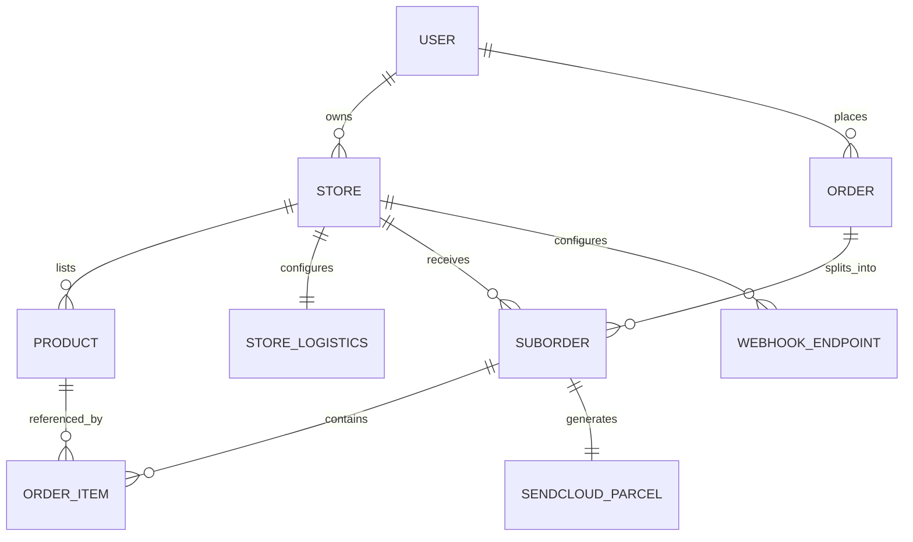

# Valor Balear

> [!info] Visión general
> **Valor Balear** es un marketplace de productos locales auténticos de las Islas Baleares. Conecta artesanos y productores baleares con clientes de toda España, permitiendo descubrir y comprar productos de gastronomía y artesanía que transmiten la cultura balear. Los negocios solo se preocupan de crear valor con su producto; la plataforma se encarga del resto.

## Concepto

Los productos baleares están **desconectados** de las redes sociales y del alcance digital. Gente de fuera de las islas no llega a estos productos. Valor Balear resuelve esto creando un marketplace exclusivo donde:

- Se venden **productos auténticos de aquí**, para que los clientes se impregnen de la cultura
- No es "otro marketplace más" — es el canal de ventas de los productos baleares
- Los negocios solo se preocupan de **generar valor con el producto**
- La plataforma se encarga de **visibilidad, logística, pagos y tecnología**

## Categorías

| Categoría | Ejemplos |
|-----------|----------|
| **Gastronomía** | Ensaimadas, sobrasada, quesos, vinos, hierbas, aceite, dulces tradicionales |
| **Artesanía** | Cerámica, joyería tradicional, textiles, cuero, madera, vidrio |

> [!note] Scope deliberado
> Se descartó agroturismo y servicios para mantener el foco en **productos físicos locales auténticos**.

## Monetización

**Modelo: Porcentaje de comisión por venta**

- El cliente paga el precio del producto + envío
- Stripe Connect hace el split automático:
  - X% → Valor Balear (comisión de la plataforma)
  - Resto → Cuenta del artesano
- Los artesanos no necesitan facturar a la plataforma; el split es automático
- Transparente para el cliente

> [!warning] Ventaja frente a modelo de suscripción
> Con comisión por venta, el artesano solo paga cuando vende. No hay barrera de entrada (setup fee ni mensualidad). Esto facilita la adopción.

## Stack Tecnológico

> [!tip] Construido sobre [[Foundation]]
> Se parte del monorepo Foundation y se añaden las features específicas del marketplace.

| Capa | Tecnología | Propósito |
|------|------------|-----------|
| **Monorepo** | Turborepo + pnpm | Task runner, gestión de paquetes |
| **Backend** | NestJS 11 + TypeORM 0.3 | API, lógica de negocio, ORM |
| **Base de datos** | PostgreSQL 17 | Datos del marketplace |
| **Frontend** | Nuxt 4 + Vue 3 | SSR, marketplace y dashboard |
| **UI** | Tailwind CSS 4 + DaisyUI 5 | Componentes accesibles y consistentes |
| **Colas / Jobs** | BullMQ + Redis | Webhooks, emails, llamadas asíncronas a Sendcloud |
| **Pagos** | Stripe Connect | Split de pagos multi-vendor |
| **Logística** | Sendcloud API | Etiquetas, tracking, recogidas |
| **Email** | Nodemailer + Maizzle | Transaccionales (pedidos, envíos) |
| **File Storage** | S3 / Local | Fotos de productos, etiquetas PDF |
| **i18n** | @nuxtjs/i18n | Español, catalán, inglés |

## Flujo del Usuario (End-to-End)

### A. Cliente compra
```
Cliente navega /productos
  ↓
Añade ensaimada (Tienda A) + collar cerámica (Tienda B)
  ↓
Carrito agrupa visualmente por tienda
  ↓
Checkout: 1 dirección, 1 pago total
  ↓
Stripe Connect procesa pago
  ↓
Sistema crea 1 Order global + 2 SubOrders
  ↓
Cliente recibe email con OrderID global
  + enlaces de seguimiento separados (Tienda A, Tienda B)
```

### B. Artesano gestiona pedido
```
Artesano entra a /dashboard
  ↓
Ve solo sus SubOrders (nunca ve los de otros)
  ↓
Prepara el paquete
  ↓
Clic "Generar Etiqueta"
  ↓
NestJS llama a Sendcloud:
  • Si Recogida: programa pickup en horario configurado
  • Si Drop-off: solo genera etiqueta PDF
  ↓
Artesano imprime etiqueta y pega en caja
  ↓
Espera al transportista o lleva al punto de entrega
```

### C. Motor de Webhooks
```
NestJS detecta SubOrder_X de Tienda A pagado
  ↓
Job en Redis: disparar webhooks
  ↓
Worker busca URLs configuradas para Tienda A
  ↓
POST a la URL del vendedor con datos del sub-pedido
  ↓
CRM/ERP del vendedor recibe evento y actualiza stock
```

## Arquitectura Multi-Vendor

> [!important] Split por tienda
> Un pedido global se divide obligatoriamente en **sub-pedidos por tienda**. Cada artesano ve solo su sub-pedido. Esto protege la privacidad del cliente y simplifica la logística.

### Diagrama de entidades



### Entidades clave

#### 1. Usuarios y Tiendas

**User**
- `id`, `email`, `password`, `role` (ADMIN, VENDOR, CUSTOMER)
- `firstName`, `lastName`, `phone`

**Store**
- `id`, `userId` (FK al vendedor)
- `name`, `slug` (URL amigable), `description`
- `story` — historia del artesano (clave para transmitir cultura)
- `logoUrl`, `bannerUrl`
- `address`, `city`, `zipCode`, `island` (Mallorca, Menorca, Ibiza, Formentera)
- `isActive`, `stripeAccountId` (Stripe Connect account)

**StoreLogistics**
- `id`, `storeId` (FK)
- `prefersDropoff` (boolean)
- `pickupTimeStart`, `pickupTimeEnd` (horario de recogida)
- `pickupDays` (array de días disponibles)

#### 2. Catálogo

**Product**
- `id`, `storeId` (FK)
- `name`, `description`, `shortDescription`
- `price` (decimal), `stock` (int)
- `weightGrams` (vital para Sendcloud calcular envío)
- `category` (GASTRONOMY, CRAFTS)
- `subcategory` (ej: SOBRASADA, ENSAIMADA, CERAMICA, JOYERIA)
- `images` (array de URLs)
- `isActive`, `isFeatured`

#### 3. Pedidos (Multi-Vendor)

**Order** (pago del cliente)
- `id`, `customerId` (FK a User)
- `totalAmount`, `stripePaymentIntentId`
- `status` (PENDING, PAID, CANCELLED, REFUNDED)
- `shippingAddressSnapshot` (JSON: nombre, calle, ciudad, CP, teléfono)
- `createdAt`, `updatedAt`

**SubOrder** (vista del artesano)
- `id`, `orderId` (FK), `storeId` (FK)
- `subtotalAmount`, `commissionAmount`, `payoutAmount`
- `status` (PENDING, PROCESSING, SHIPPED, DELIVERED, CANCELLED)
- `sendcloudParcelId`, `trackingUrl`, `shippingLabelUrl`
- `shippingCost` (calculado por Sendcloud)

**OrderItem**
- `id`, `subOrderId` (FK), `productId` (FK)
- `quantity`, `unitPriceAtPurchase`, `totalPrice`

#### 4. Motor de Webhooks

**WebhookEndpoint**
- `id`, `storeId` (FK)
- `url`, `secretKey` (para firmar payloads HMAC)
- `events` (array: suborder.paid, suborder.shipped, suborder.delivered)
- `isActive`, `createdAt`

**WebhookEvent** (log de envíos)
- `id`, `endpointId` (FK)
- `eventType`, `payload` (JSON)
- `status` (SUCCESS, FAILED, RETRYING)
- `httpStatusCode`, `responseBody`
- `attemptCount`, `nextRetryAt`
- `createdAt`, `deliveredAt`

## Vistas del Frontend (Nuxt)

### Públicas (Marketplace)

| Ruta | Descripción |
|------|-------------|
| `/` | Home: destacados, historia del marketplace, categorías |
| `/productos` | Grid con filtros (isla, precio, categoría, subcategoría) |
| `/producto/:id` | Detalle del producto, historia del creador, galería, añadir al carrito |
| `/tienda/:slug` | Perfil del artesano: historia, productos, datos de contacto |
| `/checkout` | Carrito + pasarela de pago Stripe (agrupado por tienda) |
| `/confirmacion/:orderId` | Confirmación post-compra con tracking |
| `/blog` | Artículos sobre cultura balear, recetas, artesanos destacados |
| `/blog/:slug` | Artículo individual |

### Privadas (Dashboard Vendedor)

| Ruta | Descripción |
|------|-------------|
| `/dashboard` | Resumen: ventas, pedidos pendientes, ingresos, comisiones |
| `/dashboard/productos` | CRUD de productos (con upload de imágenes) |
| `/dashboard/pedidos` | Lista de SubOrders. Botón "Generar Etiqueta" + imprimir |
| `/dashboard/ingresos` | Historial de pagos recibidos, comisiones pagadas |
| `/dashboard/ajustes/tienda` | Nombre, descripción, historia, logo, banner |
| `/dashboard/ajustes/logistica` | Dirección de origen, horarios de recogida, preferencia pickup/drop-off |
| `/dashboard/ajustes/webhooks` | Añadir URLs, seleccionar eventos, ver logs de envíos |
| `/dashboard/ajustes/pagos` | Conectar cuenta Stripe Connect |

### Admin (Valor Balear)

| Ruta | Descripción |
|------|-------------|
| `/admin/tiendas` | Gestión de tiendas (aprobar, suspender) |
| `/admin/pedidos` | Todos los pedidos globales |
| `/admin/comisiones` | Reporte de ingresos por comisión |
| `/admin/blog` | Gestión de contenido del blog |

## Logística con Sendcloud

### ¿Qué cubre Sendcloud?
- Generación de etiquetas de envío (PDF)
- Tracking de paquetes
- Programación de recogidas
- Múltiples transportistas (Correos, SEUR, GLS, etc.)

### ¿Cómo funciona la recogida?
Sendcloud permite programar una recogida en la dirección del remitente (el taller del artesano). El artesano configura su horario de disponibilidad y Sendcloud coordina con el transportista.

### ¿Y si el artesano prefiere llevarlo?
**Drop-off**: El artesano genera la etiqueta, la pega y lleva el paquete a una oficina de correos o punto de entrega. No requiere recogida programada.

### Alcance
- **Envíos dentro de Baleares**: Automatizado vía Sendcloud
- **Envíos a España peninsular**: También vía Sendcloud (sin necesidad de certificados especiales para productos estándar)
- **Envíos internacionales**: Fuera de scope inicial

### Integración NestJS → Sendcloud
```
POST /api/v2/parcels
{
  "parcel": {
    "name": "Cliente Final",
    "address": "Calle...",
    "city": "...",
    "postal_code": "...",
    "country": "ES",
    "weight": "500"
  },
  "from_address": {
    "name": "Tienda del Artesano",
    "address": "...",
    "city": "...",
    "postal_code": "...",
    "country": "ES"
  }
}
```

Si el artesano eligió recogida:
```
POST /api/v2/pickups
{
  "pickup": {
    "parcel_ids": ["parcel_id"],
    "pickup_from": "10:00",
    "pickup_until": "14:00",
    "pickup_address": { ... }
  }
}
```

## Pagos con Stripe Connect

### ¿Por qué Stripe Connect?
- **Split automático** del pago entre plataforma y vendedor
- El cliente paga **una sola vez** aunque el carrito tenga productos de varias tiendas
- Stripe distribuye los fondos a cada cuenta de vendedor
- El vendedor recibe el dinero directo en su cuenta bancaria
- Valor Balear recibe su comisión automáticamente

### Flujo de pago
```
Cliente paga 50€ (ensaimada 20€ + collar 30€)
  ↓
Stripe Connect recibe 50€
  ↓
Split automático:
  • Tienda A (ensaimada): 18€ (20€ - 10% comisión)
  • Tienda B (collar): 27€ (30€ - 10% comisión)
  • Valor Balear: 5€ (comisión total)
  • Stripe fees: ~1.5€
```

### Onboarding del vendedor
1. Artesano se registra en Valor Balear
2. Redirigido a Stripe Connect onboarding (KYC simplificado)
3. Stripe crea una "Connected Account" para el vendedor
4. El vendedor recibe pagos directo a su cuenta bancaria

## Motor de Webhooks

### ¿Por qué webhooks?
Los vendedores ya tienen sus propios sistemas (ERP, CRM, hojas de cálculo, apps de stock). Los webhooks les permiten integrar Valor Balear sin abandonar sus herramientas.

### Eventos disponibles

| Evento | Descripción | Payload |
|--------|-------------|---------|
| `suborder.paid` | Sub-pedido pagado | Datos del sub-pedido + items + dirección |
| `suborder.processing` | Artesano marcó como "en preparación" | SubOrder ID + timestamp |
| `suborder.shipped` | Etiqueta generada, enviado | Tracking URL + Sendcloud parcel ID |
| `suborder.delivered` | Paquete entregado | Fecha de entrega + confirmación |
| `suborder.cancelled` | Pedido cancelado | Razón de cancelación |
| `product.stock_low` | Stock bajo del mínimo | Product ID + stock actual |

### Seguridad
Cada webhook se firma con HMAC-SHA256 usando una `secretKey` única por tienda:
```
Header: X-ValorBalear-Signature: sha256=<hash>
Body: { "event": "suborder.paid", "data": { ... } }
```
El CRM del vendedor verifica la firma para confirmar que viene de Valor Balear.

### Reintentos
Si el webhook falla (HTTP != 2xx):
1. Reintento 1: inmediato
2. Reintento 2: 5 minutos
3. Reintento 3: 30 minutos
4. Reintento 4: 2 horas
5. Reintento 5: 6 horas
6. Después: marcado como FAILED, notificación al vendedor

## Promoción y Visibilidad

### Estrategia de contenido
- **Blog**: Artículos sobre cultura balear, recetas tradicionales, entrevistas a artesanos, guías de islas
- **Redes sociales**: Instagram y TikTok con storytelling de los productos y sus creadores
- **SEO**: Cada producto y tienda optimizada para búsquedas ("comprar ensaimada Mallorca", "artesanía Menorca online")

### Newsletter
- Suscripciones por email
- Campañas semanales: "Producto de la semana", "Nueva tienda en Valor Balear"

## Roadmap Sugerido

### Fase 1 — MVP (2-3 meses)
- [ ] Setup del monorepo desde Foundation
- [ ] Auth + roles (admin, vendor, customer)
- [ ] Catálogo de productos (CRUD vendedor)
- [ ] Carrito + checkout básico
- [ ] Stripe Connect integración
- [ ] SubOrders (split por tienda)
- [ ] Emails transaccionales (pedido confirmado, enviado)

### Fase 2 — Logística (1 mes)
- [ ] Integración Sendcloud
- [ ] Generación de etiquetas
- [ ] Tracking de envíos
- [ ] Recogida programada + Drop-off

### Fase 3 — Webhooks + API (1 mes)
- [ ] Motor de webhooks
- [ ] Dashboard de webhooks para vendedores
- [ ] Logs y reintentos

### Fase 4 — Contenido + SEO (continuo)
- [ ] Blog
- [ ] Perfiles de tiendas enriquecidos
- [ ] Optimización SEO
- [ ] Campañas en redes sociales

### Fase 5 — Escalar (futuro)
- [ ] App móvil (PWA primero)
- [ ] Sistema de reseñas
- [ ] Programa de fidelización
- [ ] Envíos internacionales

## Relaciones

- Parte del ecosistema SOM-U
- Construido sobre [[Foundation]] como base técnica (monorepo NestJS + Nuxt)
- Complementa [[Atenfy]] para atención al cliente automatizada
- Podría usar [[CanvasAPI]] para generar contenido visual de marketing
- [[GenLegalTxts]] puede proveer textos legales (términos y condiciones, privacidad)
