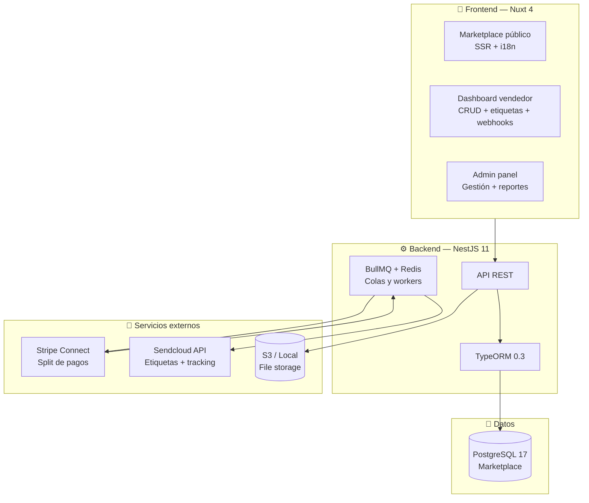
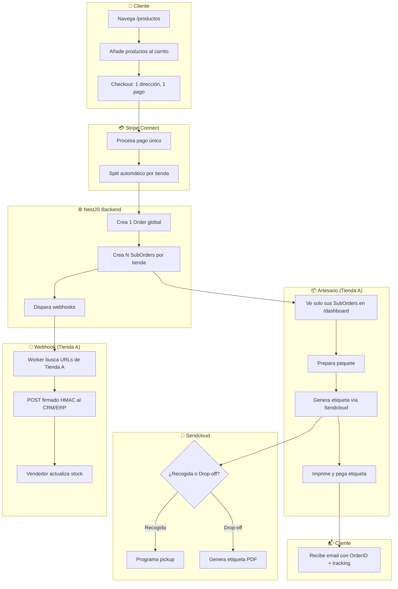
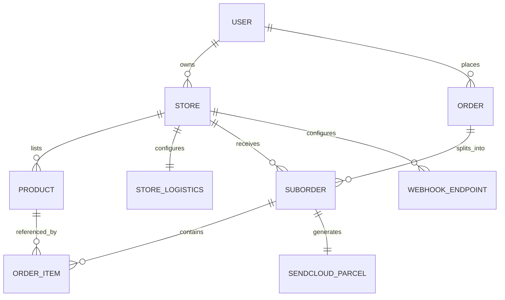
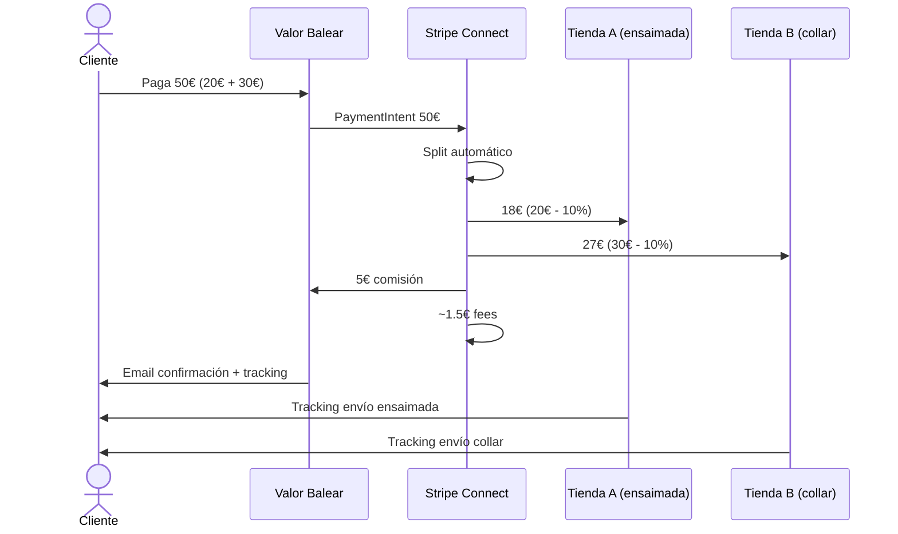
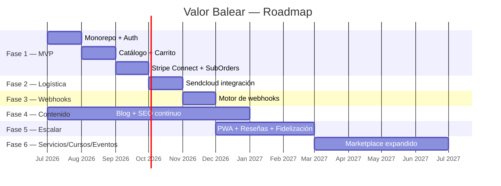
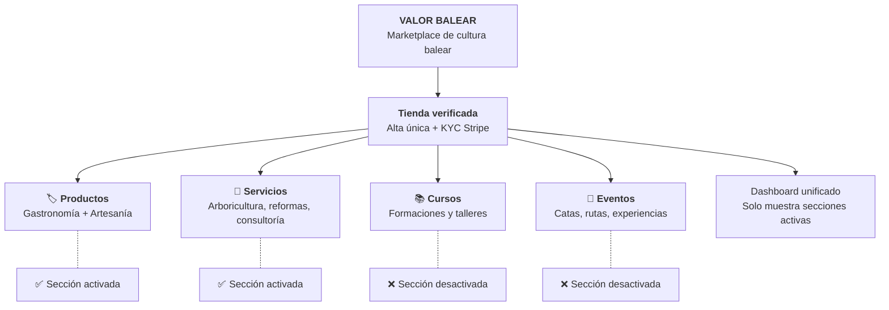
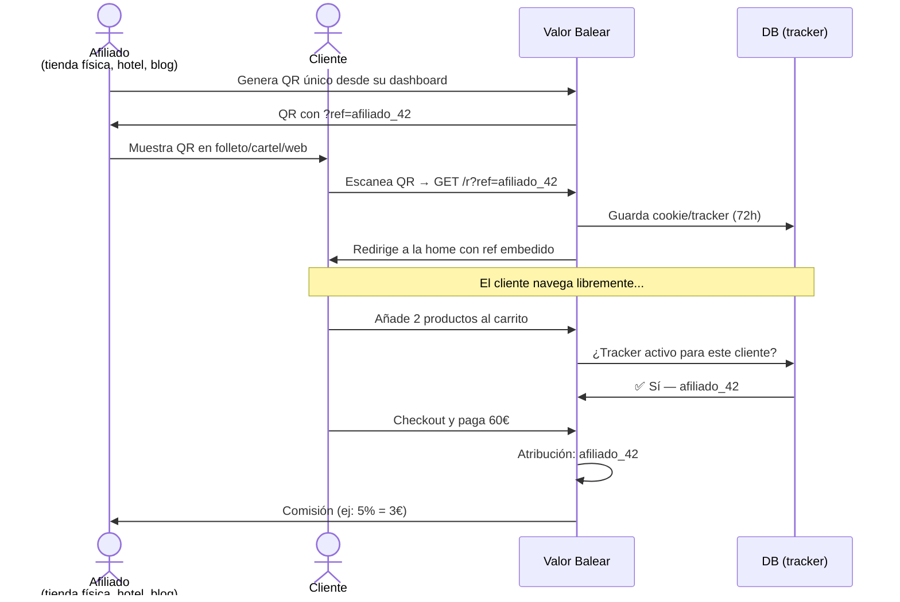
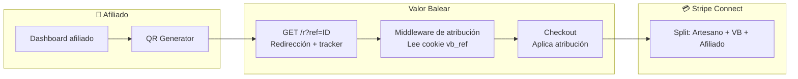

# Valor Balear

> [!info] Visión general
> **Valor Balear** es un marketplace de productos locales auténticos de las Islas Baleares. Conecta artesanos y productores baleares con clientes de toda España, permitiendo descubrir y comprar productos de gastronomía y artesanía que transmiten la cultura balear. Los negocios solo se preocupan de crear valor con su producto; la plataforma se encarga del resto.

## Concepto

Los productos baleares están **desconectados** de las redes sociales y del alcance digital. Gente de fuera de las islas no llega a estos productos. Valor Balear resuelve esto creando un marketplace exclusivo donde:

- Se venden **productos auténticos de aquí**, para que los clientes se impregnen de la cultura
- No es "otro marketplace más" — es el canal de ventas de los productos baleares
- Los negocios solo se preocupan de **generar valor con el producto**
- La plataforma se encarga de **visibilidad, logística, pagos y tecnología**

## Categorías

| Categoría | Ejemplos |
|-----------|----------|
| **Gastronomía** | Ensaimadas, sobrasada, quesos, vinos, hierbas, aceite, dulces tradicionales |
| **Artesanía** | Cerámica, joyería tradicional, textiles, cuero, madera, vidrio |

> [!note] Scope del MVP
> La Fase 1 se enfoca en **productos físicos locales auténticos** (gastronomía y artesanía). Servicios, cursos y eventos se incorporan en fases posteriores como expansión natural del marketplace (ver [[#Fase 6 — Servicios, Cursos y Eventos autóctonos|Fase 6]]).

## Monetización

**Modelo: Porcentaje de comisión por venta**

- El cliente paga el precio del producto + envío
- Stripe Connect hace el split automático:
  - X% → Valor Balear (comisión de la plataforma)
  - Resto → Cuenta del artesano
- Los artesanos no necesitan facturar a la plataforma; el split es automático
- Transparente para el cliente

> [!warning] Ventaja frente a modelo de suscripción
> Con comisión por venta, el artesano solo paga cuando vende. No hay barrera de entrada (setup fee ni mensualidad). Esto facilita la adopción.

## Stack Tecnológico

> [!tip] Construido sobre [[Foundation]]
> Se parte del monorepo Foundation y se añaden las features específicas del marketplace.

### Diagrama de arquitectura



| Capa | Tecnología | Propósito |
|------|------------|-----------|
| **Monorepo** | Turborepo + pnpm | Task runner, gestión de paquetes |
| **Backend** | NestJS 11 + TypeORM 0.3 | API, lógica de negocio, ORM |
| **Base de datos** | PostgreSQL 17 | Datos del marketplace |
| **Frontend** | Nuxt 4 + Vue 3 | SSR, marketplace y dashboard |
| **UI** | Tailwind CSS 4 + DaisyUI 5 | Componentes accesibles y consistentes |
| **Colas / Jobs** | BullMQ + Redis | Webhooks, emails, llamadas asíncronas a Sendcloud |
| **Pagos** | Stripe Connect | Split de pagos multi-vendor |
| **Logística** | Sendcloud API | Etiquetas, tracking, recogidas |
| **Email** | Nodemailer + Maizzle | Transaccionales (pedidos, envíos) |
| **File Storage** | S3 / Local | Fotos de productos, etiquetas PDF |
| **i18n** | @nuxtjs/i18n | Español, catalán, inglés |

## Flujo del Usuario (End-to-End)

### A. Cliente compra
```
Cliente navega /productos
  ↓
Añade ensaimada (Tienda A) + collar cerámica (Tienda B)
  ↓
Carrito agrupa visualmente por tienda
  ↓
Checkout: 1 dirección, 1 pago total
  ↓
Stripe Connect procesa pago
  ↓
Sistema crea 1 Order global + 2 SubOrders
  ↓
Cliente recibe email con OrderID global
  + enlaces de seguimiento separados (Tienda A, Tienda B)
```

### B. Artesano gestiona pedido
```
Artesano entra a /dashboard
  ↓
Ve solo sus SubOrders (nunca ve los de otros)
  ↓
Prepara el paquete
  ↓
Clic "Generar Etiqueta"
  ↓
NestJS llama a Sendcloud:
  • Si Recogida: programa pickup en horario configurado
  • Si Drop-off: solo genera etiqueta PDF
  ↓
Artesano imprime etiqueta y pega en caja
  ↓
Espera al transportista o lleva al punto de entrega
```

### C. Motor de Webhooks
```
NestJS detecta SubOrder_X de Tienda A pagado
  ↓
Job en Redis: disparar webhooks
  ↓
Worker busca URLs configuradas para Tienda A
  ↓
POST a la URL del vendedor con datos del sub-pedido
  ↓
CRM/ERP del vendedor recibe evento y actualiza stock
```

### Diagrama de flujo completo



## Arquitectura Multi-Vendor

> [!important] Split por tienda
> Un pedido global se divide obligatoriamente en **sub-pedidos por tienda**. Cada artesano ve solo su sub-pedido. Esto protege la privacidad del cliente y simplifica la logística.

### Diagrama de entidades



### Entidades clave

#### 1. Usuarios y Tiendas

**User**
- `id`, `email`, `password`, `role` (ADMIN, VENDOR, CUSTOMER)
- `firstName`, `lastName`, `phone`

**Store**
- `id`, `userId` (FK al vendedor)
- `name`, `slug` (URL amigable), `description`
- `story` — historia del artesano (clave para transmitir cultura)
- `logoUrl`, `bannerUrl`
- `address`, `city`, `zipCode`, `island` (Mallorca, Menorca, Ibiza, Formentera)
- `isActive`, `stripeAccountId` (Stripe Connect account)

**StoreLogistics**
- `id`, `storeId` (FK)
- `prefersDropoff` (boolean)
- `pickupTimeStart`, `pickupTimeEnd` (horario de recogida)
- `pickupDays` (array de días disponibles)

#### 2. Catálogo

**Product**
- `id`, `storeId` (FK)
- `name`, `description`, `shortDescription`
- `price` (decimal), `stock` (int)
- `weightGrams` (vital para Sendcloud calcular envío)
- `category` (GASTRONOMY, CRAFTS)
- `subcategory` (ej: SOBRASADA, ENSAIMADA, CERAMICA, JOYERIA)
- `images` (array de URLs)
- `isActive`, `isFeatured`

#### 3. Pedidos (Multi-Vendor)

**Order** (pago del cliente)
- `id`, `customerId` (FK a User)
- `totalAmount`, `stripePaymentIntentId`
- `status` (PENDING, PAID, CANCELLED, REFUNDED)
- `shippingAddressSnapshot` (JSON: nombre, calle, ciudad, CP, teléfono)
- `createdAt`, `updatedAt`

**SubOrder** (vista del artesano)
- `id`, `orderId` (FK), `storeId` (FK)
- `subtotalAmount`, `commissionAmount`, `payoutAmount`
- `status` (PENDING, PROCESSING, SHIPPED, DELIVERED, CANCELLED)
- `sendcloudParcelId`, `trackingUrl`, `shippingLabelUrl`
- `shippingCost` (calculado por Sendcloud)

**OrderItem**
- `id`, `subOrderId` (FK), `productId` (FK)
- `quantity`, `unitPriceAtPurchase`, `totalPrice`

#### 4. Motor de Webhooks

**WebhookEndpoint**
- `id`, `storeId` (FK)
- `url`, `secretKey` (para firmar payloads HMAC)
- `events` (array: suborder.paid, suborder.shipped, suborder.delivered)
- `isActive`, `createdAt`

**WebhookEvent** (log de envíos)
- `id`, `endpointId` (FK)
- `eventType`, `payload` (JSON)
- `status` (SUCCESS, FAILED, RETRYING)
- `httpStatusCode`, `responseBody`
- `attemptCount`, `nextRetryAt`
- `createdAt`, `deliveredAt`

## Vistas del Frontend (Nuxt)

### Públicas (Marketplace)

| Ruta | Descripción |
|------|-------------|
| `/` | Home: destacados, historia del marketplace, categorías |
| `/productos` | Grid con filtros (isla, precio, categoría, subcategoría) |
| `/producto/:id` | Detalle del producto, historia del creador, galería, añadir al carrito |
| `/tienda/:slug` | Perfil del artesano: historia, productos, datos de contacto |
| `/checkout` | Carrito + pasarela de pago Stripe (agrupado por tienda) |
| `/confirmacion/:orderId` | Confirmación post-compra con tracking |
| `/blog` | Artículos sobre cultura balear, recetas, artesanos destacados |
| `/blog/:slug` | Artículo individual |

### Privadas (Dashboard Vendedor)

| Ruta | Descripción |
|------|-------------|
| `/dashboard` | Resumen: ventas, pedidos pendientes, ingresos, comisiones |
| `/dashboard/productos` | CRUD de productos (con upload de imágenes) |
| `/dashboard/pedidos` | Lista de SubOrders. Botón "Generar Etiqueta" + imprimir |
| `/dashboard/ingresos` | Historial de pagos recibidos, comisiones pagadas |
| `/dashboard/ajustes/tienda` | Nombre, descripción, historia, logo, banner |
| `/dashboard/ajustes/logistica` | Dirección de origen, horarios de recogida, preferencia pickup/drop-off |
| `/dashboard/ajustes/webhooks` | Añadir URLs, seleccionar eventos, ver logs de envíos |
| `/dashboard/ajustes/pagos` | Conectar cuenta Stripe Connect |

### Admin (Valor Balear)

| Ruta | Descripción |
|------|-------------|
| `/admin/tiendas` | Gestión de tiendas (aprobar, suspender) |
| `/admin/pedidos` | Todos los pedidos globales |
| `/admin/comisiones` | Reporte de ingresos por comisión |
| `/admin/blog` | Gestión de contenido del blog |

## Logística con Sendcloud

### ¿Qué cubre Sendcloud?
- Generación de etiquetas de envío (PDF)
- Tracking de paquetes
- Programación de recogidas
- Múltiples transportistas (Correos, SEUR, GLS, etc.)

### ¿Cómo funciona la recogida?
Sendcloud permite programar una recogida en la dirección del remitente (el taller del artesano). El artesano configura su horario de disponibilidad y Sendcloud coordina con el transportista.

### ¿Y si el artesano prefiere llevarlo?
**Drop-off**: El artesano genera la etiqueta, la pega y lleva el paquete a una oficina de correos o punto de entrega. No requiere recogida programada.

### Alcance
- **Envíos dentro de Baleares**: Automatizado vía Sendcloud
- **Envíos a España peninsular**: También vía Sendcloud (sin necesidad de certificados especiales para productos estándar)
- **Envíos internacionales**: Fuera de scope inicial

### Integración NestJS → Sendcloud
```
POST /api/v2/parcels
{
  "parcel": {
    "name": "Cliente Final",
    "address": "Calle...",
    "city": "...",
    "postal_code": "...",
    "country": "ES",
    "weight": "500"
  },
  "from_address": {
    "name": "Tienda del Artesano",
    "address": "...",
    "city": "...",
    "postal_code": "...",
    "country": "ES"
  }
}
```

Si el artesano eligió recogida:
```
POST /api/v2/pickups
{
  "pickup": {
    "parcel_ids": ["parcel_id"],
    "pickup_from": "10:00",
    "pickup_until": "14:00",
    "pickup_address": { ... }
  }
}
```

## Pagos con Stripe Connect

### ¿Por qué Stripe Connect?
- **Split automático** del pago entre plataforma y vendedor
- El cliente paga **una sola vez** aunque el carrito tenga productos de varias tiendas
- Stripe distribuye los fondos a cada cuenta de vendedor
- El vendedor recibe el dinero directo en su cuenta bancaria
- Valor Balear recibe su comisión automáticamente

### Flujo de pago



```
Cliente paga 50€ (ensaimada 20€ + collar 30€)
  ↓
Stripe Connect recibe 50€
  ↓
Split automático:
  • Tienda A (ensaimada): 18€ (20€ - 10% comisión)
  • Tienda B (collar): 27€ (30€ - 10% comisión)
  • Valor Balear: 5€ (comisión total)
  • Stripe fees: ~1.5€
```

### Onboarding del vendedor
1. Artesano se registra en Valor Balear
2. Redirigido a Stripe Connect onboarding (KYC simplificado)
3. Stripe crea una "Connected Account" para el vendedor
4. El vendedor recibe pagos directo a su cuenta bancaria

## Motor de Webhooks

### ¿Por qué webhooks?
Los vendedores ya tienen sus propios sistemas (ERP, CRM, hojas de cálculo, apps de stock). Los webhooks les permiten integrar Valor Balear sin abandonar sus herramientas.

### Eventos disponibles

| Evento | Descripción | Payload |
|--------|-------------|---------|
| `suborder.paid` | Sub-pedido pagado | Datos del sub-pedido + items + dirección |
| `suborder.processing` | Artesano marcó como "en preparación" | SubOrder ID + timestamp |
| `suborder.shipped` | Etiqueta generada, enviado | Tracking URL + Sendcloud parcel ID |
| `suborder.delivered` | Paquete entregado | Fecha de entrega + confirmación |
| `suborder.cancelled` | Pedido cancelado | Razón de cancelación |
| `product.stock_low` | Stock bajo del mínimo | Product ID + stock actual |

### Seguridad
Cada webhook se firma con HMAC-SHA256 usando una `secretKey` única por tienda:
```
Header: X-ValorBalear-Signature: sha256=<hash>
Body: { "event": "suborder.paid", "data": { ... } }
```
El CRM del vendedor verifica la firma para confirmar que viene de Valor Balear.

### Reintentos
Si el webhook falla (HTTP != 2xx):
1. Reintento 1: inmediato
2. Reintento 2: 5 minutos
3. Reintento 3: 30 minutos
4. Reintento 4: 2 horas
5. Reintento 5: 6 horas
6. Después: marcado como FAILED, notificación al vendedor

## Promoción y Visibilidad

### Estrategia de contenido
- **Blog**: Artículos sobre cultura balear, recetas tradicionales, entrevistas a artesanos, guías de islas
- **Redes sociales**: Instagram y TikTok con storytelling de los productos y sus creadores
- **SEO**: Cada producto y tienda optimizada para búsquedas ("comprar ensaimada Mallorca", "artesanía Menorca online")

### Newsletter
- Suscripciones por email
- Campañas semanales: "Producto de la semana", "Nueva tienda en Valor Balear"

## Roadmap Sugerido



### Fase 1 — MVP (2-3 meses)
- [ ] Setup del monorepo desde Foundation
- [ ] Auth + roles (admin, vendor, customer)
- [ ] Catálogo de productos (CRUD vendedor)
- [ ] Carrito + checkout básico
- [ ] Stripe Connect integración
- [ ] SubOrders (split por tienda)
- [ ] Emails transaccionales (pedido confirmado, enviado)

### Fase 2 — Logística (1 mes)
- [ ] Integración Sendcloud
- [ ] Generación de etiquetas
- [ ] Tracking de envíos
- [ ] Recogida programada + Drop-off

### Fase 3 — Webhooks + API (1 mes)
- [ ] Motor de webhooks
- [ ] Dashboard de webhooks para vendedores
- [ ] Logs y reintentos

### Fase 4 — Contenido + SEO (continuo)
- [ ] Blog
- [ ] Perfiles de tiendas enriquecidos
- [ ] Optimización SEO
- [ ] Campañas en redes sociales

### Fase 5 — Escalar (futuro)
- [ ] App móvil (PWA primero)
- [ ] Sistema de reseñas
- [ ] Programa de fidelización
- [ ] Envíos internacionales
- [ ] Sistema de afiliación con QR y tracker 72h (ver [[#7. API pública y Afiliación con QR — el puente físico-digital|Propuesta 7]])

### Fase 6 — Servicios, Cursos y Eventos autóctonos (futuro)
- [ ] **Servicios autóctonos**: contratación de servicios locales (arboricultura, artesanía a medida, talleres presenciales)
- [ ] **Cursos y formaciones**: marketplace de cursos impartidos por expertos baleares (gastronomía, artesanía, oficios tradicionales, naturaleza)
- [ ] **Eventos**: experiencias presenciales y actividades culturales (catas, rutas guiadas, jornadas de concienciación medioambiental)
- [ ] Sistema de reservas con calendario y aforo
- [ ] Sistema de secciones habilitables: una tienda activa las secciones que necesita (Productos, Servicios, Cursos, Eventos) sin crear múltiples cuentas
- [ ] Dashboard unificado que se adapta dinámicamente a las secciones activas
- [ ] Valoraciones y certificaciones para servicios y formaciones

## Visión: Servicios, Cursos y Eventos autóctonos

> [!info] Expansión natural del marketplace
> Una vez consolidado el marketplace de productos físicos, Valor Balear se expande a **servicios, cursos y eventos** como evolución lógica de su misión: conectar el talento y la cultura balear con clientes de toda España.

### Arquitectura de la plataforma expandida



> [!tip] Modelo de secciones habilitables
> Una tienda se da de alta **una sola vez** con verificación KYC. A partir de ahí, **activa las secciones que necesita** desde su panel de ajustes. No hay roles fijos — hay secciones que se habilitan bajo demanda. Un mismo negocio puede vender productos, ofrecer servicios e impartir cursos simultáneamente.

### ¿Por qué?

Los productos físicos son la puerta de entrada, pero el valor cultural de Baleares no se limita a objetos. Hay un ecosistema de servicios y conocimiento local que también está **desconectado digitalmente**:

- **Servicios autóctonos**: arboricultura profesional, artesanía aplicada (reformas, restauración), consultoría agrícola tradicional
- **Cursos y formaciones**: cocina mallorquina, cerámica tradicional, trepa de árboles, gestión forestal mediterránea
- **Eventos**: catas de vino y aceite, rutas botánicas guiadas, jornadas de concienciación medioambiental, talleres de oficios tradicionales

### Caso concreto: Nemus Arboricultura

[[08 - Clientes/Nemus Arboricultura|Nemus Arboricultura y Formación]] es el ejemplo perfecto de lo que Valor Balear podría albergar en su fase 6:

| Dimensión | Nemus en Valor Balear |
|-----------|----------------------|
| **Servicio** | Contratación de servicios de arboricultura (poda, gestión forestal, evaluación de riesgos) |
| **Curso** | Formaciones profesionales: Técnico, Trepador, Palmerista, Forestal |
| **Evento** | Experiencias de concienciación medioambiental: "El conocimiento nos acerca al bosque" |

Nemus ya opera en Inca (misma ciudad que [[07 - Informacion Publica/Perfil Publico - Adrian Colom Palacios|Adrián Colom]]) y es miembro de la Asociación Española de Arboricultura. Su modelo de negocio — servicios + formación + experiencias — encaja perfectamente en la visión expandida de Valor Balear.

### Secciones habilitables (no roles)

La Fase 6 no introduce nuevos tipos de usuario, sino **secciones que cada tienda puede activar o desactivar** desde su panel de ajustes:

| Sección | ¿Qué permite? | Ejemplo |
|---------|--------------|---------|
| **Productos** | Vender productos físicos con envío | Un ceramista vende sus piezas |
| **Servicios** | Ofrecer servicios contratables con reserva | Un arborista ofrece poda profesional |
| **Cursos** | Publicar formaciones con inscripciones y aforo | Un cocinero imparte talleres de cocina mallorquina |
| **Eventos** | Crear experiencias con venta de tickets | Una bodega organiza catas mensuales |

**Ventajas del modelo:**

- Una tienda puede tener **múltiples secciones activas** simultáneamente
- El alta y la verificación KYC se hacen **una sola vez**
- El dashboard se adapta dinámicamente: solo muestra lo que la tienda tiene activado
- Ejemplo real: [[08 - Clientes/Nemus Arboricultura|Nemus]] activaría Servicios + Cursos + Eventos
- Sin fricción: si un artesano quiere añadir cursos, activa la sección sin crear otra cuenta

## Propuestas de Expansión

> [!tip] Más allá de Baleares
> Ideas para evolucionar la plataforma una vez consolidado el MVP y las 6 fases. Ordenadas por impacto potencial.

### 1. Expansión geográfica — "Valor" como franquicia regional

El modelo Valor Balear es replicable en cualquier región con identidad cultural fuerte y productos autóctonos desconectados digitalmente.

| Región | Nombre potencial | Productos insignia |
|--------|-----------------|-------------------|
| **Canarias** | Valor Canario | Mojo, gofio, ron miel, platanero |
| **País Vasco** | Valor Vasco | Txakoli, Idiazabal, sidra natural |
| **Andalucía** | Valor Andaluz | Aceite de oliva, jamón, cerámica triana |
| **Galicia** | Valor Gallego | Albariño, percebes, cerámica Sargadelos |
| **Cataluña** | Valor Català | Cava, fuet, porrón artesano |

**Estrategia**: Una vez el modelo técnico y operativo esté probado en Baleares, cada región se lanza como **instancia independiente** (mismo backend, mismo Foundation, distinto tenant/isla de datos). Misma marca paraguas "Valor", adaptada a cada territorio.

### 2. IA integrada — asistentes inteligentes

Conectando con [[Atenfy]] y el stack IA del ecosistema SOM-U:

| Feature | Descripción | Tecnología |
|---------|-------------|------------|
| **Chatbot de recomendaciones** | "¿Qué vino marida con esta sobrasada?" → recomienda productos complementarios | Atenfy + RAG sobre el catálogo |
| **Asistente para artesanos** | Sugiere mejoras en fichas de producto, detecta fotos de baja calidad, recomienda precios según mercado | IA + análisis de catálogo |
| **Generación de descripciones** | El artesano sube una foto y la IA genera una descripción optimizada para SEO en 3 idiomas | OpenAI + CanvasAPI |
| **Predicción de stock** | Alerta al artesano cuando un producto va a agotarse según tendencias de venta | ML sobre histórico |
| **Atención al cliente 24/7** | Chatbot que resuelve dudas de envíos, devoluciones y estado del pedido | Atenfy multiidioma |
| **Personalización de homepage** | Cada cliente ve productos según su historial de compras y navegación | Motor de recomendación |

### 3. Suscripción "Caja Balear" — recurrencia mensual

Modelo de suscripción complementario al marketplace:

```
Cliente se suscribe (19€/mes)
  ↓
Cada mes recibe una caja con 3-5 productos sorpresa
  ↓
Productos de diferentes artesanos (rotación mensual)
  ↓
Incluye tarjeta con historia del artesano + QR a su tienda en Valor Balear
  ↓
Cliente descubre productos → vuelve al marketplace a comprar más
```

**Ventajas**: Ingresos recurrentes, exposición rotatoria para artesanos pequeños, puerta de entrada al marketplace para nuevos clientes.

### 4. Live Shopping — el artesano en directo

Streaming en vivo donde los artesanos muestran su proceso:

- Un ceramista torneando en directo → los espectadores compran la pieza que acaban de ver nacer
- Una cocinera preparando ensaimadas → pedidos en tiempo real
- Plataforma integrada en Valor Balear (no dependiente de Instagram/TikTok)
- Chat en directo, preguntas al artesano, ofertas flash durante el streaming

### 5. Modo "Regalo" — experiencia de compra emocional

- Envoltorio especial con identidad balear (papel de estraza, cuerda de esparto, ramita de olivo)
- Tarjeta personalizada escrita a mano por el artesano
- Envío directo al destinatario con tracking
- Opción "sorpresa": el destinatario no sabe qué producto es hasta que abre la caja
- Fecha de entrega programada (cumpleaños, Navidad, Sant Jordi)

### 6. Conexión con turismo — el puente físico-digital

- **Hoteles y agroturismos**: los huéspedes reciben un QR en la habitación que lleva a una selección curada de productos locales que pueden comprar y recibir en casa
- **"Llévate Baleares"**: colaboración con aeropuertos para puntos de recogida de pedidos hechos durante la estancia
- **Mapa interactivo**: geolocalización de artesanos con talleres visitables
- **Experiencias "Origen"**: visita al taller del artesano + compra del producto (turismo experiencial)

### 7. API pública y Afiliación con QR — el puente físico-digital

Sistema de afiliación que permite a cualquier negocio, creador de contenido o particular ganar comisiones refiriendo tráfico a Valor Balear. La clave: **QR físico con tracker de 72h**.

#### Flujo completo



#### Cómo funciona el trackeo

| Componente | Detalle |
|------------|---------|
| **Generación de QR** | El afiliado crea un QR desde su dashboard. Puede apuntar a la home o a un producto/colección específica. |
| **URL del QR** | `https://valorbalear.com/r?ref=afiliado_42` — endpoint de redirección que captura la referencia. |
| **Tracker (cookie)** | Se establece una cookie `vb_ref` con el ID del afiliado y expiración a 72h. También se guarda en backend por si el navegador borra cookies. |
| **Ventana de atribución** | 72 horas desde el escaneo. Si el cliente compra en ese período, la venta se atribuye al afiliado. Último clic gana (last-click attribution). |
| **Comisión** | Porcentaje configurable por Valor Balear (ej: 5% del total del pedido). Sale del margen de la plataforma, no del artesano. |
| **Split de pago** | Stripe Connect hace el split en 3: Artesano (85%) + Valor Balear (10%) + Afiliado (5%). |
| **Dashboard del afiliado** | Estadísticas: escaneos, clics, conversiones, comisiones acumuladas, historial de pagos. |

#### Casos de uso reales

| Afiliado | Soporte físico | Ejemplo |
|----------|---------------|---------|
| **Tienda de souvenirs** | Folleto con QR en la bolsa de compra | "¿Te gustó la ensaimada? Cómprala online → QR" |
| **Hotel rural** | Tarjeta en la habitación con QR | "Descubre los productos de la isla → QR" |
| **Restaurante** | QR en el menú o en la cuenta | "El aceite que has probado, directo del productor → QR" |
| **Artesano sin e-commerce** | Cartel en el taller con QR | "¿No puedes llevártelo ahora? Pídelo online → QR" |
| **Bloguero gastronómico** | Link en artículo | Reseña de una bodega + link de afiliado |
| **Guía turístico** | QR en el mapita que entrega | "Llévate un pedacito de la isla → QR" |

#### Stack técnico



> [!tip] Ventaja competitiva
> A diferencia del affiliate marketing tradicional (solo digital), Valor Balear cierra el círculo **físico → digital → físico**: un QR en un folleto impreso lleva a una compra online que se entrega en casa. Esto no lo hace Amazon ni Etsy con identidad local.

### 8. Trazabilidad y certificación de origen

- Cada producto incluye **"Pasaporte de origen"** verificable:
  - Quién lo hizo (artesano, año de fundación del taller)
  - Dónde (isla, municipio, coordenadas)
  - Con qué (materiales, ingredientes, proveedores)
- Certificación digital de autenticidad para combatir falsificaciones
- Storytelling automático: cada producto cuenta su historia

### 9. Integración con CanvasAPI — marketing visual automatizado

- Generación automática de banners y creatividades para campañas
- Variaciones visuales por isla (Mallorca, Menorca, Ibiza, Formentera)
- Plantillas de email marketing con identidad Valor Balear
- Catálogos digitales interactivos generados desde el inventario

### 10. Programa de Embajadores — los clientes como prescriptores

- Clientes recurrentes se convierten en "Embajadores de la Cultura Balear"
- Código de descuento personalizado para compartir
- Comisión por ventas referidas (similar a afiliación pero con comunidad)
- Acceso anticipado a productos nuevos y cajas exclusivas
- Eventos privados para embajadores (catas virtuales, encuentros con artesanos)

## Relaciones

- Parte del ecosistema SOM-U
- Construido sobre [[Foundation]] como base técnica (monorepo NestJS + Nuxt)
- Complementa [[Atenfy]] para atención al cliente automatizada
- Podría usar [[CanvasAPI]] para generar contenido visual de marketing
- [[GenLegalTxts]] puede proveer textos legales (términos y condiciones, privacidad)
- [[08 - Clientes/Nemus Arboricultura|Nemus Arboricultura]] — caso concreto de proveedor de servicios, cursos y eventos autóctonos para la Fase 6
