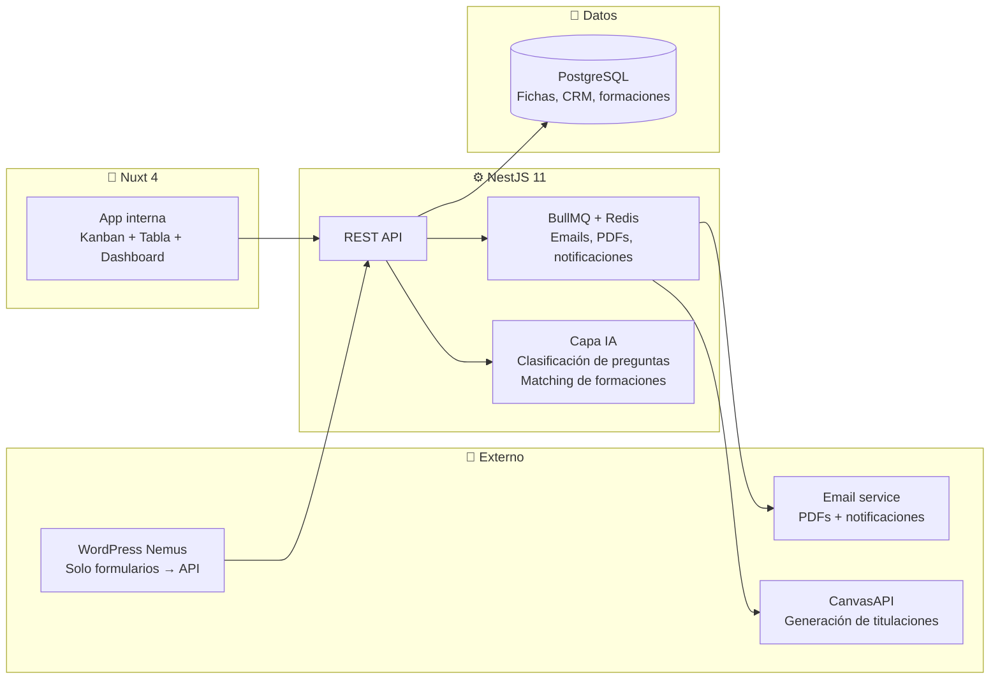

# Propuesta Nemus Digital

> [!info] Visión general
> Digitalizar los dos flujos de trabajo de [[08 - Clientes/Nemus Arboricultura|Nemus Arboricultura]] en una aplicación unificada basada en [[Foundation]]: **gestión de trabajos de campo** (arboricultura) y **gestión de formaciones** (cursos + CRM + IA). Sustituir Trello, eliminar el cuello de botella de la encargada como traductora, y automatizar todo lo que hoy es manual.

---

## Flujo completo

```mermaid
flowchart TB
    subgraph RAMA1["🌳 Rama 1: Trabajos de arboricultura"]
        VISITA[Trabajador visita al cliente<br/>Rellena desde la app:<br/>concepto, cliente, descripción, coste estimado]
        FICHA[Se crea FICHA automática<br/>Status: Pendiente revisión]
        NOTIF[Notificación a colaboradores]
        PRESUP[Colaborador vinculado<br/>crea presupuesto formal]
        APROBAR{¿Aprobado?}
        EJECUTAR[Trabajador ejecuta<br/>Checklist + imágenes + materiales]
        CERRAR[Status: Completado<br/>Ficha = conocimiento documentado]
    end

    subgraph RAMA2["📚 Rama 2: Formaciones"]
        WEB[Web WordPress<br/>Botón 'Pedir información'<br/>por cada formación]
        FORM[Formulario: email, nombre, teléfono]
        PDF[Envío automático de PDF<br/>con datos + precio de la formación]
        BOTON[Email con botón grande:<br/>'Inscribirse al curso']
        FAQ[Formulario de información general<br/>Preguntas abiertas]
    end

    subgraph IA["🤖 Capa IA"]
        FAQ --> IA_CHECK{¿Existe la formación?}
        IA_CHECK -->|Sí| LINK[Devuelve link a la formación]
        IA_CHECK -->|No| BOLSA[Crea/actualiza entrada<br/>en bolsa de interesados]
        BOLSA --> COUNT[Nombre + contador +1<br/>Registra quién preguntó]
    end

    subgraph CRM["📇 CRM automático"]
        FORM --> AUTO[Creación automática de cliente/lead]
        PDF --> AUTO
        FAQ --> AUTO
    end

    subgraph GESTION["📋 Gestión de cursos en la app"]
        INSCRITOS[Lista de inscritos por curso]
        ASISTENCIA[Check-in de asistencia]
        TITULACION[Generación automática<br/>de titulación PDF con CanvasAPI]
    end

    BOTON --> INSCRITOS
    ASISTENCIA --> TITULACION

    VISITA --> FICHA
    FICHA --> NOTIF
    NOTIF --> PRESUP
    PRESUP --> APROBAR
    APROBAR -->|Sí| EJECUTAR
    APROBAR -->|No| PRESUP
    EJECUTAR --> CERRAR
```



---

## Rama 1: Gestión de trabajos de campo

### 1. Visita inicial y creación de ficha

**Actor**: Trabajador de Nemus o autónomo subcontratado

```
Trabajador visita al cliente (física)
  ↓
Abre la app desde el móvil
  ↓
Rellena datos mínimos:
  • Concepto (qué hay que hacer: poda, tala, evaluación...)
  • Cliente (nombre, dirección, contacto)
  • Descripción del trabajo
  • Coste estimado
  ↓
Envía → Se crea FICHA automáticamente
  ↓
Status inicial: "Pendiente revisión"
```

### 2. Presupuesto

**Actor**: Colaborador (jefe)

```
Colaborador recibe notificación de nueva ficha
  ↓
Abre la ficha y crea presupuesto formal
  ↓
Se vincula el colaborador a la ficha
  ↓
Status: "Pendiente aprobación"
```

### 3. Aprobación

**Actor**: Colaborador / Admin (Carolina)

```
Colaborador revisa el presupuesto
  ↓
Aprueba o rechaza
  ├── Aprobado → Status: "Aprobado / Pendiente ejecución"
  └── Rechazado → Vuelve a presupuesto con anotaciones
```

> [!warning] Pendiente de definir
> ¿Se notifica al cliente en este punto? ¿Se envía el presupuesto por email? ¿Se necesita firma digital del cliente?

### 4. Ejecución del trabajo

**Actor**: Trabajador asignado

```
Trabajador va al campo
  ↓
Abre la ficha en la app (móvil)
  ↓
Checklist con plantilla según tipo de trabajo:
  • Poda → checklist específico de poda
  • Tala → checklist específico de tala
  • Evaluación → checklist específico de evaluación
  • Se pueden añadir/quitar items en cada ficha individual
  ↓
Sube evidencias:
  • Imágenes del antes/después
  • Video de prueba
  ↓
Registra materiales usados (solo anotación, sin control de stock)
  ↓
Historial de cambios: cada modificación de la ficha queda registrada
```

### 5. Cierre

```
Trabajador marca trabajo como completado
  ↓
Status: "Completado"
  ↓
La ficha queda como conocimiento documentado:
  • Qué se hizo
  • Quién lo hizo
  • Cuándo
  • Con qué materiales
  • Evidencias visuales
  • Historial completo
```

### Ficha — estructura de datos

| Campo | Descripción |
|-------|-------------|
| **Cliente** | Nombre, dirección, contacto (vinculado a CRM) |
| **Concepto** | Tipo de trabajo (poda, tala, evaluación, etc.) |
| **Descripción** | Texto libre del trabajador |
| **Coste estimado** | Lo que dice el trabajador en la visita |
| **Presupuesto formal** | Creado por el colaborador (PDF generado) |
| **Colaborador asignado** | Quién hizo el presupuesto |
| **Trabajador asignado** | Quién ejecuta |
| **Status** | Pendiente revisión → Pendiente aprobación → Aprobado → En ejecución → Completado |
| **Checklist** | Plantilla base + items añadidos/quitados ad-hoc |
| **Evidencias** | Imágenes, videos |
| **Materiales** | Lista de materiales usados (texto) |
| **Historial** | Log de todos los cambios de la ficha |

### Vistas

- **Kanban**: columnas = status de la ficha. Arrastrar para cambiar estado.
- **Tabla**: vista de datos tradicional con filtros (por trabajador, por status, por fecha, por cliente).
- Componentes existentes en [[Foundation]].

---

## Rama 2: Gestión de formaciones

### 1. Web WordPress → formularios

La web actual de Nemus (WordPress) se mantiene. Solo se modifican los formularios:

- Cada página de formación tiene un botón **"Pedir información"**
- El formulario pide: **email, nombre, teléfono**
- Los datos se envían vía endpoint a nuestra API (NestJS)
- WordPress solo es la capa de captura, toda la lógica está en el monorepo

### 2. Envío automático de PDF

```
Cliente rellena formulario en WordPress
  ↓
API recibe los datos
  ↓
Genera PDF dinámico con:
  • Nombre de la formación
  • Descripción, temario, fechas
  • Precio (NO visible en la web)
  • Datos del interesado
  ↓
Envía email con:
  • PDF adjunto
  • Botón grande "Inscribirse al curso" → link a la app
  ↓
Automáticamente se crea el cliente/lead en el CRM
```

> [!warning] Pendiente de definir
> ¿El PDF se genera desde cero con código (ej: Puppeteer + HTML) o se parte de una plantilla PDF que ellos ya tienen y se rellenan campos? ¿Quién diseña la plantilla del PDF?

### 3. Formulario de información general + IA

```
Usuario escribe pregunta abierta en el formulario de "Pedir información"
Ej: "¿Cuándo empieza el próximo curso de trepa?"
  ↓
IA analiza la pregunta
  ↓
¿La formación EXISTE en el catálogo?
  ├── Sí → Responde con el link a la formación
  └── No → Crea/actualiza entrada en la "bolsa de interesados"
```

**Bolsa de interesados**:

| Campo | Descripción |
|-------|-------------|
| **Nombre de la formación** | Extraído por la IA de la pregunta |
| **Contador** | +1 por cada persona que pregunta |
| **Interesados** | Lista de {nombre, email, fecha} |
| **Fuzzy matching** | Si alguien pregunta "curso trepa árboles" y ya existe "Curso de trepa", suma al existente |

**Objetivo**: Datos para que Nemus decida si abre una nueva convocatoria de una formación con demanda latente.

### 4. CRM automático

Cada vez que alguien interactúa con cualquier formulario, se crea automáticamente un perfil de cliente/lead:

```
Origen: Formulario PDF / Formulario FAQ / Inscripción directa
  ↓
CRM registra:
  • Nombre, email, teléfono
  • Fecha del primer contacto
  • Historial de interacciones (qué pidió, qué preguntó)
  • Cursos en los que se ha inscrito
  • Cursos a los que ha asistido
```

### 5. Gestión de cursos en la app

```
Admin crea un curso en la app:
  • Nombre, fechas, horas, precio, aforo, ubicación
  ↓
Los clientes se inscriben (vía email con botón o vía web)
  ↓
Admin ve lista de inscritos por curso
  ↓
El día del curso, admin hace check-in de asistencia
  ↓
Al marcar "Asistió" → se genera automáticamente titulación PDF
```

### 6. Titulación con CanvasAPI

```
Trabajador/admin marca asistencia del alumno
  ↓
Sistema dispara generación de certificado con [[06 - Proyectos/CanvasAPI|CanvasAPI / JSONCanvas]]
  ↓
PDF generado con:
  • Nombre del alumno
  • Nombre del curso
  • Fecha de realización
  • Horas de formación
  • Firma digital de Nemus
  ↓
Se envía por email al alumno
  ↓
Queda registrado en su perfil del CRM
```

> [!warning] Pendiente de definir
> ¿El certificado lleva firma del instructor? ¿Logo de la AEA? ¿Diseño específico o plantilla estándar?

---

## Roles y permisos

| Rol | Quién | Permisos |
|-----|-------|----------|
| **Admin** | Carolina Ferrer | Acceso total: fichas, presupuestos, formaciones, CRM, configuración |
| **Trabajador de empresa** | Ricardo, Toni, Luis | Ve TODAS las fichas de trabajo. Crea fichas desde visita. Ejecuta checklists. Ve formaciones. |
| **Autónomo subcontratado** | Externos | Solo ve las fichas donde está asignado. No ve otras fichas ni formaciones. |
| **Colaborador / Jefe** | Rol de supervisión | Crea presupuestos, aprueba fichas, ve todos los trabajos |

---

## Stack técnico



Basado en [[Foundation]]: monorepo Turborepo + pnpm, NestJS backend, Nuxt frontend, PostgreSQL, Tailwind + DaisyUI.

---

## Fases sugeridas

### Fase 1 — MVP Trabajos (1 mes)
- [ ] Setup monorepo desde Foundation
- [ ] Auth + roles (admin, trabajador, autónomo, colaborador)
- [ ] CRUD de fichas de trabajo
- [ ] Flujo de estados: Pendiente revisión → Pendiente aprobación → Aprobado → En ejecución → Completado
- [ ] Plantillas de checklist por tipo de trabajo
- [ ] Subida de imágenes y video
- [ ] Registro de materiales
- [ ] Historial de cambios
- [ ] Vistas Kanban + Tabla

### Fase 2 — Presupuestos + Notificaciones (2-3 semanas)
- [ ] Creación de presupuesto vinculado a ficha
- [ ] Aprobación/rechazo por colaborador
- [ ] Notificaciones (email + in-app)
- [ ] PDF de presupuesto generado automáticamente

### Fase 3 — Formaciones (1 mes)
- [ ] CRUD de formaciones
- [ ] Integración formularios WordPress → API
- [ ] Generación y envío automático de PDF
- [ ] Email con botón de inscripción
- [ ] Lista de inscritos + check-in de asistencia
- [ ] Generación de titulación con CanvasAPI

### Fase 4 — IA + CRM (2-3 semanas)
- [ ] CRM automático: creación de leads desde formularios
- [ ] IA de clasificación de preguntas (¿existe la formación?)
- [ ] Bolsa de interesados con fuzzy matching
- [ ] Respuesta automática con link o registro en bolsa

### Fase 5 — Pulido y cliente (continuo)
- [ ] Portal de cliente (ver estado de sus trabajos)
- [ ] Exportación de reportes
- [ ] Integración con email de Nemus (info@nemusarboricultura.com)
- [ ] Dashboard de métricas (trabajos/mes, formaciones más demandadas, etc.)

---

## Relaciones

- [[08 - Clientes/Nemus Arboricultura]] — cliente, información de la empresa
- [[Foundation]] — base técnica del monorepo
- [[06 - Proyectos/CanvasAPI|CanvasAPI]] — generación de titulaciones PDF
- [[06 - Proyectos/Atenfy|Atenfy]] — potencial chatbot para web de Nemus en el futuro
- [[Conceptos/Concepto Central Actualizado - De componentes aislados a sistemas operativos inteligentes]] — esto es literalmente convertir el caos analógico de Nemus en un sistema operativo
- [[Conceptos/ADN - Tecnología-Tierra]] — arboricultura = tierra; app = tecnología
