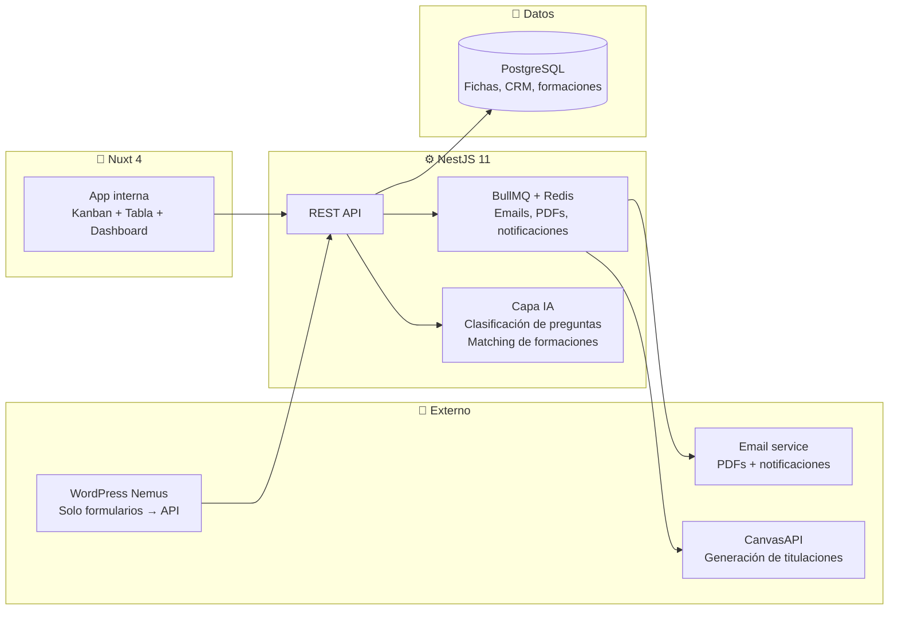

# Propuesta Nemus Digital

> [!info] Visión general
> Digitalizar los dos flujos de trabajo de [[08 - Clientes/Nemus Arboricultura|Nemus Arboricultura]] en una aplicación unificada basada en [[Foundation]]: **gestión de trabajos de campo** (arboricultura) y **gestión de formaciones** (cursos + CRM + IA). Sustituir Trello, eliminar el cuello de botella de la encargada como traductora, y automatizar todo lo que hoy es manual.

---

## Flujo completo

```mermaid
flowchart TB
    subgraph RAMA1["🌳 Rama 1: Trabajos de arboricultura"]
        VISITA[Trabajador visita al cliente<br/>Rellena desde la app:<br/>concepto, cliente, descripción, coste estimado]
        FICHA[Se crea FICHA automática<br/>Status: Pendiente revisión]
        NOTIF[Notificación a colaboradores]
        PRESUP[Colaborador vinculado<br/>crea presupuesto formal]
        APROBAR{¿Aprobado?}
        EJECUTAR[Trabajador ejecuta<br/>Checklist + imágenes + materiales]
        CERRAR[Status: Completado<br/>Ficha = conocimiento documentado]
    end

    subgraph RAMA2["📚 Rama 2: Formaciones"]
        WEB[Web WordPress<br/>Botón 'Pedir información'<br/>por cada formación]
        FORM[Formulario: email, nombre, teléfono]
        PDF[Envío automático de PDF<br/>con datos + precio de la formación]
        BOTON[Email con botón grande:<br/>'Inscribirse al curso']
        FAQ[Formulario de información general<br/>Preguntas abiertas]
    end

    subgraph IA["🤖 Capa IA"]
        FAQ --> IA_CHECK{¿Existe la formación?}
        IA_CHECK -->|Sí| LINK[Devuelve link a la formación]
        IA_CHECK -->|No| BOLSA[Crea/actualiza entrada<br/>en bolsa de interesados]
        BOLSA --> COUNT[Nombre + contador +1<br/>Registra quién preguntó]
    end

    subgraph CRM["📇 CRM automático"]
        FORM --> AUTO[Creación automática de cliente/lead]
        PDF --> AUTO
        FAQ --> AUTO
    end

    subgraph GESTION["📋 Gestión de cursos en la app"]
        INSCRITOS[Lista de inscritos por curso]
        ASISTENCIA[Check-in de asistencia]
        TITULACION[Generación automática<br/>de titulación PDF con CanvasAPI]
    end

    BOTON --> INSCRITOS
    ASISTENCIA --> TITULACION

    VISITA --> FICHA
    FICHA --> NOTIF
    NOTIF --> PRESUP
    PRESUP --> APROBAR
    APROBAR -->|Sí| EJECUTAR
    APROBAR -->|No| PRESUP
    EJECUTAR --> CERRAR
```



---

## Rama 1: Gestión de trabajos de campo

### 1. Visita inicial y creación de ficha

**Actor**: Trabajador de Nemus o autónomo subcontratado

```
Trabajador visita al cliente (física)
  ↓
Abre la app desde el móvil
  ↓
Rellena datos mínimos:
  • Concepto (qué hay que hacer: poda, tala, evaluación...)
  • Cliente (nombre, dirección, contacto)
  • Descripción del trabajo
  • Coste estimado
  ↓
Envía → Se crea FICHA automáticamente
  ↓
Status inicial: "Pendiente revisión"
```

### 2. Presupuesto

**Actor**: Colaborador (jefe)

```
Colaborador recibe notificación de nueva ficha
  ↓
Abre la ficha y crea presupuesto formal
  ↓
Se vincula el colaborador a la ficha
  ↓
Status: "Pendiente aprobación"
```

### 3. Aprobación

**Actor**: Colaborador / Admin (Carolina)

```
Colaborador revisa el presupuesto
  ↓
Aprueba o rechaza
  ├── Aprobado → Status: "Aprobado / Pendiente ejecución"
  └── Rechazado → Vuelve a presupuesto con anotaciones
```

> [!note] Confirmado
> Al aprobar, se notifica al cliente por email automáticamente.

### 4. Ejecución del trabajo

**Actor**: Trabajador asignado

```
Trabajador va al campo
  ↓
Abre la ficha en la app (móvil)
  ↓
Checklist con plantilla según tipo de trabajo:
  • Poda → checklist específico de poda
  • Tala → checklist específico de tala
  • Evaluación → checklist específico de evaluación
  • Se pueden añadir/quitar items en cada ficha individual
  ↓
Sube evidencias:
  • Imágenes del antes/después
  • Video de prueba
  ↓
Registra materiales usados (solo anotación, sin control de stock)
  ↓
Historial de cambios: cada modificación de la ficha queda registrada
```

### 5. Cierre

```
Trabajador marca trabajo como completado
  ↓
Status: "Completado"
  ↓
La ficha queda como conocimiento documentado:
  • Qué se hizo
  • Quién lo hizo
  • Cuándo
  • Con qué materiales
  • Evidencias visuales
  • Historial completo
```

### Ficha — estructura de datos

| Campo | Descripción |
|-------|-------------|
| **Cliente** | Nombre, dirección, contacto (vinculado a CRM) |
| **Concepto** | Tipo de trabajo (poda, tala, evaluación, etc.) |
| **Descripción** | Texto libre del trabajador |
| **Coste estimado** | Lo que dice el trabajador en la visita |
| **Presupuesto formal** | Creado por el colaborador (PDF generado) |
| **Colaborador asignado** | Quién hizo el presupuesto |
| **Trabajador asignado** | Quién ejecuta |
| **Status** | Pendiente revisión → Pendiente aprobación → Aprobado → En ejecución → Completado |
| **Checklist** | Plantilla base + items añadidos/quitados ad-hoc |
| **Evidencias** | Imágenes, videos |
| **Materiales** | Lista de materiales usados (texto) |
| **Historial** | Log de todos los cambios de la ficha |

### Vistas

- **Kanban**: columnas = status de la ficha. Arrastrar para cambiar estado.
- **Tabla**: vista de datos tradicional con filtros (por trabajador, por status, por fecha, por cliente).
- Componentes existentes en [[Foundation]].

---

## Rama 2: Gestión de formaciones

### 1. Web WordPress → formularios

La web actual de Nemus (WordPress) se mantiene. Solo se modifican los formularios:

- Cada página de formación tiene un botón **"Pedir información"**
- El formulario pide: **email, nombre, teléfono**
- Los datos se envían vía endpoint a nuestra API (NestJS)
- WordPress solo es la capa de captura, toda la lógica está en el monorepo

### 2. Envío automático de PDF

```
Cliente rellena formulario en WordPress
  ↓
API recibe los datos
  ↓
Genera PDF dinámico con:
  • Nombre de la formación
  • Descripción, temario, fechas
  • Precio (NO visible en la web)
  • Datos del interesado
  ↓
Envía email con:
  • PDF adjunto
  • Botón grande "Inscribirse al curso" → link a la app
  ↓
Automáticamente se crea el cliente/lead en el CRM
```

> [!note] Confirmado
> PDF generado desde cero con código (HTML → PDF vía **PDFMake**). Plantilla a diseñar.

### 3. Formulario de información general + IA

```
Usuario escribe pregunta abierta en el formulario de "Pedir información"
Ej: "¿Cuándo empieza el próximo curso de trepa?"
  ↓
IA analiza la pregunta
  ↓
¿La formación EXISTE en el catálogo?
  ├── Sí → Responde con el link a la formación
  └── No → Crea/actualiza entrada en la "bolsa de interesados"
```

**Bolsa de interesados**:

| Campo | Descripción |
|-------|-------------|
| **Nombre de la formación** | Extraído por la IA de la pregunta |
| **Contador** | +1 por cada persona que pregunta |
| **Interesados** | Lista de {nombre, email, fecha} |
| **Fuzzy matching** | Si alguien pregunta "curso trepa árboles" y ya existe "Curso de trepa", suma al existente |

**Objetivo**: Datos para que Nemus decida si abre una nueva convocatoria de una formación con demanda latente.

### 4. CRM automático

Cada vez que alguien interactúa con cualquier formulario, se crea automáticamente un perfil de cliente/lead:

```
Origen: Formulario PDF / Formulario FAQ / Inscripción directa
  ↓
CRM registra:
  • Nombre, email, teléfono
  • Fecha del primer contacto
  • Historial de interacciones (qué pidió, qué preguntó)
  • Cursos en los que se ha inscrito
  • Cursos a los que ha asistido
```

### 5. Gestión de cursos en la app

```
Admin crea un curso en la app:
  • Nombre, fechas, horas, precio, aforo, ubicación
  ↓
Los clientes se inscriben (vía email con botón o vía web)
  ↓
Admin ve lista de inscritos por curso
  ↓
El día del curso, admin hace check-in de asistencia
  ↓
Al marcar "Asistió" → se genera automáticamente titulación PDF
```

### 6. Titulación con CanvasAPI

```
Trabajador/admin marca asistencia del alumno
  ↓
Sistema dispara generación de certificado con [[06 - Proyectos/CanvasAPI|CanvasAPI / JSONCanvas]]
  ↓
PDF generado con:
  • Nombre del alumno
  • Nombre del curso
  • Fecha de realización
  • Horas de formación
  • Firma digital de Nemus
  ↓
Se envía por email al alumno
  ↓
Queda registrado en su perfil del CRM
```

> [!note] Confirmado
> El certificado lleva firma del instructor y logo de la AEA (Asociación Española de Arboricultura).

---

## Roles y permisos

| Rol | Quién | Permisos |
|-----|-------|----------|
| **Admin** | Carolina Ferrer | Acceso total: fichas, presupuestos, formaciones, CRM, configuración |
| **Trabajador de empresa** | Ricardo, Toni, Luis | Ve TODAS las fichas de trabajo. Crea fichas desde visita. Ejecuta checklists. Ve formaciones. |
| **Autónomo subcontratado** | Externos | Solo ve las fichas donde está asignado. No ve otras fichas ni formaciones. |
| **Colaborador / Jefe** | Rol de supervisión | Crea presupuestos, aprueba fichas, ve todos los trabajos |

---

## Stack técnico



Basado en [[Foundation]]: monorepo Turborepo + pnpm, NestJS backend, Nuxt frontend, PostgreSQL, Tailwind + DaisyUI.

---

## Fases sugeridas

### Fase 1 — MVP Trabajos (1 mes)
- [ ] Setup monorepo desde Foundation
- [ ] Auth + roles (admin, trabajador, autónomo, colaborador)
- [ ] CRUD de fichas de trabajo
- [ ] Flujo de estados: Pendiente revisión → Pendiente aprobación → Aprobado → En ejecución → Completado
- [ ] Plantillas de checklist por tipo de trabajo
- [ ] Subida de imágenes y video
- [ ] Registro de materiales
- [ ] Historial de cambios
- [ ] Vistas Kanban + Tabla

### Fase 2 — Presupuestos + Notificaciones (2-3 semanas)
- [ ] Creación de presupuesto vinculado a ficha
- [ ] Aprobación/rechazo por colaborador
- [ ] Notificaciones (email + in-app)
- [ ] PDF de presupuesto generado automáticamente

### Fase 3 — Formaciones (1 mes)
- [ ] CRUD de formaciones
- [ ] Integración formularios WordPress → API
- [ ] Generación y envío automático de PDF
- [ ] Email con botón de inscripción
- [ ] Lista de inscritos + check-in de asistencia
- [ ] Generación de titulación con CanvasAPI

### Fase 4 — IA + CRM (2-3 semanas)
- [ ] CRM automático: creación de leads desde formularios
- [ ] IA de clasificación de preguntas (¿existe la formación?)
- [ ] Bolsa de interesados con fuzzy matching
- [ ] Respuesta automática con link o registro en bolsa

### Fase 5 — Pulido y cliente (continuo)
- [ ] Portal de cliente (ver estado de sus trabajos)
- [ ] Exportación de reportes
- [ ] Dashboard de métricas (trabajos/mes, formaciones más demandadas, etc.)

> [!note] Facturación
> Va por fuera de la app. No se integra en este sistema.

---

## Análisis crítico — Abogado del diablo

> [!danger] Disclaimer
> Esto no es para frenar el proyecto. Es para identificar agujeros **antes** de escribir código y evitar retrabajo. Cada punto tiene una propuesta de solución.

### 🔴 Problemas detectados en Rama 1 (Trabajos)

| # | Problema | Riesgo | Solución propuesta |
|---|----------|--------|-------------------|
| 1 | **Coste estimado vs presupuesto formal**: el trabajador dice una cifra, el colaborador pone otra. No hay paso de reconciliación. | El cliente recibe dos números distintos. Desconfianza. | Añadir campo "nota del colaborador" si el presupuesto difiere del estimado. Ocultar el estimado al cliente, solo mostrar el formal. |
| 2 | **Aprobación solo interna**: el flujo actual aprueba el colaborador, pero ¿y el cliente? ¿No tiene que aceptar el presupuesto? | Se ejecuta un trabajo sin que el cliente haya dicho que sí al precio. | Añadir estado "Pendiente aceptación del cliente" entre "Aprobado" y "En ejecución". El email de aprobación incluye un botón "Aceptar presupuesto". |
| 3 | **Autónomo no puede crear fichas**: según permisos, solo ve sus tareas asignadas. Pero un autónomo también hace visitas y debería poder crear fichas. | O la empresa pierde capacidad de captación, o el autónomo llama por teléfono (lo mismo de ahora). | El autónomo puede crear fichas desde visita, pero con visibilidad limitada: solo ve las suyas propias + las que le asignen. |
| 4 | **Checklists mutables sin control**: se pueden añadir/quitar items en cada ficha. ¿Qué pasa si la plantilla de "Poda" cambia? ¿Se actualizan las fichas en curso? | Fichas con checklist desactualizado. Inconsistencia entre trabajadores. | Las fichas heredan la plantilla en el momento de creación. Los cambios posteriores a la plantilla no afectan fichas existentes (snapshot). Si un colaborador quiere actualizar una ficha concreta, lo hace manualmente. |
| 5 | **Materiales en texto libre**: "solo anotación" → cada trabajador escribe como quiere. "Cuerda 12mm", "cuerda 12 mm", "cuerda 1.2cm"... | Datos inservibles para análisis. Imposible saber cuánta cuerda se gasta al mes. | Lista predefinida de materiales (configurable por admin) + campo "cantidad". Se puede añadir material nuevo si no existe. Texto libre solo como nota adicional. |
| 6 | **Kanban sin validación de transiciones**: arrastrar una tarjeta de "Pendiente revisión" a "Completado" no debería ser posible. | Saltos de estado ilegales. Caos. | Definir matriz de transiciones válidas. El kanban solo permite drops en columnas válidas para el estado actual. |
| 7 | **Fichas estancadas sin alerta**: una ficha en "Pendiente revisión" 5 días. Nadie se entera. | El cuello de botella actual (Carolina) se traslada a la app. | Notificación automática si una ficha lleva >48h en el mismo estado. Escalar a admin si >72h. |

### 🔴 Problemas detectados en Rama 2 (Formaciones)

| # | Problema | Riesgo | Solución propuesta |
|---|----------|--------|-------------------|
| 8 | **Inscripción sin cuenta**: el cliente hace clic en "Inscribirse" desde el email. ¿Necesita crear cuenta en la app? Si no, ¿cómo rastreamos quién es? | Sin cuenta = sin CRM = sin seguimiento. O fricción de registro = abandono. | Inscripción con token único en la URL (ej: `/inscribirse?token=abc123&curso=42`). Sin registro previo. Solo confirma datos. Se crea cuenta automáticamente en background. |
| 9 | **IA con LLM por cada pregunta**: si cada consulta al formulario FAQ dispara una llamada a OpenAI, el coste se dispara. | 100 preguntas/mes = manejable. 1000+ = coste significativo. | Primera capa: keyword matching contra catálogo (rápido, gratis). Si no hay match claro → segunda capa: embedding similarity. Si aún no está claro → LLM. El 80% de preguntas se resuelven en capa 1. |
| 10 | **Fuzzy matching poco fiable con texto libre**: "curso de podar arboles" vs "Curso de poda de árboles". Levenshtein no basta. | Falsos negativos: se crean entradas duplicadas en la bolsa. Datos inservibles. | Usar embeddings (text-embedding-3-small o similar) para comparar similitud semántica. Umbral de 0.85 para considerar que es la misma formación. |
| 11 | **La IA no conoce el catálogo en tiempo real**: si el admin añade un curso nuevo, la IA necesita saberlo. | Responde que no existe cuando sí existe. | Sincronización automática: cada vez que se crea/modifica/elimina un curso, se regenera el índice de búsqueda (vector store o índice en memoria). |
| 12 | **Duplicados en CRM**: mismo email rellena formulario FAQ y formulario PDF → dos leads. | CRM sucio. Carolina se vuelve loca. | Detección por email: si ya existe, se añade la nueva interacción al historial del lead existente en vez de crear uno nuevo. |
| 13 | **PDFs grandes como adjunto → spam**: un PDF de 5MB con imágenes de la formación. | El email acaba en spam. El cliente nunca ve el precio. | El email contiene un link de descarga al PDF (almacenado en S3 con tiempo de expiración). El PDF se adjunta solo si pesa <500KB. |
| 14 | **Pago no definido**: ¿cómo paga el cliente la inscripción? No se menciona en el flujo. | Inscripciones fantasma sin compromiso de pago. | Definir: ¿transferencia bancaria, pago online con Stripe, o solo reserva de plaza (sin pago)? Si es sin pago, el check-in es el compromiso. |

### 🔴 Problemas transversales

| # | Problema | Riesgo | Solución propuesta |
|---|----------|--------|-------------------|
| 15 | **WordPress → API sin autenticación**: los formularios de WP envían datos a la API. ¿Cómo evitas que un bot spamee el endpoint? | Miles de leads falsos. | Rate limiting por IP + API key interna (solo WP conoce la key) + honeypot field invisible en el formulario. |
| 16 | **Mobile-first no garantizado**: los componentes de Foundation (Kanban, DataTable) funcionan en desktop. ¿Y en móvil en una finca? | El trabajador no puede usar la app donde la necesita. | Testear Kanban drag-drop en móvil (touch events). Considerar vista de lista simplificada como alternativa móvil al Kanban. El DataTable de TanStack se adapta mejor. |
| 17 | **Sin offline mode**: el trabajador está en una finca sin cobertura. No puede rellenar el checklist. | Se vuelve al papel. La app no se usa. | Fase 2+: PWA con service worker. Las fichas se guardan en IndexedDB local y se sincronizan al recuperar conexión. No para el MVP pero sí planificado. |
| 18 | **Almacenamiento de imágenes/video**: Foundation tiene storage con S3. Pero sin compresión previa, un trabajador sube una foto de 12MP y un video de 500MB desde el móvil. | Costes de S3. Timeouts en subida. | Compresión en frontend antes de subir (librería browser-image-compression). Video comprimido o límite de duración (máx 60s). |
| 19 | **Dependencia externa de CanvasAPI**: la generación de titulaciones depende de un proyecto en desarrollo. Si no está listo a tiempo, la Fase 3 se bloquea. | Cuello de botella externo. | Alternativa fallback: PDFMake directo para titulaciones simples mientras CanvasAPI madura. No depender de un solo punto. |
| 20 | **Foundation tiene solo 2 roles (admin, customer)**: ampliar a 4 roles (admin, trabajador, autónomo, colaborador) requiere refactorizar el enum de roles y los guards de NestJS. | Más trabajo del estimado en Fase 1. | Refactorizar `RoleEnum` de Foundation para soportar roles dinámicos (tabla `roles` con permisos granulares en vez de enum fijo). Aprovechar el `RolesGuard` existente. |
| 21 | **Fase 4 (IA + CRM) en 2-3 semanas es optimista**: IA de clasificación + embeddings + fuzzy matching + CRM completo. | Fase 4 se desborda y retrasa todo. | Separar en Fase 4a (CRM básico: leads, historial) y Fase 4b (IA: clasificación + bolsa). Estimar 3-4 semanas total. |
| 22 | **Sin fase de UAT con Carolina**: ella es la usuaria crítica. Si la app no le funciona mejor que Trello + email, la rechaza. | Adopción cero. | Añadir "Fase 0: UAT interna" después de cada fase. Carolina prueba en un entorno staging antes del deploy a producción. |

---

## Inventario Foundation — ¿Qué tenemos ya?

> [!tip] Reutilización directa
> Foundation cubre ~60% de las necesidades del MVP. Esto ahorra semanas de desarrollo.

### ✅ Componentes reutilizables (sin modificar)

| Componente | Para qué sirve en Nemus Digital |
|------------|--------------------------------|
| **Kanban** (completo) | Vista de fichas por estado. Drag-drop, checklists, tags, assignees. Listo. |
| **DataTable** (TanStack v8) | Vista de tabla con sorting, filtrado, paginación server-side. |
| **11 form components** | Todos los formularios: crear ficha, presupuesto, cliente, curso. |
| **Auth** (JWT + refresh) | Login para todos los roles. Refresh token automático. |
| **File storage** (local/S3) | Subida de imágenes y videos de trabajos. Adjuntos polimórficos (se vinculan a cualquier entidad). |
| **Email** (Nodemailer + BullMQ + Maizzle) | Notificaciones, PDFs, envío de presupuestos y titulaciones. |
| **RichEditor** (TipTap) | Notas enriquecidas en fichas, descripciones de cursos. |
| **Calendar** (4 vistas) | Calendario de cursos y trabajos programados. |
| **i18n** (DB + JSON) | Español + Catalán (obligatorio para Nemus). |
| **Error tracker** | Monitorización de errores en producción. |
| **Docker** (postgres, redis, mailpit) | Desarrollo local y despliegue. |
| **Extension system** | Los nuevos módulos (fichas, formaciones, CRM) se añaden como extensiones sin tocar el core. |

### 🟡 Necesita adaptación

| Componente | Cambio necesario |
|------------|-----------------|
| **Roles** | Pasar de enum fijo (admin, customer) a sistema granular con permisos. Añadir `trabajador`, `autonomo`, `colaborador`. |
| **CMS** (páginas, blog) | Patrón reutilizable para CRUD de formaciones (cursos). Misma estructura: entidad + traducciones + SEO. |
| **Dashboard** | Componentes base existen (Overview, Cards). Necesita widgets específicos: trabajos/mes, cursos activos, leads nuevos. |

### 🔴 Necesita construcción desde cero

| Qué | Esfuerzo | Fase |
|-----|----------|------|
| **Entidad Ficha** (fichas de trabajo) + workflow de estados | Medio | F1 |
| **Plantillas de checklist** (herencia + snapshot en creación) | Bajo | F1 |
| **Audit log** (historial de cambios en fichas) | Bajo | F1 |
| **Presupuestos** (entidad + PDF con PDFMake) | Medio | F2 |
| **Notificaciones in-app** (polling/WebSocket) | Medio | F2 |
| **Formaciones** (CRUD cursos, inscripciones, check-in) | Medio | F3 |
| **PDFs dinámicos** (HTML → PDF via PDFMake) | Bajo | F3 |
| **CRM** (leads, interacciones, historial) | Medio | F4a |
| **IA clasificación** (keyword + embeddings + LLM fallback) | Alto | F4b |
| **Bolsa de interesados** (fuzzy matching semántico) | Medio | F4b |
| **Titulaciones CanvasAPI** (integración + fallback PDFMake) | Medio | F3 |
| **Portal cliente** (vista limitada de sus trabajos) | Medio | F5 |
| **PWA / offline** | Alto | Post-F5 |
| **Exportación reportes** (CSV/Excel) | Bajo | F5 |

---

## Relaciones

- [[08 - Clientes/Nemus Arboricultura]] — cliente, información de la empresa
- [[Foundation]] — base técnica del monorepo
- [[06 - Proyectos/CanvasAPI|CanvasAPI]] — generación de titulaciones PDF
- [[06 - Proyectos/Atenfy|Atenfy]] — potencial chatbot para web de Nemus en el futuro
- [[Conceptos/Concepto Central Actualizado - De componentes aislados a sistemas operativos inteligentes]] — esto es literalmente convertir el caos analógico de Nemus en un sistema operativo
- [[Conceptos/ADN - Tecnología-Tierra]] — arboricultura = tierra; app = tecnología
