> [!info] Visión general
> Sistema que automatiza el 90% de las incidencias en parkings usando IA, con el objetivo de **rentabilizar la operación reduciendo personal presencial y permitiendo gestión remota multi-parking**. Cuando un usuario tiene un problema (barrera que no abre, puerta peatonal bloqueada, ticket no leído, matrícula no reconocida), elige entre dos canales según su contexto: si está de pie usa la tablet/kiosko táctil, si está en el coche habla con la IA por el telefonillo. El sistema consulta en tiempo real los datos del parking (matrícula, hora de entrada, tarifa, permisos de acceso) y ejecuta acciones sobre **barreras, pestillos electrónicos y puertas** — o redirige inteligentemente a un operador remoto con contexto completo. Colaboración: [[08 - Clientes/Lorenç Prats - Telecomunicaciones y Parkings IA|Lorenç Prats]] (VoIP + acceso a managers de parking) + SOM-OS.dev (IA + app + conectores).

---

## Flujo de decisión: ¿qué canal usa el usuario?

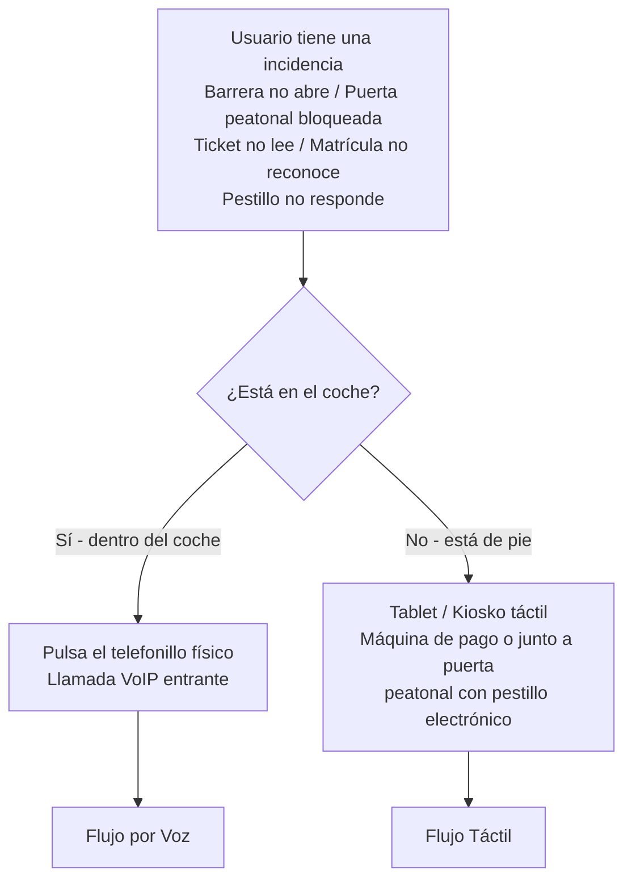

---

## Flujo 1: Canal táctil (Tablet / Kiosko)

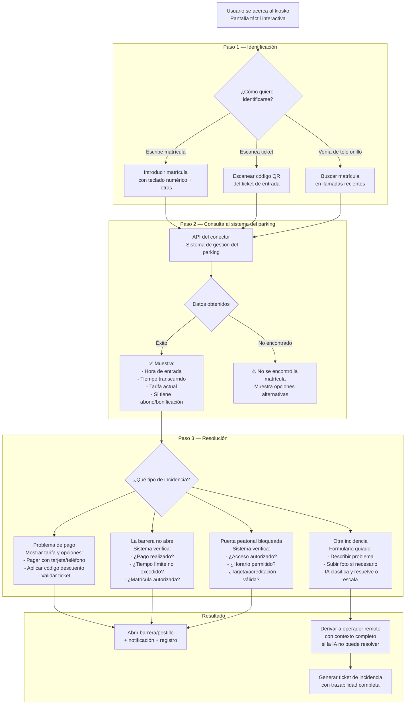

---

## Flujo 2: Canal de voz (Telefonillo IA)

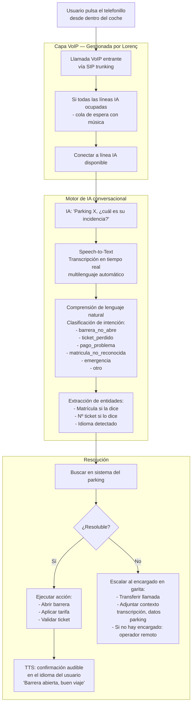

---

## Flujo 2b: Escalado al encargado y operador remoto

Cuando la IA no puede resolver, el sistema escala **primero al encargado en garita** (si está disponible) y solo deriva al operador remoto cuando el encargado no está (noche, valle) o cuando el encargado necesita ayuda con un caso complejo.

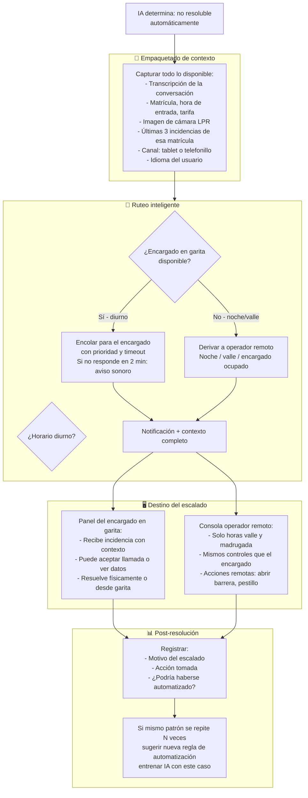

> [!tip] El encargado es el primer humano, el operador remoto es el backup
> Durante el día, el 15% que la IA no resuelve va directo al encargado en garita. Solo de noche o cuando el encargado está ocupado con otra incidencia física, el sistema deriva al operador remoto.

---

## Modelo de negocio: Rentabilización mediante operación remota

### Las tres capas de resolución

No todas las incidencias son iguales. El sistema distingue tres tipos, y cada uno se resuelve en una capa distinta:

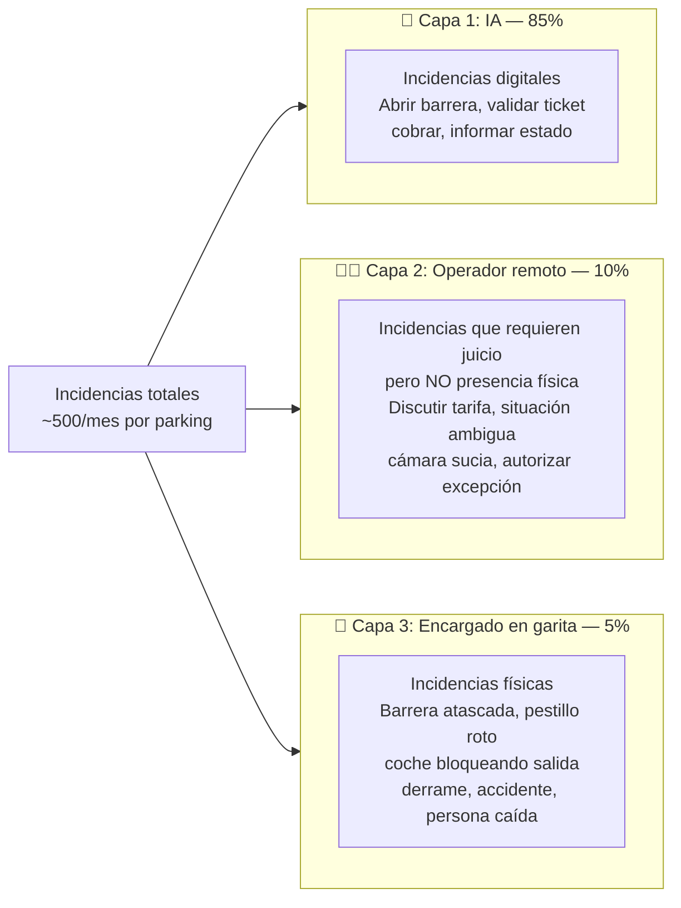

> [!important] El encargado ya está en la garita — es el primer humano en la cadena
> Todos los parkings tienen una persona en la garita. Esa persona **ya existe, ya cobra, ya está allí**. Hoy atiende el 100% de las llamadas del telefonillo. Con el sistema, la IA resuelve el 85% sin que el encargado se entere. El 15% restante **se deriva al encargado** — ya sea la llamada telefónica directamente o una notificación en su panel. El encargado sigue siendo quien resuelve lo que la IA no puede, pero ahora solo interrumpe su trabajo 75 veces al mes en vez de 500.

### El antes y el después

| | Antes (sin sistema) | Después (con Parkings IA) |
|---|---|---|
| **Encargado en garita** | Responde el 100% de llamadas del telefonillo (~500/mes). El 85% son "¿por qué no abre la barrera?" que se resuelven en 30 segundos pero interrumpen constantemente. Hace mantenimiento "cuando puede". | **La misma persona. Mismo sueldo. Mismo turno.** Pero solo recibe ~75 incidencias/mes (el 15% que la IA no resolvió). Tiene tiempo real para mantenimiento preventivo, limpieza, atender al cliente que entra. |
| **Usuario** | Si el encargado está ocupado (atendiendo otra llamada, haciendo una ronda, arreglando algo), el telefonillo suena y suena. | La IA atiende al instante, siempre. Si escala al encargado y está ocupado, el sistema le notifica y le pasa el contexto — atiende en cuanto puede. |
| **Madrugada** | Si hay encargado nocturno: igual que de día, pero con menos incidencias. Si no hay: el telefonillo no lo atiende nadie. | La IA 24/7. Si escala de madrugada y no hay encargado → operador remoto de guardia (desde casa). Si es físico urgente → el sistema notifica al manager o al encargado localizable. |
| **Idiomas** | Contratar encargados que hablen inglés, alemán, francés... o perder clientes. | IA multilingüe automática. Si escala al encargado, el sistema ya tradujo y le pasa la incidencia en español. |

### Flujo real de escalado

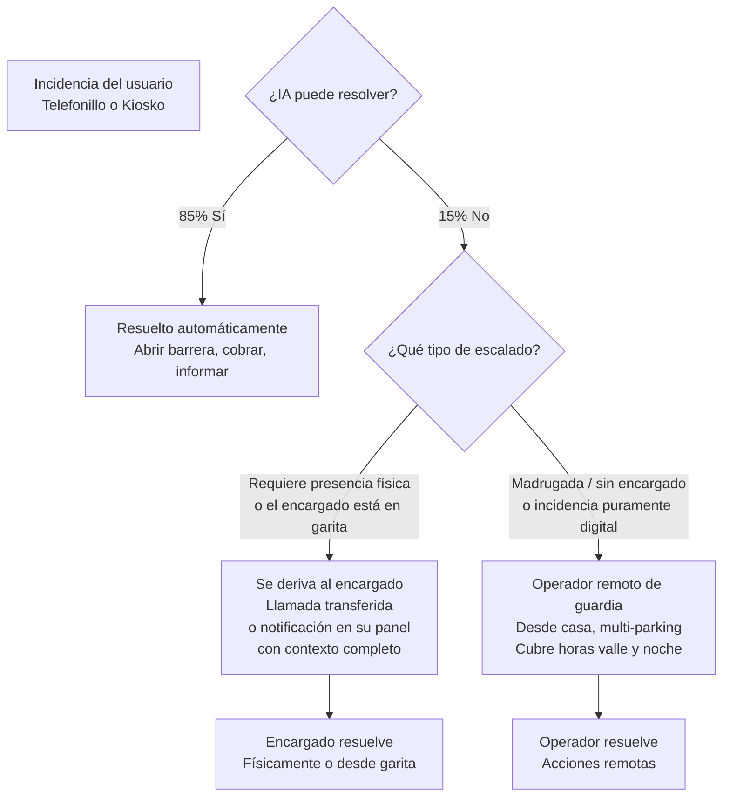

### Qué cambia y qué no — Parking con plantilla

```
❌ NO SE TOCA al encargado de caja/rondas.
   Misma gente, mismo sueldo. Solo deja de recibir llamadas.

✅ SE ELIMINA el puesto de operador de telefonillo.
   Era un puesto dedicado a contestar "¿por qué no abre?" 500 veces al mes.
   La IA lo absorbe. Ahorro real: ~1.830 €/mes por turno eliminado.

➕ SE AÑADE operador remoto nocturno (~250 €/mes compartido).
   Solo para madrugada/horas valle.
```

### Visión a futuro: parkings pequeños gestionados en remoto

> [!tip] Fase 2 — cuando el sistema esté probado al 100%
> Hoy el parking pequeño (1 persona por turno) no puede eliminar a su encargado porque alguien tiene que estar físicamente para incidencias, caja y presencia. Pero si el sistema demuestra **cero fallos en parkings grandes durante 6-12 meses**, se abre un modelo nuevo:

```
Parking pequeño con IA madura:

  3 parkings de 100 plazas en la misma zona
  ↓
  1 encargado rotativo entre los 3 (presencia física cuando haga falta)
  + IA resolviendo el 95%+ de incidencias
  + Operador remoto de guardia
  ↓
  Ahorro: 2 puestos de encargado eliminados (~3.660 €/mes)
  ↓
  De "no rentable" a "muy rentable"
```

> [!warning] Esto NO es para hoy
> Requiere que el sistema tenga una tasa de resolución >95% y cero falsos positivos en apertura de barreras. Es el horizonte al que se llega después de validar en parkings grandes con plantilla. Pero es el argumento de largo plazo para el manager que hoy tiene parkings pequeños: "cuando el sistema esté maduro, esto te permite gestionar 3 parkings con 1 persona."

### ¿Para qué parking es rentable?

No todos los parkings son iguales. El punto de equilibrio está en la plantilla:

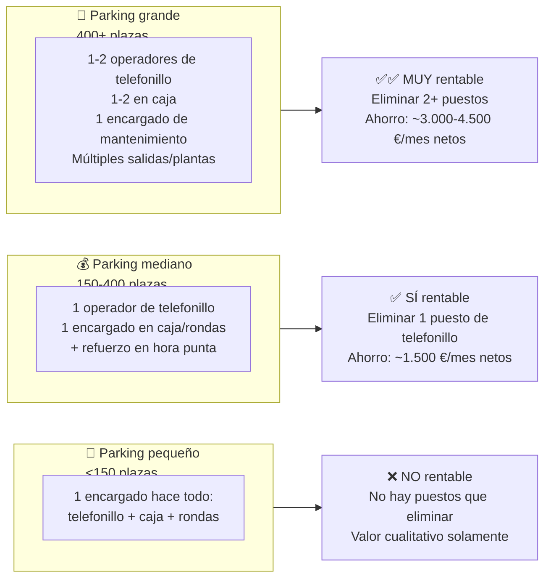

> [!tip] Punto de equilibrio: 2 personas por turno
> Si el parking solo tiene 1 persona por turno, no hay puesto que eliminar — el encargado tiene que estar ahí físicamente sí o sí. El sistema aporta calidad pero no ahorro directo.
> A partir de **2 personas por turno**, ya hay un operador cuyo trabajo es mayoritariamente atender el telefonillo (70%+ del tiempo). Ese puesto **se puede eliminar o reasignar**. El sistema cuesta ~380 €/mes y libera ~1.830 €/mes en salario. **Ahorro neto: ~1.450 €/mes.**

### La matemática según tamaño de parking

| | Parking pequeño | Parking mediano | Parking grande |
|---|---|---|---|
| **Plazas** | <150 | 150-400 | 400-1.000+ |
| **Salidas** | 1-2 | 2-4 | 4+ |
| **Personas por turno** | 1 | 2-3 | 3-5 |
| **Puestos de telefonillo** | 0 (lo atiende el encargado) | 1 por turno | 1-2 por turno |
| **¿Se puede eliminar algún puesto?** | No | **Sí, 1 por turno** | **Sí, 1-2 por turno** |
| **Ahorro en salarios/mes** | 0 € | ~1.830 € | ~3.660-5.490 € |
| **Coste del sistema/mes** | ~380 € | ~380 € | ~500-700 € (más líneas IA) |
| **Ahorro neto/mes** | **-380 €** (cuesta) | **~1.450 €** ✅ | **~3.000-4.800 €** ✅✅ |
| **ROI** | No aplica (es inversión en calidad) | <8 días | <3 días |

### El parking de pruebas ideal

Para la primera implantación, el parking ideal tiene:
- **2+ personas por turno** → se puede demostrar ahorro real desde el día 1
- **Múltiples salidas** → más puntos de fricción, más incidencias, más valor del sistema
- **Tráfico mixto** (abonados + rotación) → variedad de incidencias para entrenar la IA
- **Afluencia turística** → el multilingüe se nota y se valora

Ejemplos: parking de centro comercial, parking de hospital, parking de estación de tren, parking de aeropuerto (mediano).

### La matemática real — Parking mediano típico

```
Parking de 300 plazas, centro comercial, 3 personas por turno:

ANTES:
  Operador telefonillo (1 por turno):  4.5 FTE × 1.830 €/mes = 8.235 €/mes
  Encargados caja/rondas (2 por turno): 9.0 FTE × 1.830 €/mes = 16.470 €/mes
  ─────────────────────────────────────────────────────────────
  TOTAL PERSONAL:                                          24.705 €/mes

DESPUÉS:
  Operador telefonillo:                0 FTE                            0 €/mes
  Encargados caja/rondas:              9.0 FTE × 1.830 €/mes = 16.470 €/mes
  (Los mismos. La IA les quita el telefonillo de encima.)
  Sistema Parkings IA:                                      ~   380 €/mes
  ─────────────────────────────────────────────────────────────
  TOTAL:                                                   16.850 €/mes

  AHORRO NETO MENSUAL: ~7.855 €/mes (32% de reducción)
  ROI DEL SISTEMA: <2 días
```

### Y si el parking es pequeño...

```
Parking de 100 plazas, 1 persona por turno:

ANTES:
  1 encargado por turno (24/7):       4.5 FTE × 1.830 €/mes = 8.235 €/mes

DESPUÉS:
  El mismo encargado.                   4.5 FTE × 1.830 €/mes = 8.235 €/mes
  Sistema Parkings IA:                                      ~   380 €/mes

  COSTE ADICIONAL: +380 €/mes

  ¿Vale la pena? Solo si el parking valora:
  - Atención multilingüe para turistas
  - Cero esperas en telefonillo (el encargado ya no deja de hacer rondas)
  - Trazabilidad de incidencias
  - Cobertura nocturna sin contratar a nadie extra
```

### Flujo multi-parking

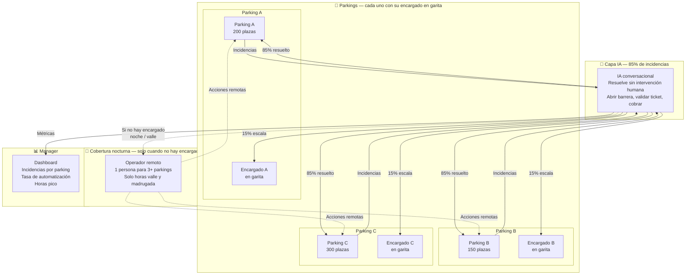

### Política de degradación elegante

Cuando la IA no puede resolver Y no hay operador disponible (ej: 4am, operador durmiendo) Y el encargado no está en el parking:

| Tipo de incidencia | Acción automática |
|--------------------|-------------------|
| Barrera no abre, pago confirmado | **Abrir.** Registro completo. Notificación push al manager. |
| Barrera no abre, sin pago, tiempo < 15 min extra | **Abrir con cortesía.** Marcar matrícula. A la 3ª cortesía en el mes: bloquear. |
| Pestillo peatonal, acceso autorizado | **Abrir.** Si es zona restringida, verificar horario. |
| Ticket perdido, matrícula reconocida | **Cobrar tarifa máxima del día.** Marcar incidencia para revisión. |
| Barrera físicamente atascada (detectado por sensor) | **Notificar al encargado** con prioridad. Si no responde en 5 min: escalar a manager. Mientras tanto: mensaje al usuario con tiempo estimado. |
| Emergencia (accidente, incendio, atrapado) | **Protocolo automático:** abrir todas las barreras + llamar a emergencias (API) + notificar manager y encargado con prioridad crítica. |
| Matrícula no reconocida, sin datos | **No abrir.** Mensaje: "Su incidencia ha sido registrada. Será contactado a la mayor brevedad. Disculpe las molestias." |

---

## Flujo 3: Ciclo completo con todos los actores

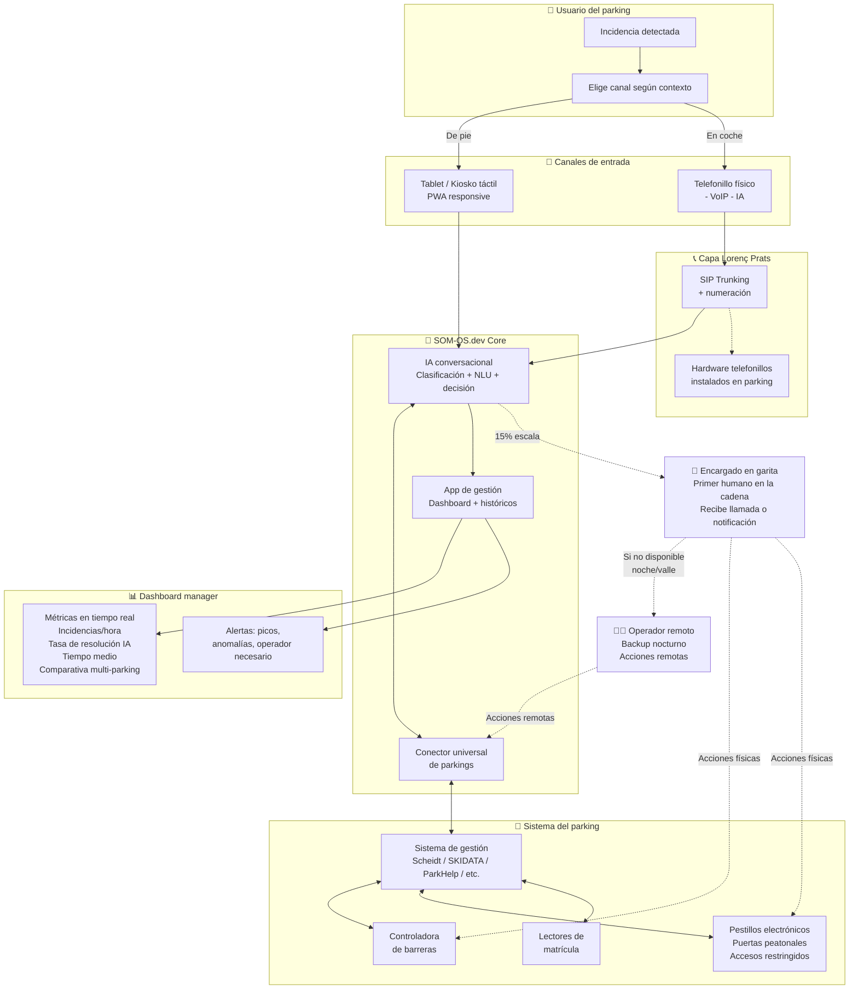

---

## Arquitectura técnica

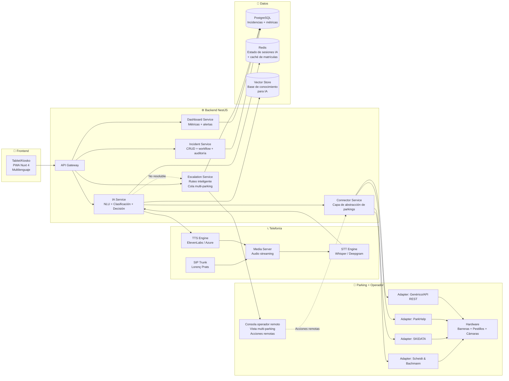

---

## El conector universal: el corazón del proyecto

### Interfaz abstracta del conector

```typescript
interface ParkingConnector {
  // Identificación
  buscarPorMatricula(matricula: string): Promise<VehiculoInfo | null>;
  buscarPorTicket(codigoTicket: string): Promise<VehiculoInfo | null>;

  // Barreras (vehículos)
  abrirBarrera(carrilId: string, motivo: string): Promise<Resultado>;
  estadoBarrera(carrilId: string): Promise<EstadoBarrera>;

  // Pestillos y puertas peatonales
  abrirPestillo(puertaId: string, motivo: string): Promise<Resultado>;
  estadoPestillo(puertaId: string): Promise<EstadoPestillo>;
  bloquearPuerta(puertaId: string, duracionMinutos?: number): Promise<Resultado>;

  // Tarifas y pagos
  calcularTarifa(vehiculoId: string): Promise<Tarifa>;
  validarPago(vehiculoId: string, metodo: MetodoPago): Promise<Resultado>;

  // Incidencias
  registrarIncidencia(vehiculoId: string, incidencia: Incidencia): Promise<Ticket>;

  // Estado
  estadoParking(): Promise<EstadoParking>;
}

interface EstadoPestillo {
  puertaId: string;
  abierto: boolean;
  bloqueado: boolean;
  ultimaApertura: Date;
  tipo: 'peatonal' | 'empleados' | 'restringido' | 'emergencia';
}
```

### Estrategia de implementación

| Fase | Qué | Resultado |
|------|-----|-----------|
| **Fase 1** | Adapter concreto para el parking de pruebas | Sistema funcionando en un parking real |
| **Fase 2** | Extraer interfaz común + adapter genérico HTTP | Conector reutilizable para parkings con API REST |
| **Fase 3** | Adapters específicos por fabricante | Cobertura del 80% del mercado |
| **Fase 4** | SDK público para que fabricantes implementen | Efecto red: SOM-OS.dev como estándar |

---

## Mapa de decisiones de la IA

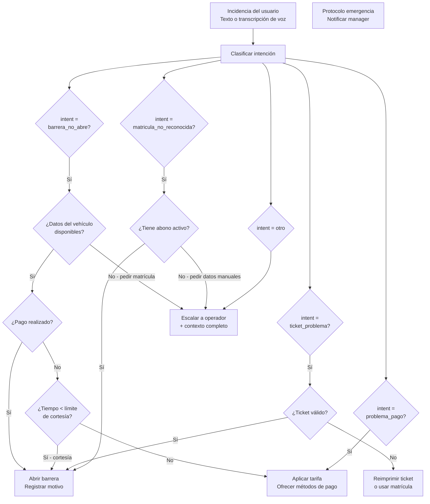

---

## Dashboard del manager de parking

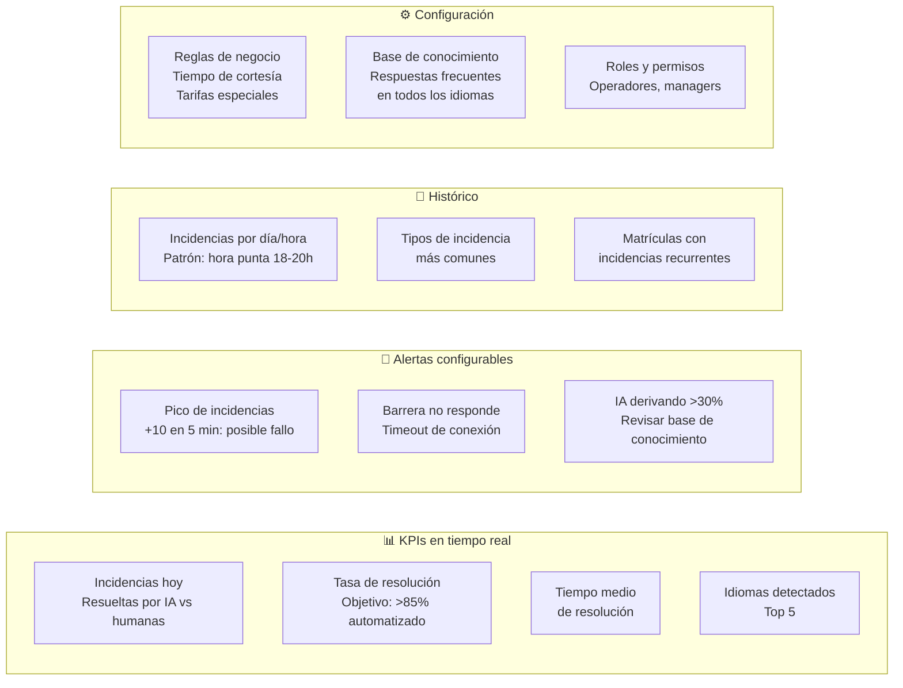

---

## Stack técnico propuesto

| Capa | Tecnología | Justificación |
|------|-----------|---------------|
| **Frontend kiosko** | Nuxt 4 (PWA) + Tailwind | Misma base que [[06 - Proyectos/Foundation|Foundation]]. PWA para funcionar offline si hay microcortes. Teclado táctil optimizado. |
| **Consola operador** | Nuxt 4 + WebSocket | Vista multi-parking con actualización en tiempo real. Panel dividido: cola, contexto, controles. |
| **Backend** | NestJS 11 | Tipado, modularidad, guards para roles. Foundation ya tiene esta base. |
| **IA conversacional** | DeepSeek / GPT-4o-mini (clasificación barata) + RAG con vector store | Clasificación de intención con modelo pequeño y barato. RAG para respuestas contextuales del parking concreto. |
| **STT (voz a texto)** | Whisper (Open Source) o Deepgram | Multilenguaje automático. Sin depender de un solo proveedor. |
| **TTS (texto a voz)** | ElevenLabs o Azure Speech | Voz natural multilingüe. Baja latencia (<500ms) para conversación fluida. |
| **Telefonía** | SIP trunking (Lorenç) + Asterisk/FreeSWITCH | Media server para bridging entre llamada telefónica y stream de audio hacia el STT/TTS. |
| **Conector parkings** | Patrón Adapter por fabricante | Cada parking implementa su adapter. Interfaz común en TypeScript. |
| **Base de datos** | PostgreSQL + Redis | Foundation ya usa este stack. Redis para estado de sesiones IA y caché. |
| **Vector store** | Qdrant o pgvector | Base de conocimiento del parking: FAQs, reglas, horarios, tarifas. |

---

## Estimación de costes mensuales

> [!info] Coste medio estimado por parking: **100-160 €/mes**
> Esto incluye servidor, IA, telefonía y licencia del sistema. No incluye el desarrollo inicial ni el hardware físico (tablets, telefonillos), que van por Lorenç y el manager del parking.

### Desglose por parking (150 plazas, ~500 incidencias/mes)

| Concepto | Proveedor | Coste unitario | Uso estimado/mes | Coste/mes |
|----------|-----------|---------------|-------------------|-----------|
| **Servidor VPS** (4 vCPU, 8GB) | Hetzner / Contabo | 40-60 €/mes fijo | Compartido entre 5 parkings | **8-12 €** |
| **PostgreSQL** | incluido en VPS o Neon free tier | 0 € | — | **0 €** |
| **Redis** | incluido en VPS | 0 € | — | **0 €** |
| **STT (voz a texto)** | Deepgram Nova-2 o Whisper | 0,004-0,006 €/min | ~200 llamadas × 1.5 min = 300 min | **1,20-1,80 €** |
| **TTS (texto a voz)** | ElevenLabs Turbo o Azure | 0,01-0,015 €/min | ~300 min (respuestas IA) | **3-4,50 €** |
| **LLM clasificación** | DeepSeek V4 Flash o GPT-4o-mini | ~0,002 €/call | ~500 incidencias | **1 €** |
| **LLM conversacional** | DeepSeek V4 o GPT-4o | ~0,08-0,15 €/min | ~100 min (casos complejos) | **8-15 €** |
| **SIP trunking** | Proveedor VoIP (Lorenç) | 5-10 €/mes + 0,01 €/min | 1 número + ~300 min llamadas | **8-13 €** |
| **Vector store (Qdrant)** | incluido en VPS | 0 € | — | **0 €** |
| **Licencia SOM-OS.dev** | Software + mantenimiento | 50-80 €/mes | Por parking | **50-80 €** |
| **TOTAL** | | | | **79-127 €/mes** |

> [!tip] ¿Por qué tan barato el LLM?
> El 85% de incidencias se resuelven con **clasificación de intención** (modelo pequeño, ~0,002 €/call). Solo el 15% que escala a operador o requiere diálogo complejo consume LLM conversacional (~0,11 €/min). Es clave diseñar el árbol de decisión para que el modelo caro se use lo mínimo.

### Comparativa: coste mensual

| | Actual | Con Parkings IA |
|---|---|---|
| **Encargados en garita** (turnos 24/7) | 4,5 FTE × 1.830 € = **8.235 €/mes** | 4,5 FTE × 1.830 € = **8.235 €/mes** |
| **Operador remoto nocturno** | — | ~**250 €/mes** (compartido entre parkings) |
| **Sistema Parkings IA** | — | **100-160 €/mes** |
| **Total operación** | **8.235 €/mes** | **8.585-8.645 €/mes** |
| **Coste adicional** | — | **~380 €/mes (+4.6%)** |

> [!note] El encargado no se toca
> El sistema no ahorra en salarios porque el encargado **no se puede eliminar** — tiene que estar físicamente en la garita. El valor real es calidad de servicio: sin esperas, multilingüe, trazabilidad, cobertura nocturna real, y el encargado liberado para hacer mantenimiento preventivo en vez de contestar 500 llamadas al mes.

### Escalado: del parking 1 al parking 10

```
Parking 1:  130 €/mes (servidor VPS se amortiza solo)
Parking 2:  120 €/mes (comparte VPS, mismo operador)
Parking 3:  115 €/mes (economías de escala en IA, Redis compartido)
Parking 4:  110 €/mes
Parking 5:  105 €/mes (VPS se paga completamente entre los 5)
...
Parking 10: ~95 €/mes (coste marginal tiende a licencia + consumo IA)
```

> [!note] Hardware físico NO incluido
> Tablets para kioskos (~150-300 €/unidad, amortizable), telefonillos SIP (~80-200 €/unidad) y pestillos electrónicos van por cuenta del parking o de Lorenç. SON-OS.dev solo provee el software, la IA y el conector.

### Lo que el sistema aporta (más allá del coste)

| Problema actual | Con Parkings IA |
|-----------------|-----------------|
| Usuario esperando al telefonillo porque el encargado está ocupado | IA atiende al instante, siempre. 0 espera. |
| Turista alemán que nadie entiende → se va furioso | IA multilingüe automática. El encargado recibe la incidencia traducida. |
| Encargado no puede hacer mantenimiento porque el telefonillo no para | 85% menos interrupciones. Tiempo real para prevenir averías. |
| De madrugada no hay quien atienda → coches atrapados | IA + operador remoto de guardia. Cobertura 24/7 real. |
| "¿Quién abrió la barrera a las 3am?" → nadie sabe | Trazabilidad total: cada acción queda registrada con motivo. |
| Mismo problema recurrente (ej: lector de matrícula sucio) → nadie se entera del patrón | Dashboard detecta patrones y alerta antes de que sea un problema crónico. |

---

## Consideraciones críticas

> [!warning] Desafíos técnicos

| # | Desafío | Riesgo | Mitigación |
|---|---------|--------|------------|
| 1 | **Fragmentación de sistemas de parking** | Cada fabricante tiene su propio protocolo. Algunos sin API documentada. | Empezar con el parking de pruebas (protocolo conocido). Abstraer después. |
| 2 | **Latencia en llamada IA** | STT → NLU → Decisión → TTS. Si tarda >2s, la conversación se siente robotizada. | Usar STT/TTS streaming. Precalentar modelos. Redis para estado de sesión. |
| 3 | **Ruido ambiente en el parking** | El telefonillo capta tráfico, viento, otros coches. El STT falla. | Microfonía direccional. Noise suppression DSP en el media server. |
| 4 | **Fallback cuando IA no resuelve** | Si la IA deriva al operador pero no hay operador disponible de madrugada. | Definir política de "degradación elegante": abrir barrera si es seguro + notificar al manager. |
| 5 | **Seguridad de apertura de barreras** | Un fallo o un prompt injection podría abrir barreras indebidamente. | La IA nunca abre barreras directamente. El conector tiene una capa de validación independiente (reglas hardcodeadas, no LLM). |
| 6 | **Concurrencia: 3 llamadas a la vez** | ¿Cuántas líneas IA simultáneas soporta el sistema? | Dimensionar media server + procesos STT paralelos. Escalar horizontalmente con más instancias. |
| 7 | **Mantenimiento del conector** | Cada actualización del software del fabricante puede romper la integración. | Contratos con managers: acceso a entornos de staging. Tests de integración automatizados. |
| 8 | **Pestillos electrónicos sin estándar** | Cada fabricante de cerraduras eléctricas (ASSA ABLOY, dormakaba, Salto) tiene su protocolo. Algunos son relays secos, otros modbus, otros API propietaria. | El conector abstrae la capa física. Para el parking de pruebas: relevar modelo exacto y construir adapter. A futuro: catálogo de pestillos compatibles. |
| 9 | **Operador remoto: desorientación** | El operador recibe una incidencia del Parking C pero no conoce físicamente ese parking. ¿Dónde está la puerta 3? ¿Qué cámara la ve? | Cada puerta/barrera tiene foto + posición en plano en la consola. El operador ve la vista de cámara correspondiente automáticamente al seleccionar el dispositivo. |
| 10 | **Operador remoto: latencia en acciones** | El operador está en su casa con conexión doméstica. Un comando `abrirBarrera` que tarda 3s es una eternidad para el usuario en el coche. | WebSocket con keep-alive. Acciones críticas con confirmación local inmediata (optimistic UI) y verificación backend asíncrona. Timeout máximo: 500ms. |
| 11 | **Horas valle: ¿quién paga al operador?** | Si el operador es compartido entre 5 parkings pero solo hay 2 incidencias en toda la noche, el coste por incidencia es altísimo. | Modelo híbrido: operador de guardia con sueldo base bajo + bono por incidencia resuelta. O IA + degradación elegante para horas valle. |

---

## Fases sugeridas

### Fase 0 — Descubrimiento (2 semanas)
- [ ] Visita al parking de pruebas con Lorenç
- [ ] Relevar sistema de gestión que usan (fabricante, versión, API disponible)
- [ ] Relevar hardware: telefonillos, barreras, cámaras LPR, **pestillos electrónicos, puertas peatonales**
- [ ] Identificar marcas/modelos de pestillos, verificar si tienen API/relay
- [ ] Definir top 10 incidencias más comunes (datos reales del parking)
- [ ] Relevar reglas de negocio: tarifas, cortesías, abonos, excepciones, zonas restringidas
- [ ] Probar latencia y ruido en el telefonillo real

### Fase 1 — Conector + IA básica (4-6 semanas)
- [ ] Adapter concreto para el sistema del parking de pruebas
- [ ] Endpoints: `buscarPorMatricula`, `abrirBarrera`, `abrirPestillo`, `calcularTarifa`, `registrarIncidencia`
- [ ] IA conversacional con clasificación de intenciones (modo texto, sin voz aún)
- [ ] Dashboard interno de incidencias (solo para nosotros)
- [ ] Prueba controlada: simular las 10 incidencias top

### Fase 2 — Voz + Kiosko (4 semanas)
- [ ] Integración SIP trunking de Lorenç con media server
- [ ] Pipeline STT → IA → TTS completo
- [ ] PWA para kiosko táctil (multilenguaje)
- [ ] Prueba con usuarios reales en el parking

### Fase 3 — Dashboard manager + Consola operador + refactor conector (3-4 semanas)
- [ ] Dashboard para el manager del parking (métricas, alertas, histórico)
- [ ] **Consola del operador remoto multi-parking** (cola unificada, contexto, acciones remotas)
- [ ] Sistema de ruteo inteligente y política de degradación elegante
- [ ] Extraer interfaz abstracta del conector
- [ ] Documentar protocolo de integración para nuevos fabricantes y pestillos

### Fase 4 — Expansión horizontal (continuo)
- [ ] Nuevos adapters por fabricante
- [ ] Onboarding de parkings de la red de Lorenç
- [ ] SDK público (largo plazo)

---
## Relaciones

- [[08 - Clientes/Lorenç Prats - Telecomunicaciones y Parkings IA]] — ficha de cliente, contexto de negocio
- [[06 - Proyectos/Foundation]] — base técnica del monorepo
- [[Conceptos/Concepto Central Actualizado - De componentes aislados a sistemas operativos inteligentes]] — esto es un sistema operativo de parking
- [[Conceptos/Propuesta de Valor - Sistemas operativos empresariales]] — propuesta de valor aplicada
- [[Conceptos/ADN - Tecnología-Tierra]] — IA + VoIP aterrizadas en un parking físico
- [[Conceptos/Metodología - 5 pasos SOM-OS]] — metodología para el conector universal
- [[Conceptos/Diferenciación - Inventor vs Técnico]] — no es instalar un chatbot, es integrar hardware, voz y gestión