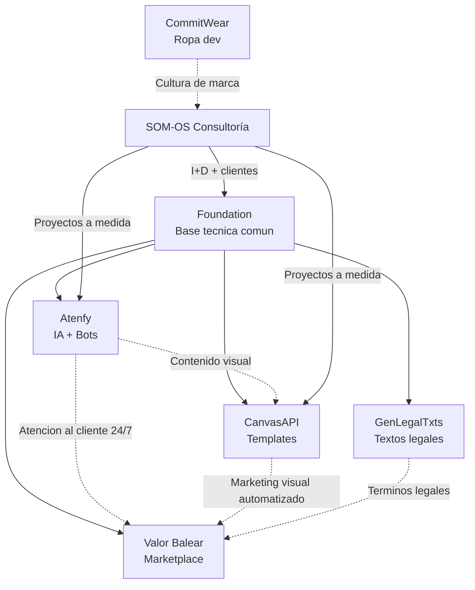

---
title: "Plan de Empresa - ecosistema SOM-OS"
date: 2026-05-11
tags:
  - plan-de-empresa
  - estrategia
  - financiero
  - roadmap
  - SOM-OS.dev
  - ecosistema
  - valor-balear
  - foundation
  - atefy
  - canvasapi
category: plan-de-empresa
status: activo
description: "Plan de empresa integral del ecosistema SOM-OS by Adrian Colom. Cubre los 7 proyectos, su modelo de negocio, proyecciones financieras, estrategia de go-to-market y roadmap de ejecucion. Valor Balear como proyecto prioritario de generacion de caja."
---

# Plan de Empresa - Ecosistema SOM-OS

> [!info] Resumen ejecutivo
> SOM-OS.dev es un ecosistema de **7 productos digitales interconectados** que comparten una base tecnica comun ([[Foundation]]) y una filosofia de marca: disenar sistemas operativos empresariales que integran personas, procesos e IA. El plan prioriza **Valor Balear** como proyecto tractor de facturacion a corto plazo, mientras los productos SaaS ([[Atenfy]], [[CanvasAPI]]) maduran su modelo recurrente. La consultoria SOM-OS.dev actua como motor de origen y laboratorio de I+D.

---

## 1. El Ecosistema

### 1.1 Marca paraguas: SOM-OS.dev

**Propuesta de valor**: Disenamos sistemas operativos empresariales que integran personas, procesos e inteligencia artificial para que tu negocio funcione como un sistema conectado, eficiente y proactivo.

**ADN**: [[ADN - Tecnologia-Tierra]] - tecnologia avanzada aterrizada en la realidad local (Mallorca/Baleares).

**Arquetipo**: [[Arquetipo de Marca - El Arquitecto]] - no implementa herramientas sueltas, disena sistemas.

### 1.2 Los 7 proyectos

| # | Proyecto | Tipo | Modelo de ingreso | Estado | Prioridad |
|---|----------|------|-------------------|--------|-----------|
| 1 | **[[Valor Balear]]** | Marketplace B2C/B2B2C | Comision por venta (X%) | Planificacion | P1 - Tractor de caja |
| 2 | **[[Atenfy]]** | SaaS B2B | Suscripcion mensual (Enterprise) | Activo (MVP) | P2 - Recurrencia |
| 3 | **[[CanvasAPI]]** | SaaS B2B | API pay-per-use / suscripcion | Activo (MVP) | P2 - Recurrencia |
| 4 | **[[Foundation]]** | Infraestructura | Interno (ahorro de costes) | Activo | P3 - Base |
| 5 | **[[GenLegalTxts]]** | SaaS B2B/B2C | Freemium / trafico | Activo | P3 - Trafico |
| 6 | **[[CommitWear]]** | E-commerce B2C | Venta de producto fisico | Idea | P4 - Experimental |
| 7 | **SOM-OS Consultoría** | Servicio B2B | Proyecto + membresia | Activo | P2 - Caja inicial |

### 1.3 Sinergias entre proyectos



> [!tip] La ventaja del ecosistema
> Cada proyecto nuevo se construye en **semanas, no meses** porque hereda auth, billing, CMS, email, storage, i18n, y 60+ componentes de [[Foundation]]. El coste marginal de lanzar un nuevo producto es bajisimo comparado con empezar de cero.

---

## 2. Valor Balear - Proyecto Prioritario

### 2.1 Por que Valor Balear primero?

1. **Flujo de caja predecible**: comision por venta genera ingresos desde el dia 1
2. **Mercado validado**: los productos baleares tienen demanda real, estan desconectados digitalmente
3. **Efecto red**: cada artesano que se une trae sus clientes; cada cliente atrae mas artesanos
4. **Escalabilidad geografica**: el modelo "Valor [Region]" es replicable en Canarias, Pais Vasco, Andalucia...
5. **Sinergia con el resto del ecosistema**: Atenfy atiende a los clientes, CanvasAPI genera contenido visual, GenLegalTxts cubre los textos legales

### 2.2 Modelo de negocio

```
Cliente compra producto(s) de N tiendas -> 1 pago unico
                                              |
                              Stripe Connect split automatico:
                              - Artesano: 85-90% del precio
                              - Valor Balear: 10-15% comision
                              - Stripe: ~1.4% + 0.25
```

**Estructura de comision propuesta**:

| Categoria | Comision VB |
|-----------|-------------|
| Gastronomia | 12% |
| Artesania | 15% |
| Afiliado (futuro) | 5% (sale del margen VB) |

### 2.3 Proyeccion financiera - Valor Balear

| Metrica | Ano 1 | Ano 2 | Ano 3 |
|---------|-------|-------|-------|
| Artesanos activos | 30 | 80 | 150 |
| Productos en catalogo | 300 | 1,000 | 2,500 |
| Pedidos/mes (promedio) | 50 | 200 | 500 |
| Ticket medio | 40 | 42 | 45 |
| **GMV mensual** | 2,000 | 8,400 | 22,500 |
| **GMV anual** | 24,000 | 100,800 | 270,000 |
| **Ingresos VB (12% avg)** | 2,880 | 12,096 | 32,400 |
| Costes operativos (hosting, Sendcloud, Stripe fees) | ~1,200 | ~3,000 | ~6,000 |
| **Margen bruto** | 1,680 | 9,096 | 26,400 |

> [!warning] Supuestos conservadores
> - 50 pedidos/mes en Ano 1 = menos de 2 pedidos/dia. Alcanzable con 30 artesanos activos.
> - No se incluye afiliacion (Fase 5), que anadiria un multiplicador de trafico sin coste de adquisicion.
> - No se incluye "Caja Balear" (suscripcion), que anadiria ingresos recurrentes.

### 2.4 Roadmap de ejecucion

Ver detalle completo en [[Valor Balear#Roadmap Sugerido]].

| Fase | Entregable | Duracion | Inversion |
|------|-----------|----------|-----------|
| **F1 - MVP** | Catalogo + Checkout + Stripe Connect + SubOrders | 3 meses | Tiempo de desarrollo |
| **F2 - Logistica** | Sendcloud: etiquetas, tracking, recogidas | 1 mes | Tiempo de desarrollo |
| **F3 - Webhooks** | Motor de webhooks + dashboard | 1 mes | Tiempo de desarrollo |
| **F4 - Contenido** | Blog + SEO + redes sociales | Continuo | Tiempo + 200/mes ads |
| **F5 - Escalar** | PWA + Resenas + Afiliacion QR | 3 meses | Tiempo de desarrollo |
| **F6 - Expandir** | Servicios, Cursos, Eventos autoctonos | 4 meses | Tiempo de desarrollo |

**Inversion total estimada**: Principalmente tiempo de desarrollo (8-12 meses de F1 a F5). Costes externos: ~200/mes en ads + ~50/mes infraestructura.

### 2.5 Estrategia de captacion de artesanos

| Canal | Accion | Coste |
|-------|--------|-------|
| **Visitas presenciales** | Recorrer talleres y mercados artesanales en Mallorca, Menorca, Ibiza | Gasolina + tiempo |
| **Asociaciones locales** | Colaborar con DO, IGP, consells insulars, asociaciones de artesanos | 0 |
| **Caso exito inicial** | Captar 5 artesanos "semilla" con 0% comision primeros 3 meses | Coste de oportunidad |
| **Boca a boca** | Los primeros artesanos traen a otros del sector | 0 |
| **RRSS + ads locales** | Instagram/TikTok con contenido de los propios artesanos | 200/mes |

### 2.6 Estrategia de captacion de clientes

| Canal | Accion | Coste |
|-------|--------|-------|
| **SEO organico** | "comprar ensaimada online", "artesania mallorquina", "productos baleares" | Tiempo |
| **Blog** | Recetas tradicionales, historias de artesanos, guias de islas | Tiempo |
| **Google Shopping** | Feed de productos automatizado (gratis) | 0 |
| **RRSS** | Contenido generado por los artesanos + clientes (UGC) | Tiempo |
| **Afiliacion QR** | Hoteles, restaurantes, tiendas fisicas con QR -> comision | Solo cuando venden |
| **PR local** | Medios locales (Diario de Mallorca, IB3, Ara Balears) | 0 |

---

## 3. Productos SaaS - Ingresos Recurrentes

### 3.1 Atenfy

| Concepto | Detalle |
|----------|---------|
| **Producto** | Plataforma de atencion al cliente 24/7 con IA multicanal |
| **Modelo** | Suscripcion Enterprise (precio personalizado) |
| **Estado** | MVP activo, features core pendientes (agentes IA, Stripe, chatbots) |
| **Mercado** | Restaurantes, hoteles, clinicas, servicios con reservas |
| **Ventaja** | Handoff inteligente con contexto completo - no es un chatbot generico |

**Proyeccion conservadora**:

| Metrica | Ano 1 | Ano 2 | Ano 3 |
|---------|-------|-------|-------|
| Clientes activos | 5 | 15 | 40 |
| Ticket medio/mes | 150 | 180 | 200 |
| **MRR** | 750 | 2,700 | 8,000 |
| **ARR** | 9,000 | 32,400 | 96,000 |
| Costes (infra + APIs IA) | ~600 | ~1,800 | ~4,800 |
| **Margen bruto** | 8,400 | 30,600 | 91,200 |

### 3.2 CanvasAPI

| Concepto | Detalle |
|----------|---------|
| **Producto** | API-first Template Engine - motor de plantillas visuales |
| **Modelo** | API pay-per-use (primeros N renders gratis) + plan Pro |
| **Estado** | MVP activo, editor funcional, API documentada |
| **Mercado** | Devs que necesitan generar imagenes/PDFs programaticamente |
| **Ventaja** | JSON <-> Canvas bidireccional, integracion IA, escalabilidad |

**Proyeccion conservadora**:

| Metrica | Ano 1 | Ano 2 | Ano 3 |
|---------|-------|-------|-------|
| Clientes activos | 10 | 40 | 100 |
| Ticket medio/mes | 25 | 35 | 45 |
| **MRR** | 250 | 1,400 | 4,500 |
| **ARR** | 3,000 | 16,800 | 54,000 |
| Costes (render + almacenamiento) | ~300 | ~1,200 | ~3,600 |
| **Margen bruto** | 2,700 | 15,600 | 50,400 |

### 3.3 GenLegalTxts

| Concepto | Detalle |
|----------|---------|
| **Producto** | Generador de textos legales personalizados |
| **Modelo** | Freemium (gratis con atribucion, premium sin atribucion + extras) |
| **Estado** | Activo, 6 generadores funcionando |
| **Mercado** | Cualquier web/negocio en Espana que necesite textos legales |
| **Rol en ecosistema** | Generador de trafico y autoridad de dominio |

**Proyeccion**:

| Metrica | Ano 1 | Ano 2 | Ano 3 |
|---------|-------|-------|-------|
| Visitas/mes | 1,000 | 5,000 | 15,000 |
| Tasa conversion premium | 2% | 3% | 3% |
| Clientes premium | 20 | 150 | 450 |
| Ticket premium (unico) | 15 | 15 | 15 |
| **Ingresos** | 300 | 2,250 | 6,750 |

### 3.4 SOM-OS Consultoría

| Concepto | Detalle |
|----------|---------|
| **Servicio** | Arquitectura de sistemas digitales para empresas |
| **Modelo** | Proyecto (presupuesto cerrado) + membresia opcional (iteracion) |
| **Metodologia** | [[Metodologia - 5 pasos SOM-OS]]: Descubrimiento -> Estrategia -> Desarrollo -> Lanzamiento -> Iteracion |
| **Rol en el ecosistema** | Genera caja inicial, valida necesidades del mercado, alimenta I+D para los productos SaaS |

**Proyeccion**:

| Metrica | Ano 1 | Ano 2 | Ano 3 |
|---------|-------|-------|-------|
| Proyectos/ano | 4 | 6 | 8 |
| Ticket medio/proyecto | 3,000 | 4,500 | 6,000 |
| Membresias activas | 2 | 5 | 10 |
| Ticket membresia/mes | 150 | 200 | 250 |
| **Ingresos proyectos** | 12,000 | 27,000 | 48,000 |
| **Ingresos membresias** | 3,600 | 12,000 | 30,000 |
| **Total consultoria** | 15,600 | 39,000 | 78,000 |

---

## 4. Finanzas Consolidadas

### 4.1 Ingresos por linea de negocio

| Linea | Ano 1 | Ano 2 | Ano 3 | % A3 |
|-------|-------|-------|-------|------|
| Valor Balear | 2,880 | 12,096 | 32,400 | 12% |
| Atenfy | 9,000 | 32,400 | 96,000 | 36% |
| CanvasAPI | 3,000 | 16,800 | 54,000 | 20% |
| GenLegalTxts | 300 | 2,250 | 6,750 | 3% |
| Consultoria | 15,600 | 39,000 | 78,000 | 29% |
| **TOTAL** | **30,780** | **102,546** | **267,150** | 100% |

> [!tip] Cambio de mix estrategico
> En Ano 1, la consultoria representa el 51% de los ingresos (caja inicial). En Ano 3, los productos SaaS (Atenfy + CanvasAPI) representan el 56% del total, logrando el objetivo de negocio recurrente y escalable.

### 4.2 Estructura de costes (Ano 1)

| Concepto | Mensual | Anual | % Ingresos |
|----------|---------|-------|------------|
| **Infraestructura** (VPS, DB, Redis, dominio, email) | 80 | 960 | 3.1% |
| **APIs externas** (Stripe, Sendcloud, OpenAI, etc.) | 100 | 1,200 | 3.9% |
| **Marketing y ads** | 200 | 2,400 | 7.8% |
| **Software y herramientas** | 50 | 600 | 1.9% |
| **Gestoria y legal** | 100 | 1,200 | 3.9% |
| **Formacion** | 50 | 600 | 1.9% |
| **Imprevistos (10%)** | 58 | 696 | 2.3% |
| **TOTAL COSTES** | **638** | **7,656** | **24.9%** |

### 4.3 Cuenta de resultados proyectada

| | Ano 1 | Ano 2 | Ano 3 |
|---|-------|-------|-------|
| Ingresos totales | 30,780 | 102,546 | 267,150 |
| Costes operativos | -7,656 | -15,000 | -28,000 |
| **Margen bruto** | **23,124** | **87,546** | **239,150** |
| Margen (%) | 75.1% | 85.4% | 89.5% |

> [!note] Nota sobre costes laborales
> Los costes reflejados son exclusivamente operativos (infraestructura, APIs, herramientas). El desarrollo lo realiza Adrian Colom como fundador. A medida que los ingresos crezcan (Ano 2-3), se contempla la contratacion de:
> - 1 desarrollador full-stack (Ano 2, ~30,000/ano)
> - 1 persona de atencion al cliente / community manager (Ano 2-3, ~24,000/ano)

### 4.4 Punto de equilibrio

Con los costes operativos actuales (~638/mes), el punto de equilibrio se alcanza con:

| Fuente | Umbral mensual |
|--------|---------------|
| **Solo consultoria** | 1 proyecto de 3,000 cada 4.7 meses |
| **Solo Valor Balear** | 2,656 en GMV mensual (~66 pedidos/mes a 40 ticket medio) |
| **Solo Atenfy** | 5 clientes a 150/mes |
| **Mix realista** | 1 proyecto/trimestre + 3 clientes Atenfy + 15 pedidos/mes VB |

> [!important] Realidad actual
> A mayo 2026, el ecosistema ya genera ingresos via consultoria (SOM-OS.dev) y tiene productos SaaS en funcionamiento (Atenfy, CanvasAPI, GenLegalTxts). El punto de equilibrio operativo es alcanzable en el **primer trimestre** de ejecucion de este plan. El objetivo del plan no es "llegar a equilibrio" sino **acelerar el crecimiento** con Valor Balear como multiplicador.

---

## 5. Estructura Legal y Fiscal

### 5.1 Situacion actual

| Elemento | Estado |
|----------|--------|
| **Autonomo** | Adrian Colom Palacios, dado de alta en Inca (Mallorca) |
| **Marcas** | SOM-OS.dev y productos bajo la marca personal/autonomo |
| **Facturacion** | Consultoria y proyectos via autonomo |
| **Dominios** | Multiples dominios registrados (ikiraisolutions.com, genlegaltxts.com, etc.) |

### 5.2 Recomendacion: Sociedad Limitada

A medida que Valor Balear escale, se recomienda constituir una **Sociedad Limitada**:

| Concepto | Detalle |
|----------|---------|
| **Momento recomendado** | Cuando Valor Balear facture > 20,000/ano o al captar el artesano numero 50 |
| **Estructura** | SL unipersonal o con socio (Joan Toni Ramon Crespi para el area visual) |
| **Ventajas** | Responsabilidad limitada, imagen corporativa, deduccion de gastos |
| **Coste** | ~3,000 constitucion + ~1,500/ano gestoria |
| **Nombre propuesto** | SOM-OS Sistemas Digitales SL o Valor Balear Marketplace SL |

### 5.3 Obligaciones fiscales del marketplace

Como marketplace que intermedia pagos, Valor Balear debe cumplir:

- **DAC7** (desde 2023): declaracion informativa de vendedores ante la AEAT
- **Facturacion**: Stripe Connect no emite factura por el artesano. Cada artesano factura a su cliente. VB factura su comision.
- **IVA**: Los productos de gastronomia/artesania tributan IVA en origen (Baleares = 21% general, 10% reducido en alimentacion). VB solo declara IVA de su comision.

> [!warning] Asesoramiento profesional requerido
> La estructura fiscal del marketplace debe ser validada por un gestor/asesor fiscal antes del lanzamiento. Lo aqui expuesto es orientativo basado en investigacion, no asesoramiento legal.

---

## 6. Estrategia Go-to-Market

### 6.1 Fases de lanzamiento

```mermaid
gantt
    title ecosistema SOM-OS - Go-to-Market
    dateFormat  YYYY-MM
    axisFormat  %b %Y

    section Fase 0 - Fundacion
    Completar Atenfy MVP           :done, f0a, 2026-01, 2026-05
    Completar CanvasAPI MVP        :done, f0b, 2026-01, 2026-05
    Foundation estable              :done, f0c, 2025-09, 2026-05

    section Fase 1 - Valor Balear MVP
    Desarrollo F1 (MVP)            :f1a, 2026-07, 2026-09
    Captacion 10 artesanos semilla :f1b, 2026-08, 2026-10
    Lanzamiento publico VB         :milestone, f1c, 2026-10, 0d
    Desarrollo F2 (Logistica)      :f1d, 2026-10, 2026-11

    section Fase 2 - Crecimiento
    VB: 30 artesanos, F3 Webhooks :f2a, 2026-11, 2027-01
    Atenfy: venta activa (5 clientes) :f2b, 2026-06, 2027-03
    CanvasAPI: venta activa (10 clientes) :f2c, 2026-06, 2027-06
    VB: F4 Contenido + SEO        :f2d, 2026-10, 2027-06

    section Fase 3 - Escalar
    VB: F5 Escalar (80 artesanos)  :f3a, 2027-01, 2027-06
    SL constituida                 :milestone, f3b, 2027-03, 0d
    Primera contratacion           :milestone, f3c, 2027-06, 0d
    VB: F6 Servicios/Cursos        :f3d, 2027-06, 2027-10
```

### 6.2 Canales de adquisicion por producto

| Producto | Canal primario | Canal secundario | Coste adquisicion |
|----------|---------------|-------------------|-------------------|
| **Valor Balear** | Visitas presenciales + SEO | Afiliacion QR + RRSS | Bajo (tiempo) |
| **Atenfy** | Networking B2B + LinkedIn | Webinars + casos de exito | Bajo (tiempo) |
| **CanvasAPI** | GitHub + dev.to + documentacion | SEO tecnico + API marketplaces | Cero (organico) |
| **GenLegalTxts** | SEO + busquedas Google | Foros + blogs de marketing | Cero (organico) |
| **Consultoria** | Boca a boca + LinkedIn | Proyectos publicos como portfolio | Cero (reputacion) |

---

## 7. Analisis de Riesgos

| Riesgo | Probabilidad | Impacto | Mitigacion |
|--------|-------------|---------|------------|
| **Baja adopcion de artesanos** | Media | Alto | Visitas presenciales, 0% comision primeros 3 meses, casos exito tempranos |
| **Problemas con Stripe Connect KYC** | Baja | Medio | Preparar guia en castellano para artesanos, ofrecer asistencia personalizada |
| **Competencia de Amazon/Etsy** | Media | Medio | Diferenciacion por autenticidad, curacion, identidad local, storytelling |
| **Dependencia de Adrian Colom** | Alta | Alto | Documentar todo, preparar onboarding, contratar primer empleado en Ano 2 |
| **Cambio regulatorio (DAC7, PSD2)** | Baja | Medio | Asesoramiento fiscal preventivo, arquitectura adaptable (adapter pattern) |
| **Abandono de checkout sin Bizum** | Media | Medio | Medir tasa de abandono en MVP; si >15%, acelerar migracion a PaynoPain |
| **Estacionalidad turistica** | Alta | Bajo | Diversificar: clientes peninsulares (no turistas), suscripcion Caja Balear, productos no perecederos |

---

## 8. Metricas Clave (KPIs)

### 8.1 Por proyecto

| Proyecto | KPI principal | Objetivo Ano 1 | Objetivo Ano 3 |
|----------|--------------|----------------|----------------|
| Valor Balear | GMV mensual | 2,000 | 22,500 |
| Valor Balear | Artesanos activos | 30 | 150 |
| Atenfy | MRR | 750 | 8,000 |
| Atenfy | Churn rate | <5% | <3% |
| CanvasAPI | MRR | 250 | 4,500 |
| CanvasAPI | API calls/mes | 5,000 | 50,000 |
| GenLegalTxts | Visitas/mes | 1,000 | 15,000 |
| Consultoria | Proyectos/ano | 4 | 8 |

### 8.2 OKR Ecosistema (Ano 1)

**Objetivo**: Validar que el ecosistema SOM-OS genera ingresos diversificados y sostenibles

| Key Result | Target |
|------------|--------|
| Ingresos totales anuales | >= 24,000 |
| Valor Balear lanzado y operativo | Si, con >= 15 artesanos |
| Al menos 2 productos con MRR > 0 | Atenfy + CanvasAPI |
| Costes operativos < 25% ingresos | Si |

---

## 9. Proximos Pasos (90 dias)

### Inmediato (Mayo - Junio 2026)

- [ ] Completar features pendientes de Atenfy (Stripe, chatbots IA)
- [ ] Iniciar desarrollo F1 de Valor Balear desde Foundation
- [ ] Visitar 5 artesanos potenciales en Inca/Mallorca para validar interes
- [ ] Validar estructura fiscal del marketplace con gestor
- [ ] Crear pagina de aterrizaje "Valor Balear - Proximamente"

### Corto plazo (Julio - Agosto 2026)

- [ ] MVP Valor Balear funcional (catalogo + checkout + Stripe Connect)
- [ ] Captar 10 artesanos semilla con condiciones especiales
- [ ] Atenfy: cerrar 3 clientes piloto (hosteleria local)
- [ ] CanvasAPI: publicar documentacion y 2 casos de uso publicos
- [ ] Publicar 5 articulos de blog en GenLegalTxts para SEO

---

## 10. Relaciones

- [[Valor Balear]] - proyecto prioritario, analisis completo
- [[Valor Balear - Arquitectura de Pagos]] - decision Stripe Connect vs PaynoPain
- [[Atenfy]] - SaaS de atencion al cliente IA
- [[CanvasAPI]] - API de templates visuales
- [[Foundation]] - base tecnica del ecosistema
- [[GenLegalTxts]] - generador de textos legales
- [[CommitWear]] - marca de ropa dev
- [[Metodologia - 5 pasos SOM-OS]] - metodologia de consultoria
- [[Propuesta de Valor - Sistemas operativos empresariales]] - propuesta de valor central
- [[ADN - Tecnologia-Tierra]] - ADN diferencial de la marca
- [[08 - Clientes/Nemus Arboricultura]] - cliente potencial Fase 6 de Valor Balear
- [[07 - Informacion Publica/Joan Toni Ramon Crespi - Socio]] - socio potencial
- [[07 - Informacion Publica/Perfil Publico - Adrian Colom Palacios]] - fundador
